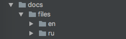
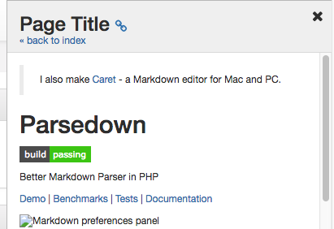

# Splynx site documentation

In this repository store documentation files for Splynx site.
After pushing to this repository, documentation in Splynx site will be automatically updated. 

### Files format description

#### Translations

Languages files should be placed in self directories.



#### Page title

Each page should be begin from the page title.

```
Page Title
==========
```
This title will be show in the header of the documentation panel.



#### Image size

For set image size you can use url parameters.

```

```

This code will be converted to:

```html

```

#### Image src
For images `src` you can use absolute url or relative path.

Absolute url:

```
http://images.google.com/some_image.png
```

Relative path (recommended):

```
./images/my_image.png
```

#### Links
You can use:

* Absolute links. This links will be open in new tab.

```
[Google](https://google.com)
```

* Relative links to other docs pages.

```
[Invoices](finance/invoices/invoices.md)
```

* Javascript functions

```
// Switch Splynx page
[Open config](javascript:switch_page('/admin/config'))

// Open dialog
[Add location](javascript:open_dialog_new('administration/locations--add'))

// Open help dialog
[Help me](javascript:open_help_dialog('index.md'))
```