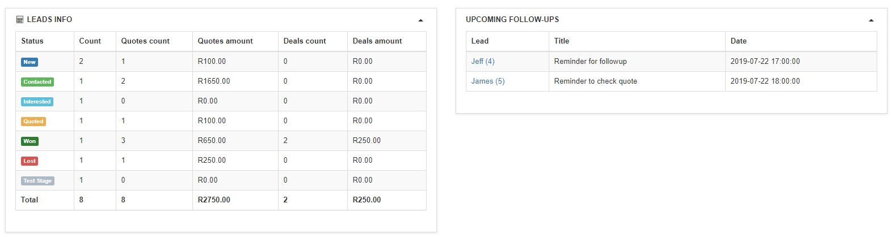

CRM Dashboard
===
The CRM dashboard gives us an overview of our sales activities in regards to prospective leads.

Here we can see the directory boards - My leads, My quotes, My deals, all leads which will direct you to the appropriate sections.

A pie chart - **My leads by stages** - displays the various stages of the logged in administrator's leads in the system.

The **Recent Activities** stream shows us live information of changes to the leads in the system.

In the **Leads Info** section we can see a tabulated breakdown of the quotes vs deals and their amounts.

In the last table - **Upcoming follow-ups** we can see all reminder notifications set in the leads information page.

