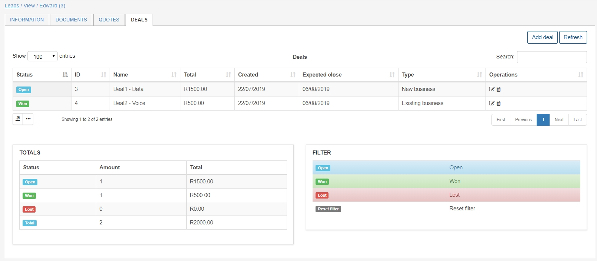
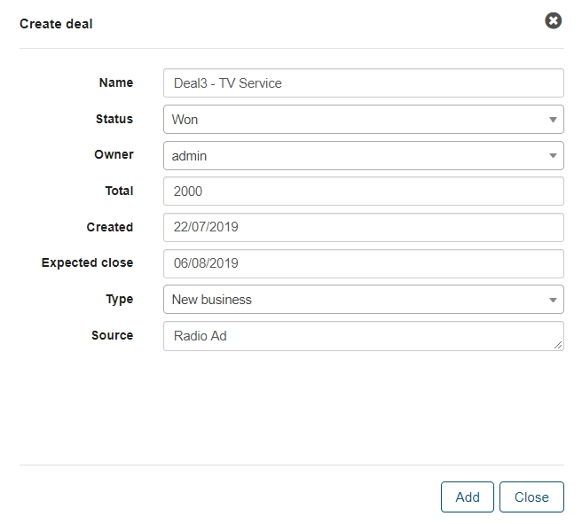
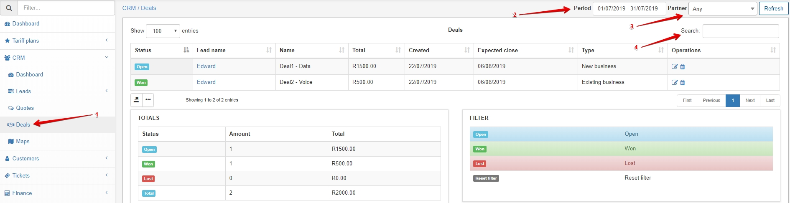

Deals
====
Deals are commitments created with leads on business done with them.

Deals are created within the specific lead's page under the **Deals** tab.

Once you have selected to add a deal you have to fill in the required information:

* `Name of deal` - Best practice is to create a descriptive name for the deal.
* `Status` - Whether the deal is Open, Won or lost.
* `Owner` - The administrator to whom the deal belongs to.
* `Total` - The total value of the deal.
* `Created` - The date the deal is created (by default today's date)
* `Expected close` - The date that the deal is expected to close by.
* `Type` - Is the deal new, or existing business?
* `Source` - The source of the deal eg. TV ad, newspaper, billboard etc.

Once the deal is added it will also be added to the totals tab which will provide us with a summary of all deals made with the customer.

We can also use the filter options to filter between the different status' the deals belong to.

All deals can viewed under the Deals Menu - here we can also search for deals via Period, Partner or via the search field.

