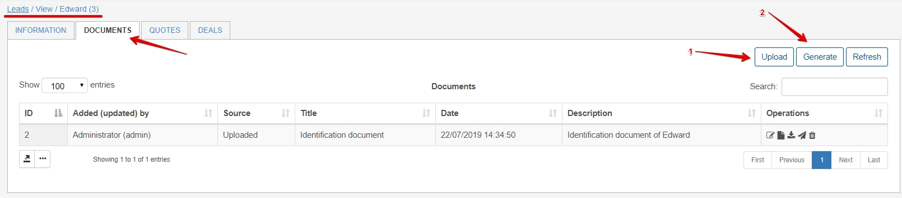
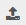
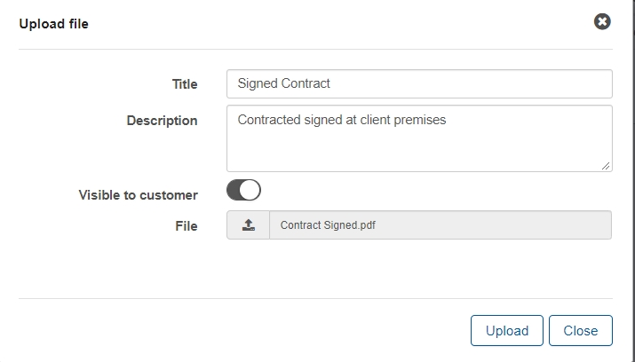
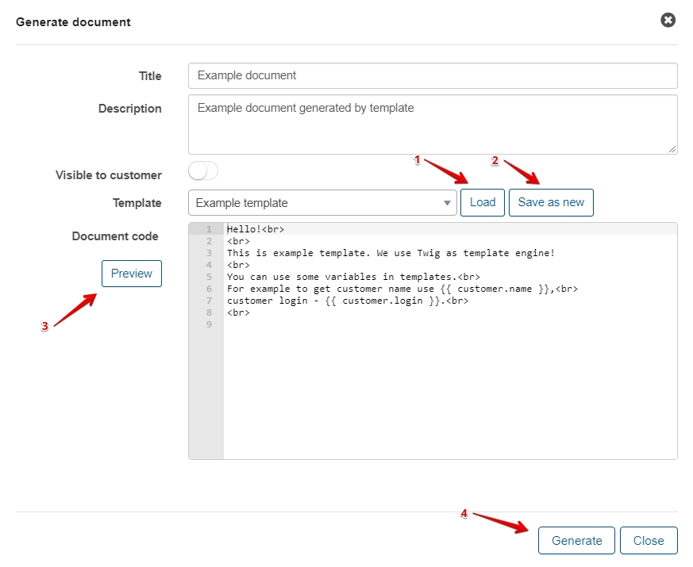

Documents
=====
The documents section of leads can be accessed on the lead's page. Here we can upload all documents pertaining to the lead eg. documentation, contracts, NDA, agreements.

We have two options to create document entries into Splynx.

1. Uploading documents - simply click on upload - Add the title with optional description, whether the document should be visible to the customer within their portal and finally upload the document via the File upload button 

2. Generate documents - We can generate documents via **loading** predefined templates in the system or generate a document and **save as new** template. We can also **preview** the document before finally generating it. (Template configuration is covered [here](configuration/system/templates/templates.md))

Finally once we have uploaded/generated the document we have the option to either **Edit**, **View**, **Download**, **Send** or **Delete** the document.

