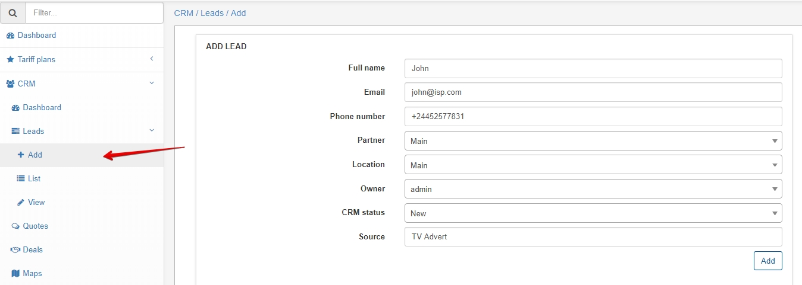
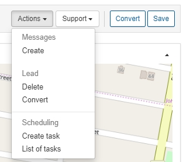
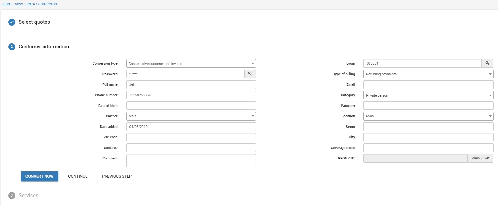
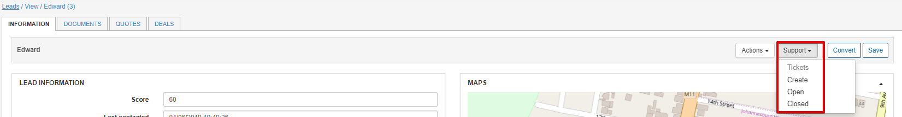

Leads
=======
A lead is a person or business who may eventually become a client. Leads are the central part of the CRM that binds all other functions together.

Our first step is to **Add a new lead** - here we will specify all the details pertaining to the client including their lead information (Owner, CRM Status and Source). The client information will be used when converting them to a customer.

The leads list is where we'll find a complete list of all "My leads" (default view) - these are the leads which the current administrator is the owner of.

We can change the view of the leads by selecting a view from the drop down list. We also have the option to filter leads according to several fields in the filter tab 

Next we can view a lead by clicking on their full name/ID - this will open the lead viewing page where we can define all the details relevant to the lead.

In the leads information page all details will be entered as per a normal customer except information regarding to service.

CRM specific details:
- Score - A scoring function that can be used to score leads based on popularity.
- Last contacted - time and date feature to record last contacted instance.
- CRM status - Status of lead (Can be customized withing Config / CRM / Lead Stages)
- Owner - the administrator who is responsible for the leads.
- Source - Where the lead originates from.
- Notification - Notifications for lead (sent to the administrator) also shows as upcoming follow-up on the dashboard.

We can also view all changes made to the lead in the recent activities tab at the bottom of the page. Comments can also be added with customizable icons/color schemes.

In the **actions** drop-down we can access the following functions:
- Creating a message which will be sent to the customer (can be processed with preconfigured template)
- Delete the lead
- Convert the lead - See conversion process below
- Create task - Create a task related to the lead (directs to [scheduling a task](scheduling/scheduling.md))
- List of tasks - List all tasks related to lead

## Converting a customer

Our main goal within the CRM is to convert potential leads into customers that use our services.

By accessing the actions tab we can choose to convert the lead.

This will start the conversion process which consists of three steps.

1. **Select the quote/s** that will be used to create the customer's services.

2. Edit customer information - here we can choose which type of conversion we want to use, `create active customer and invoice` or `create inactive customer and proforma invoice`. We can choose to convert within this step or continue to add services.

3. The final step will allow us to edit the services we selected in step 1.
Once all details have been entered we can finish by converting the customer.

The leads concept is also linked to the support system whereby you can log new tickets on behalf of the customer or view their open or closed tickets linked to them. You can do this by navigating to the Support drop-down as shown below:

