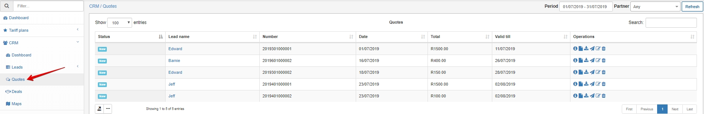
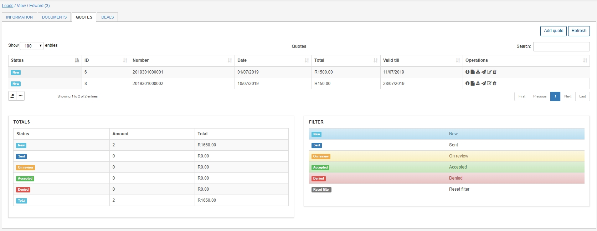

Quotes
=======
A quote is a document provided to a lead to inform them of the cost of a service/s before they decide to purchase it.

To view a list of all quotes, simply click on the Quotes menu in the sidebar. Here we can see the Operations panel where we have multiple actions to choose from - *view*, *view PDF*, *download PDF*, *send*, *edit* or *delete*.

Quotes per lead can be accessed by navigating to the Quotes tab on the leads page. Here we can see a list of all quotes generated, a summary of the total value of the quotes and a filter section where we can filter out the quotes we are looking for.

To add a quote we should click on the `Add quote` button in the top right-hand corner.

When adding a quote we are presented with the pop-up window below:

Here we can edit the following fields:
- **Status** - New, Sent, On review, Accepted or Denied
- **Date** of the quote
- **Quote number** - (Pattern/format can be changed under Config / CRM / Finance)
- **Valid till** - Default is 10 days (Can be changed under Config / CRM /Finance)
- **Note**
- **Memo**
- **Create deal** - Enable/Disable to create deal from the quotes

From here we can select the  icon to choose a service to add to the quote. We can also add multiple services by selecting the "+" icon. Services can also be re-ordered by dragging and dropping the services to the selected position.

Once we have created the quote we can navigate to the Operations panel where we have multiple actions to choose from - *view*, *view PDF*, *download PDF*, *send*, *edit* or *delete*. Quote templates can be edited [here](configuration/system/templates/templates.md)
