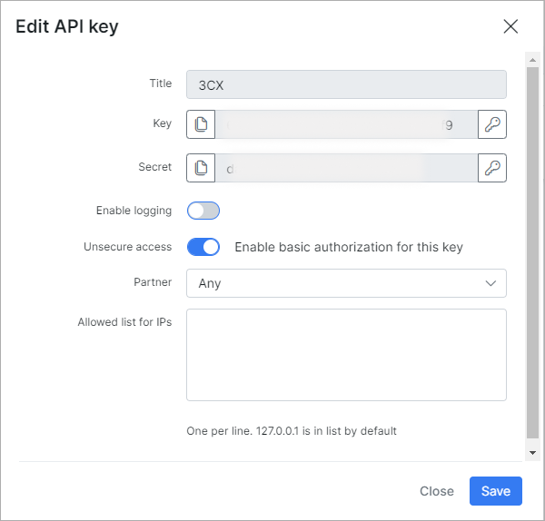

3CX add-on
========

*3CX* is the add-on module designed for the integration your Splynx with [3CX service](https://www.3cx.com/call-center/crm-integration/) via the server-side CRM integration engine and its own API. The add-on creates the API key/secret with the necessary permissions and entry point in Splynx in order to download the generated XML configuration file.

To install the add-on use one of the two methods: via CLI on the Splynx server or via the Splynx Web UI.

To install the add-on via CLI, the following commands can be used:

```bash
apt-get update  
apt-get install splynx-3cx
```

To install the add-on from the Web UI:

Navigate to `Config → Integrations → Add-ons`:


Find there the "splynx-3cx" add-on and click on the install icon in the *Actions* column of the table


Then, click on the "OK, confirm" button to begin the installation process


Once the installation process has completed, all configurations for the add-on can be found in `Config → Modules → List`, simply click on the necessary icon of the module and you will be able to change settings of the add-on


## Using the 3CX module

After add-on installation in your Splynx system will be created [API key/secret](administration/main/api_keys/api_keys.md) (unsecure access unabled) with such permissions:

|Customers|
|:-----------:|
|**Customer:** Add, View; **Customer notes:** Add|

|CRM|
|:-----------:|
|**Leads:** Add, View; **Leads notes:** Add|




And, in `Config → Integrations`, you can find the *3CX* section with the link to download the generated `splynx.xml` file


Use any text editor to open the downloaded `splynx.xml` file, specify the necessary values, e.g. your Splynx domain, API key/secret etc. and save the changes. Use XML file for integration procedure.


More information about the integration and XML file structure can be found on the following links: https://www.3cx.com/docs/crm-integration/ ; https://www.3cx.com/docs/server-side-crm-template-xml-description/ .
