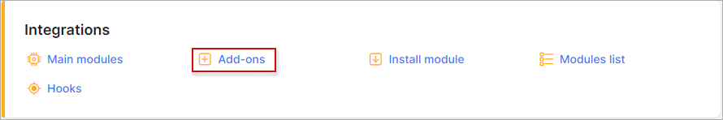
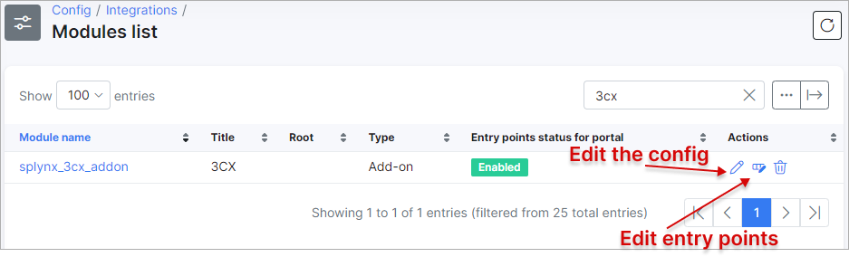
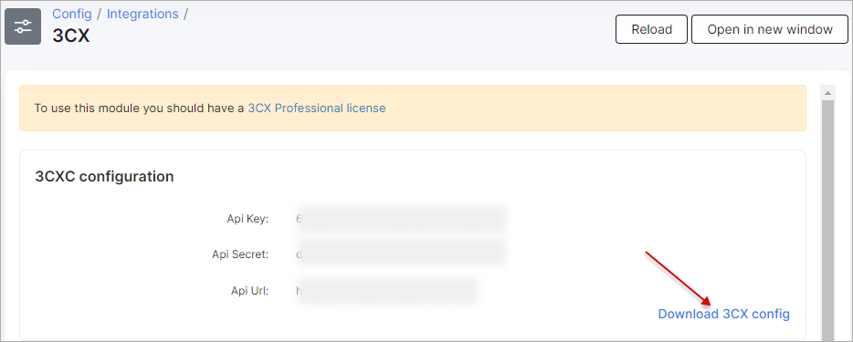
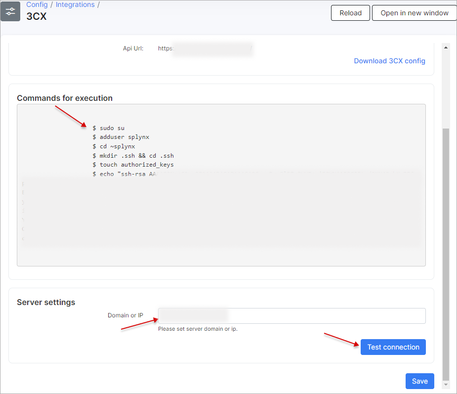
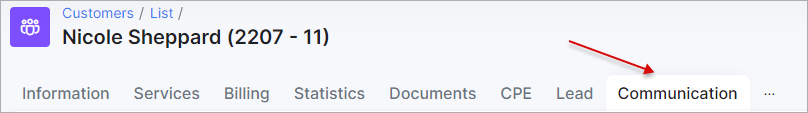

3CX add-on
========

*3CX* is the add-on module designed for the integration your Splynx with [3CX service](https://www.3cx.com/call-center/crm-integration/) via the server-side CRM integration engine and its own API. 3CX add-on simplifies the calls management in Splynx, as a result, we have a complete call history in relation to the specific customer, it's possible to listen, download the recorded files, add the comment to the call, to link/unlink call to the ticket etc.

**Note:** **3CX server is required to be installed on separate/cloud server.**
More information you can find using these links:
- https://www.3cx.com/3cxacademy/videos/basic/installing/
- https://www.3cx.com/3cxacademy/videos/basic/installing/

To install the add-on use one of the two methods: via CLI on the Splynx server or via the Splynx Web UI.

To install the add-on via CLI, the following commands can be used:

```bash
apt-get update  
apt-get install splynx-3cx
```

To install the add-on from the Web UI:

Navigate to `Config → Integrations → Add-ons`:



Find there the "splynx-3cx" add-on and click on the install icon in the *Actions* column of the table


Then, click on the "OK, confirm" button to begin the installation process


Once the installation process has completed, all configurations for the add-on can be found in `Config → Modules → List`, simply click on the necessary icon of the module and you will be able to change settings of the add-on



In add-on configuration you can set the absolute **path to the record's folder**, by default it's `/var/lib/3cxpbx/Instance1/Data/Recordings/`.


## Using the 3CX module

After add-on installation in your Splynx system will be created the [API key and its secret](administration/main/api_keys/api_keys.md) (an `Unsecure access` is enabled by default) with such permissions:

|Customers|
|:-----------:|
|**Customer:** Add, View; **Customer notes:** Add|

|CRM|
|:-----------:|
|**Leads:** Add, View; **Leads notes:** Add|


And, in `Config → Integrations`, you can find the **3CX** section

with the link to download the generated XML configuration file - `splynx.xml`. It has a specific structure that is used for integration purposes.

Suggested read: [CRM Template XML Description](https://www.3cx.com/docs/server-side-crm-template-xml-description/#h.ydml7w97b24x).




Save the XML file, it will be used for the CRM integration procedure.

Let's perform the first time configuration of the 3CX system:

1. [Sign up](https://www.3cx.com/ordering/pricing/) on the 3CX web page with preferred price choice

2. Choose the location for the 3CX system, write down your license key and follow the required installation steps. Open the IP of the machine 3CX is installed on followed by port `5015` in a browser, e.g. `https://<IP_address>:5015`. The *3CX Web Configuration Tool* guides you through important network and security settings.

Check the following links for more details:

- [Installing 3CX using ISO (Debian)](https://www.3cx.com/docs/manual/configuring-your-pbx/)
- [Installing 3CX on Windows](https://www.3cx.com/docs/manual/phone-system-installation-windows/)
- [Using Hyper-V to host your 3CX](https://www.3cx.com/docs/installing-microsoft-hyper-v/)
- [Hosting 3CX on Google Cloud](https://www.3cx.com/docs/hosted-pbx-google-cloud/)
- [Hosting 3CX on Amazon AWS](https://www.3cx.com/docs/cloud-pbx-amazon-aws/)
- [Hosting 3CX on Amazon Lightsail](https://www.3cx.com/docs/hosted-pbx-amazon-lightsail/)
- [Hosting 3CX on Microsoft Azure](https://www.3cx.com/docs/hosting-pbx-phone-system-microsoft-azure/)
- [How to access for Self Hosted Instances via SSH](https://www.3cx.com/docs/self-hosted-instances-ssh/)


3. Once the 3CX system installation has finished, open the *3CX Management console* via `https://<domain/IP>:5001`  


4. In order to connect Splynx to the **3CX** server, please execute one by one the commands which are listed in `Config → Integration → 3CX`on the the server with **3CX** system.



<details style="font-size: 15px; margin-bottom: 5px;">
<summary><b>Example of commands</b></summary>
<div markdown="1">


```
sudo su
adduser splynx
cd ~splynx
mkdir .ssh && cd .ssh
touch authorized_keys
echo "ssh-rsa rsa_key_value= splynx@base" >> "authorized_keys"
```

</div>
</details>

The permission and owner to **.ssh** folder should be the next `drwxr-xr-x  2 root   root   4096 Sep 15 08:40 .ssh`.

Type the IP address or domain name of your **3CX** system in **Domain or IP** field and press the **Test Connection** button to check the connection. Press **Save** button in order to save the entered IP address or domain name.


5. To upload your XML file to 3CX system, click on `Settings → CRM Integration` and follow the required CRM integration steps as shown on the screenshots.


- Click the **Add** button to upload the XML file:


- After that, fill in the **API Key/Secret/URL** values in the required fields:


- Then, scroll down and enable the **Call Journaling** and **Contract Creation** option blocks:


- And press the **Test** button to check the CRM configuration.

- To check the creation of contacts, try dialing a number and click on the **Contacts** item on the sidebar and enter the phone number to search in CRM:


More information about the integration can be found on the following link: https://www.3cx.com/docs/crm-integration/

6. Install [iOS](https://apps.apple.com/us/app/3cx-communications-system/id992045982), [Android](https://play.google.com/store/apps/details?id=com.tcx.sipphone14) or [Windows](https://www.3cx.com/user-manual/installation-windows/) app, navigate to your [3CX Web Client](https://www.3cx.com/user-manual/web-client/) via `https://<domain/IP>/webclient`, log in using the extension number and password from your email letter and click on *Activate your 3CX Browser Extension*, in the top left-hand corner of the Web Client click *Allow Notifications* to enable desktop notifications, you will see the blue phone icon in the extensions bar in your browser. Click on the icon to open the Browser Extension pop out window.
Now you can quickly and easily make and receive calls from your desktop without needing to open the full Web Client. Moreover, you can call to customers directly from Splynx.


The calls history with its directions can be found in customer's profile, **Communications** tab



The player to listen the call will be visible if the add-on receives `voice_file_url` value. In case we use the 3d-party add-on that receives only `recording_url`, the link (`Recording: <link>`) to listen/download the file will appear instead.

To each call item in the list the description message can be added, the call can be link to the existing ticket in Splynx, if the ticket is closed, it will be reopened automatically.


