FatturaPA
=========

FatturaPA is a Splynx add-on that allows the exporting of Splynx invoices in xlm format, which can then be exported to the system of electronic invoices.

The add-on can be installed in two methods, via CLI or via the Web UI.

To install the "splynx-fatturapa" add-on via CLI, the following commands can be used:

```bash
sudo apt update
sudo apt install splynx-fatturapa
```
To install it via the Web UI:

Navigate to *Config -> Integrations -> Add-ons:*

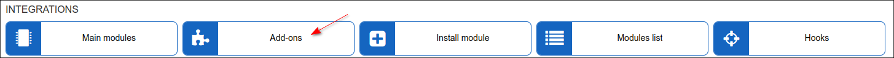

Locate or search for the "splynx-fatturapa" add-on and click on the install icon in the *Actions* column:

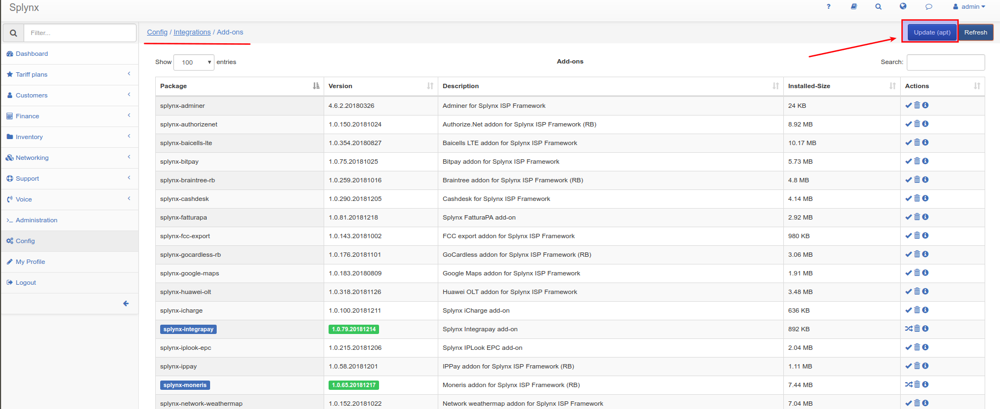

Click on the "OK, confirm" button to begin the installation process:

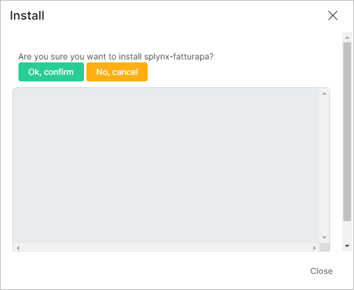

After the installation has completed, it is necessary to configure the add-on under *Config / Integrations / Modules list / splynx_fatturapa*  using the edit <icon class="image-icon"></icon> icon.

This process is illustrated in the images below:

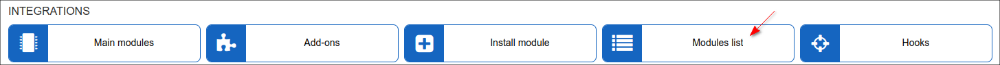

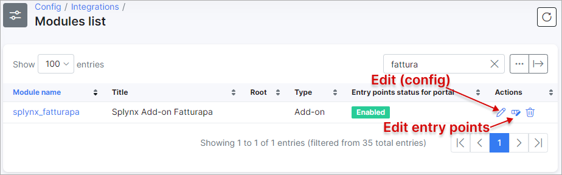

Select a partner to configure:

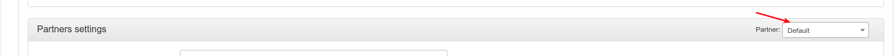

The configure the partner parameters:

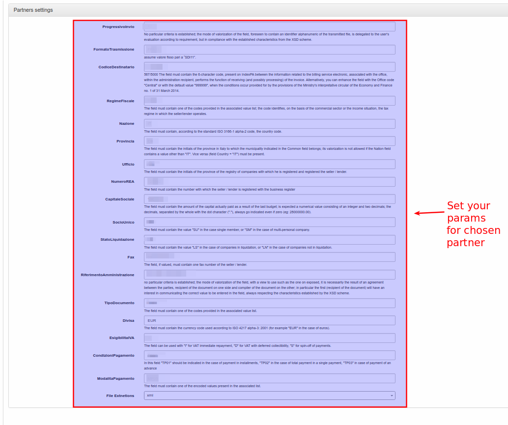

**ProgressivoInvio** - No particular criteria is established; the mode of valorization of the field, foreseen to contain an identifier alphanumeric of the transmitted file, is delegated to the user's evaluation according to requirements, but in compliance with the established characteristics from the XSD scheme.

**FormatoTrasmissione** - assumes a fixed value equal to "SDI11".

**CodiceDestinatario** - 567/5000 The field must contain the 6-character code, present on IndexPA between the information related to the billing service electronics, associated with the office, within the administration recipient, performs the function of receiving (and possibly processing) of the invoice. Alternatively, you can enhance the field with the Office code "Central" or with the default value "999999", when the conditions occur provided for by the provisions of the Ministry's interpretative circular of the Economy and Finance no. 1 of 31 March 2014.


**RegimeFiscale** - The field must contain one of the codes provided in the associated value list; the code identifies, on the basis of the commercial sector or the income situation, the tax regime in which the seller/lender operates.

**Nazione** - The field must contain, according to the standard ISO 3166-1 alpha-2 code, the country code.

**Provincia** - The field must contain the initials of the province in Italy to which the municipality indicated in the Common field belongs; its valorization is not allowed if the Nation field   contains a value other than "IT". Vice versa (field Country = "IT") must be present.

**Ufficio** - The field must contain the initials of the province of the registry of companies with which he is registered and registered the seller / lender.

**NumeroREA** - The field must contain the number with which the seller / lender is registered with the business register

**CapitaleSociale** - The field must contain the amount of the capital actually paid as a result of the last budget; is expected a numerical value consisting of an integer and two decimals; the decimals, separated by the whole with the dot character ("."), always go indicated even if zero (eg: 28000000.00).

**SocioUnico** - The field must contain the value "SU" in the case single member, or "SM" in the case of multi-personal company.

**StatoLiquidazione** - The field must contain the value "LS" in the case of companies in liquidation, or "LN" in the case of companies not in liquidation.

**Fax** - The field, if valued, must contain one fax number of the seller / lender.

**RiferimentoAmministrazione** - no particular criteria is established; the mode of valorization of the field, with a view to use such as the one on exposed, it is necessarily the result of an agreement between the parties, recipient of the document on one side and compiler of the document on the other; in particular the first (recipient of the document) will have an interest in communicating the correct value to be entered in the field, always respecting the characteristics established by the XSD scheme.

**TipoDocumento** - The field must contain one of the codes provided in the associated value list.

**Divisa** - The field must contain the currency code used according to ISO 4217 alpha-3: 2001 (for example "EUR" in the case of euros).

**EsigibilitaIVA** - The field can be used with "I" for VAT immediate repayment, "D" for VAT with deferred collectability, "S" for spin-off of payments.

**CondizioniPagamento** - In this field "TP01" should be indicated in the case of payment in installments, "TP02" in the case of total payment in a single payment, "TP03" in case of payment of an advance

**ModalitaPagamento** - The field must contain one of the encoded values present in the associated list.

You also have to configure the partner settings under *Config/System/Company Information*

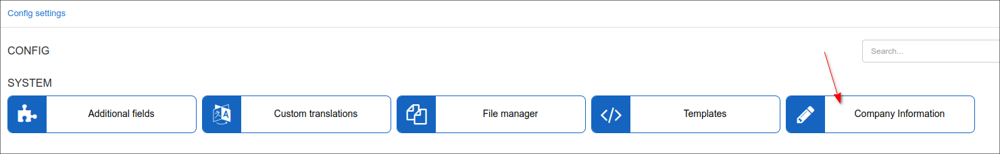


**Company name** - required

**Street** - required

**ZIP Code** - required

**City** - required

**Email** - required

**Phone** - required

**VAT number** - required (format must be like - IT11111111111)

**VAT %** - required

**Bank Account** - required

**Bank name** - required

Thereafter, you need to set up the *Customer additional fields* for customers whose invoices you will export, as depicted below:

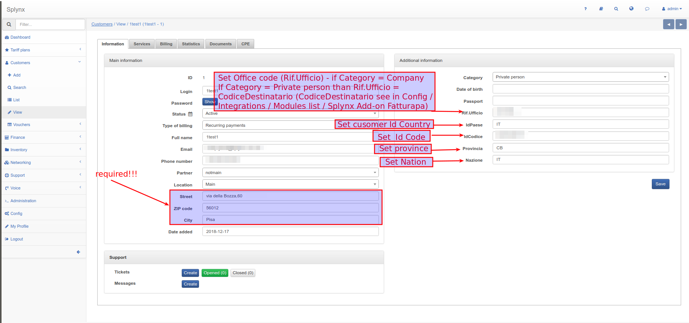

**Fields: _Street, ZIP code and City_ in _customers information_ must be set!!!**

**IdPaese** - required  (format must be like - IT)

**IdCodice** - required (format must be like - 00071090303)

**Provincia** - required (format must be like - CB)

**Nazione** - required (format must be like - IT)

**Rif.Ufficio** - required (if Category = Private person then _Rif.Ufficio = CodiceDestinatario_ (_CodiceDestinatario_ can be viewed in _Config / Integrations / Modules list / Splynx Add-on Fatturapa_
), if Category = Company then set your Office code here)

Once you've Installed and configured the _splynx-fatturapa_ add-on, you can navigate to _Administration / Reports / Fatturapa Export_ and export invoices in XML format, as depicted below:

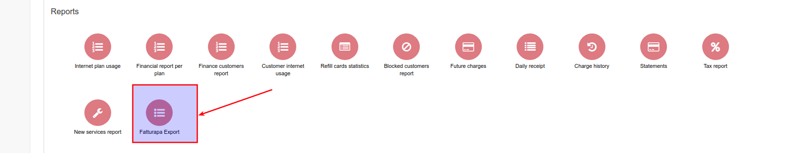

Click the following button <icon class="image-icon"></icon> and set filter to export. Then click "Export" button.

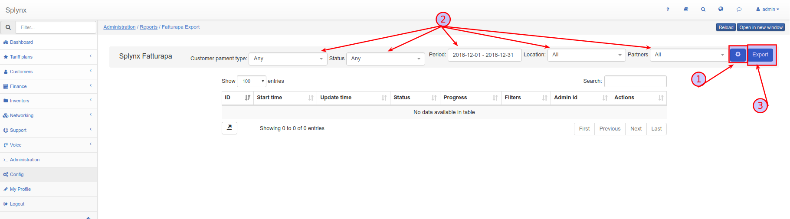

If the process completed successfully, you will see the new record in the Fatturapa table with the possibility to download an archive with invoices in XML format.

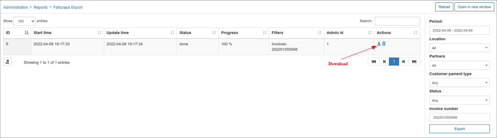

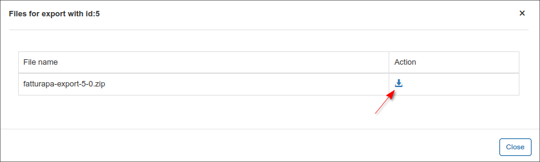

If an error occurred, you will see a new record in the table with an exclamation mark in the "Actions" column. Click the following button <icon class="image-icon"></icon> to see invoices that were not exported with a description for the error

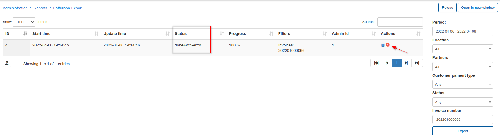

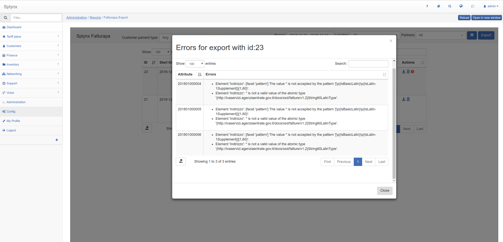
