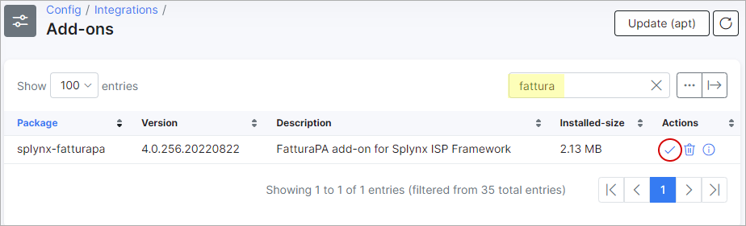
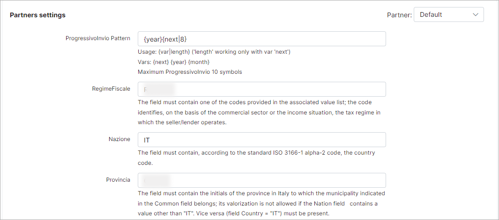
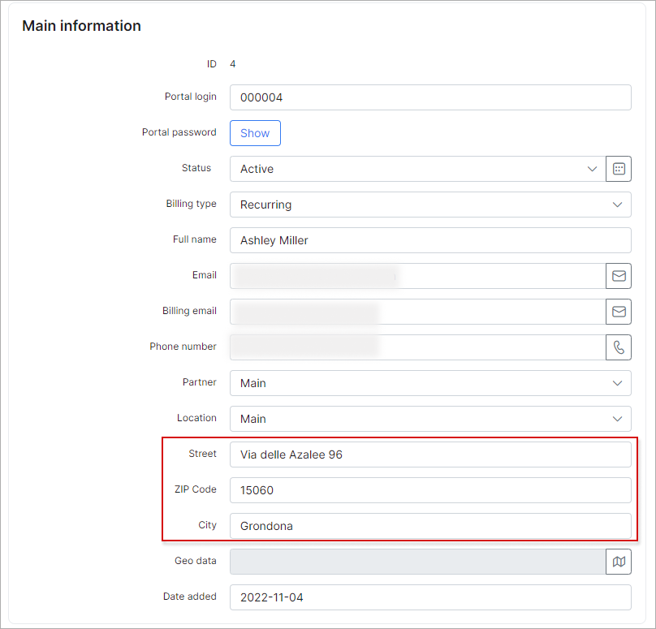
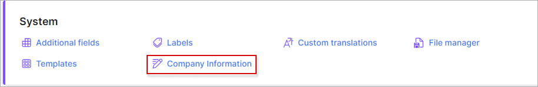

FatturaPA
=========

FatturaPA is a Splynx add-on that **enables the export of Splynx invoices into XML format**, which can then be imported into an electronic invoice system.


The add-on **can be installed in two methods**: via **CLI** or via the **Web UI**.

To install the `splynx-fatturapa` add-on via **CLI**, the following commands can be used:

```bash
sudo apt update
sudo apt install splynx-fatturapa
```
To install it via the **Web UI**, navigate to `Config → Integrations → Add-ons`:


Locate or search for the `splynx-fatturapa` add-on, and click the *Install* icon in the *Actions* column:



Click the `OK, confirm` button to begin the installation process:


After the installation has been completed, it is necessary to configure the add-on under `Config → Integrations → Modules list` with the *Edit* <icon class="image-icon"></icon> icon:


Enable the [Entry points](configuration/integrations/modules_list/modules_list.md) display and select a [Partner](administration/main/partners/partners.md) (optional) to configure:

<icon class="image-icon"></icon> **NOTE:**

- In case in Splynx system is used the multiple partners scheme, you can divide FatturaPA configuration between them. Create a new partner in Splynx, in FatturaPA config select the necessary partner and set the required settings;

- The fields marked with `*` sign have different values from the original ones (original values are related to the **Default** partner).


Once the required *Partner* is selected, click `Save` at the bottom of the page.

**Partners settings**



- **ProgressivoInvio Pattern** - the max field length is 10 symbols. Usage: ``` {var|length} ``` (where the value `length` only works with the **var** type of the `next` value). Available variables: ```{next} {year} {month}```. By default is used: ```{year}{next|8}```. 
The method of validating the field, intended to include an alphanumeric identifier of the transmitted file, is left to the user's assessment based on requirements, while adhering to the established characteristics outlined in the XSD scheme.

- **RegimeFiscale** - the field must contain one of the codes provided in the corresponding list of values. These codes identify the tax regime in which the seller/creditor operates based on their commercial sector or income situation;

- **Nazione** - the field must contain the country code according to the ISO 3166-1 alpha-2 standard;

- **Provincia** - the field must contain the initials of the province in Italy to which the municipality indicated in the Common field belongs. Its valorization is not allowed if the Nation field contains a value other than `IT`. Vice versa, if the Country field is `IT`, it must be present.


- **Ufficio** - the field must include the initials of the province where the seller/lender is registered and listed in the company registry;

- **NumeroREA** - the field must contain the number under which the seller/creditor is registered in the business register;

- **CapitaleSociale** - the field must contain the amount of the capital actually paid as a result of the last budget. A numerical value is expected, consisting of an integer and two decimal places. The decimal numbers, separated from the integers by a dot character (.), must always be specified, even if the value is zero (for example: 28000000.00);

- **SocioUnico** - the field must contain the value `SU` in the case of a single-member company or `SM` in the case of a multi-personal company;

- **StatoLiquidazione** - the field must contain the value `LS` for companies in liquidation or `LN` for companies not in liquidation;


- **Fax** - the field must contain one fax number of the seller/lender if it is valued;

- **RiferimentoAmministrazione** - no particular criteria are established for the mode of valorization of the field, which is intended for use as described. It is necessarily the result of an agreement between the parties involved: the recipient of the document and the compiler of the document. Specifically, the recipient of the document (the first party) will have an interest in communicating the correct value to be entered in the field, while always respecting the characteristics established by the XSD scheme;

- **TipoDocumento** - the field must contain one of the codes provided in the associated value list;

- **Divisa** - The field must contain the currency code used according to ISO 4217 alpha-3: 2001 (for example, `EUR` in the case of euros);

- **CondizioniPagamento** - in this field you should specify `TP01` in the case of payment in installments, `TP02` in the case of full payment in a single payment, and `TP03` in the case of payment in advance;

- **ModalitaPagamento** - the field must contain one of the encoded values present in the associated list;

- **File Extnetions** - available values: `xml` or `xml.p7m`;

- **Get name from this field for business customers** - use this setting only for customers related to the business category. The available values are `Full name` or `Company ID`. This setting determines which value will be used in the exported XML. If a customer profile is of the **Business** type and the **Company ID** field is not empty (usually containing the company name), the FatturaPA add-on will use the value from the **Company ID** field instead of the **Full name** field when exporting invoices. Conversely, if the **Company ID** field does not have a value, the **Full name** field value will be used.

- **Natura** - choose a code used to indicate the nature of the goods or services being invoiced.

<details style="font-size: 15px; margin-bottom: 5px;">
<summary><b>Example</b></summary>
<div markdown="1">

If the **Category** field = `Business` and the **Company ID** field is not empty, use the **Company ID** value instead of the **Company name** one.


In the XML file in the `CessionarioCommittente` block the `Denominazione` field must correspond to the `Company ID` value.


</div>
</details>
<br>


<icon class="image-icon"></icon> Before getting started, you need to fill out the customer **additional fields** for customers (individual or business category) whose invoices you are going to export.

Under the **Main information** block:



- the fields **Street**, **ZIP code** and **City** under the *Information* tab of customer profile must be set;

Under the **Additional information** block:


- **IdPaese** - required  (format must be like - IT)
- **P.IVA** - required
- **Provincia** - required  (format must be like - CB)
- **Nazione** - required (format must be like - IT)
- **CodiceDestinatario** - required
- **PEC** - required

_________________________

Additionally, please ensure that the **Company Information** fields under `Config → System → Company Information` are accurately filled out with values that are relevant to the required *Partner*.




- **Company name** - required
- **Street** - required
- **ZIP Code** - required
- **City** - required
- **Email** - required
- **Phone** - required
- **VAT number** - required (format must be like - *IT11111111111*)
- **VAT %** - required
- **Bank Account** - required
- **Bank name** - required

---

Once you've installed and configured the FatturaPA add-on, you can navigate to `Administration → Reports → Fatturapa Export` and export invoices in XML format, as shown below:


To set the necessary parameters, use the filter located on the right sidebar. Once you have set the parameters, click the `Export` button.

If the process is completed successfully, you will be able to see the new record in the FatturaPA table and download an archive containing invoices in XML format.

If there was an error, you will see a new entry in the table with an exclamation mark in the *Actions* column. Click the following icon <icon class="image-icon"></icon> to view invoice (-s) that have not been exported, with a description of the error:


