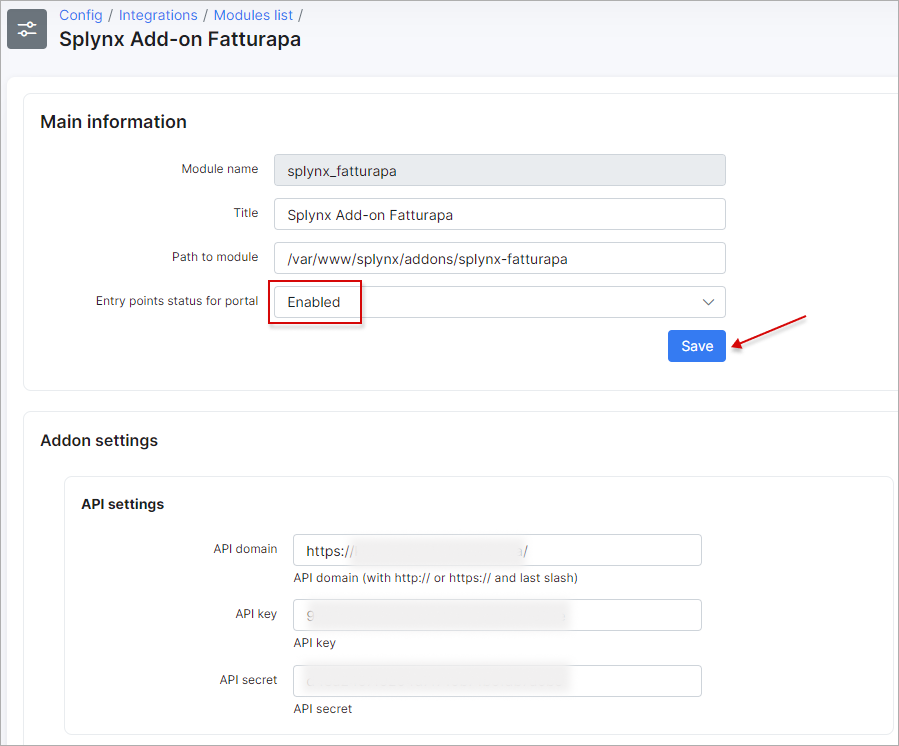
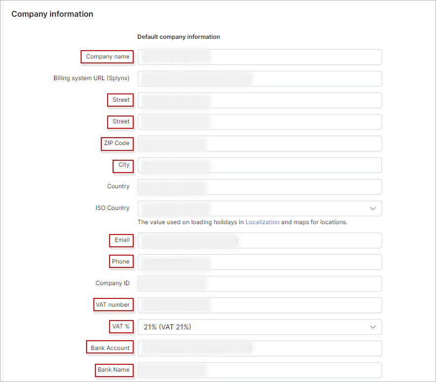
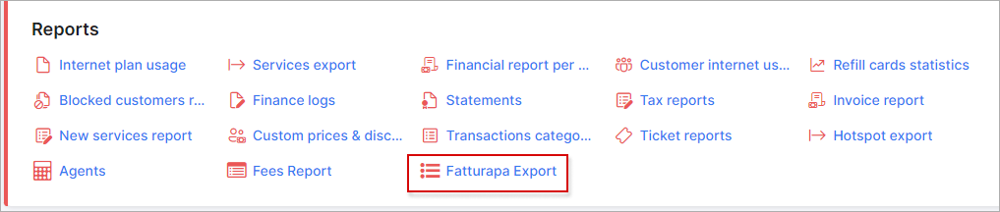
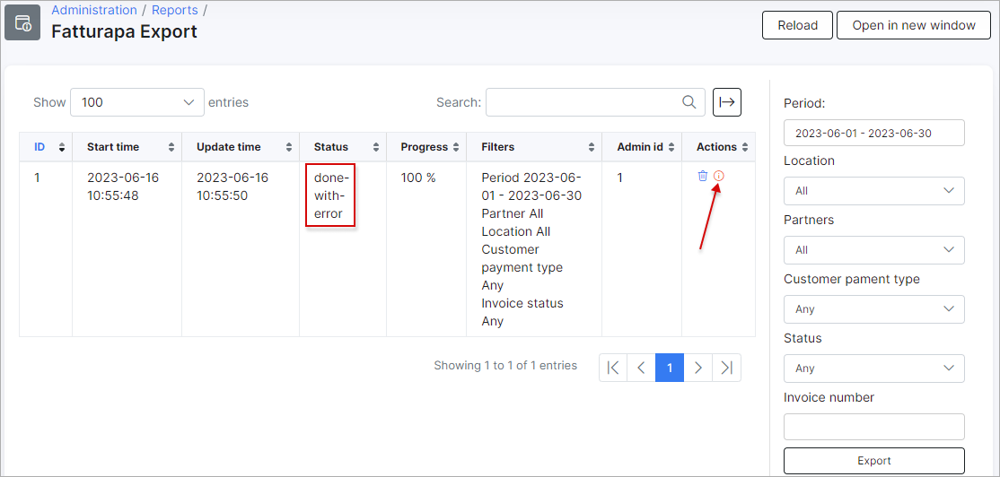

FatturaPA
=========

FatturaPA is a Splynx add-on that **allows Splynx invoices to be exported into XML format**, which can then be exported into an electronic invoice system.


The add-on **can be installed in two methods**, via **CLI** or via the **Web UI**.

To install the `splynx-fatturapa` add-on via **CLI**, the following commands can be used:

```bash
sudo apt update
sudo apt install splynx-fatturapa
```
To install it via the **Web UI**:

Navigate to `Config → Integrations → Add-ons`:


Locate or search for the `splynx-fatturapa` add-on and click on the install icon in the *Actions* column:


Click on the **OK, confirm** button to begin the installation process:


After the installation has completed, it is necessary to configure the add-on under `Config → Integrations → Modules list → splynx_fatturapa`  using the edit <icon class="image-icon"></icon> icon.

This process is illustrated in the images below:


Turn on the [Entry points](configuration/integrations/modules_list/modules_list.md) display and select a [Partner](administration/main/partners/partners.md) (optional) to configure:

<icon class="image-icon"></icon> **NOTE:**

- In case in Splynx system is used the multiple partners scheme, you can divide FatturaPA configuration between them. Create a new partner in Splynx, in FatturaPA config select the necessary partner and set the required settings;

- The fields marked with ***** sign have the different values from original ones (original values are related to **Default** partner).



Once the required *Partner* is selected, click **Save** at the bottom of the page.


**Partners settings**


- **ProgressivoInvio Pattern** - the max field length is 10 symbols. Usage: ``` {var|length} ``` (where the value `length` only works with the **var** type of the `next` value). Available variables: ```{next} {year} {month}```. By default is used: ```{year}{next|8}```. The mode of valorization of the field, foreseen to contain an identifier alphanumeric of the transmitted file, is delegated to the user's evaluation according to requirements, but in compliance with the established characteristics from the XSD scheme;

- **RegimeFiscale** - the field must contain one of the codes provided in the corresponding list of values; the code identifies, based on the commercial sector or income situation, the tax regime in which the seller/creditor operates;

- **Nazione** - the field must contain, according to the standard ISO 3166-1 alpha-2 code, the country code;

- **Provincia** - the field must contain the initials of the province in Italy to which the municipality indicated in the Common field belongs; its valorization is not allowed if the Nation field  contains a value other than `IT`. Vice versa (field Country = `IT`) must be present;

- **Ufficio** - the field must contain the initials of the province of the company registry in which the seller/lender is registered and listed;

- **NumeroREA** - the field must contain the number under which the seller / creditor is registered in the business register;

- **CapitaleSociale** - the field must contain the amount of the capital actually paid as a result of the last budget; is expected a numerical value consisting of an integer one and two decimals; the decimal numbers separated from integers by a dot character (**.**) must always be specified, even if it is a zero value (for example: 28000000.00);

- **SocioUnico** - the field must contain the value `SU` in the case single member, or `SM` in the case of multi-personal company;

- **StatoLiquidazione** - the field must contain the value `LS` in the case of companies in liquidation, or `LN` in the case of companies not in liquidation;

- **Fax** - the field, if valued, must contain one fax number of the seller / lender;

- **RiferimentoAmministrazione** - no particular criteria is established; the mode of valorization of the field, with a view to use such as the one on exposed, it is necessarily the result of an agreement between the parties, recipient of the document on one side and compiler of the document on the other; in particular the first (recipient of the document) will have an interest in communicating the correct value to be entered in the field, always respecting the characteristics established by the XSD scheme.

- **TipoDocumento** - the field must contain one of the codes provided in the associated value list;

- **Divisa** - The field must contain the currency code used according to ISO 4217 alpha-3: 2001 (for example `EUR` in the case of euros);

- **CondizioniPagamento** - in this field you should specify `TP01` in the case of payment in installments, `TP02` in the case of full payment in one payment, `TP03` in case of payment in advance;

- **ModalitaPagamento** - the field must contain one of the encoded values present in the associated list;

- **File Extnetions** - available values: `xml` or `xml.p7m`;

- **Get name from this field for business customers** - use this setting only for customers related to the business category. Available values: `Full name` or `Company ID`. It defines what value will be used in exported XML. If a customer profile is of **Business** type and **Company ID** field is not empty (in most cases this field contains company name), then when exporting invoices, the FatturaPA add-on will use value from the **Company ID** field instead of the **Full name** field value. On the other hand, if there is no value in the **Company ID** field, then the value from the **Full name** field will be used. <!-- SAFAT-28 -->

<details style="font-size: 15px; margin-bottom: 5px;">
<summary><b>Example</b></summary>
<div markdown="1">

If the **Category** field = `Business` and the **Company ID** field is not empty, use the **Company ID** value instead of **Full name** one.


In the XML file in the `<CessionarioCommittente>` block the `<Denominazione>` field must correspond to the value `Company ID`.


</div>
</details>
<br>


<icon class="image-icon"></icon> **IMPORTANT:**

Before getting started, you need to fill out the customer **additional fields** for customers (individual or business category) whose invoices you are going to export:


Under the **Main information** block:

- the fields **Street**, **ZIP code** and **City** under the *Information* tab of customer profile must be set;

Under the **Additional information** block:

- **IdPaese** - required  (format must be like - IT)
- **P.IVA** - required
- **Provincia** - required  (format must be like - CB)
- **Nazione** - required (format must be like - IT)
- **CodiceDestinatario** - required
- **PEC** - required


Also, make sure that the **Company Information** fields under `Config → System → Company Information` are correctly filled out and its values are related to the required *Partner*:




- **Company name** - required
- **Street** - required
- **ZIP Code** - required
- **City** - required
- **Email** - required
- **Phone** - required
- **VAT number** - required (format must be like - *IT11111111111*)
- **VAT %** - required
- **Bank Account** - required
- **Bank name** - required

---


Once you've installed and configured the FatturaPA add-on, you can navigate to `Administration → Reports → Fatturapa Export` and export invoices in XML format, as depicted below:



Use the filter on the right sidebar to set the necessary parameters. Then click the **Export** button.

If the process is completed successfully, you will see the new record in the Fatturapa table with the possibility to download an archive with invoices in XML format.


If there was an error, you will see a new entry in the table with an exclamation mark in the *Actions* column. Click the following icon <icon class="image-icon"></icon> to view invoice (-s) that have not been exported, with a description of the error




