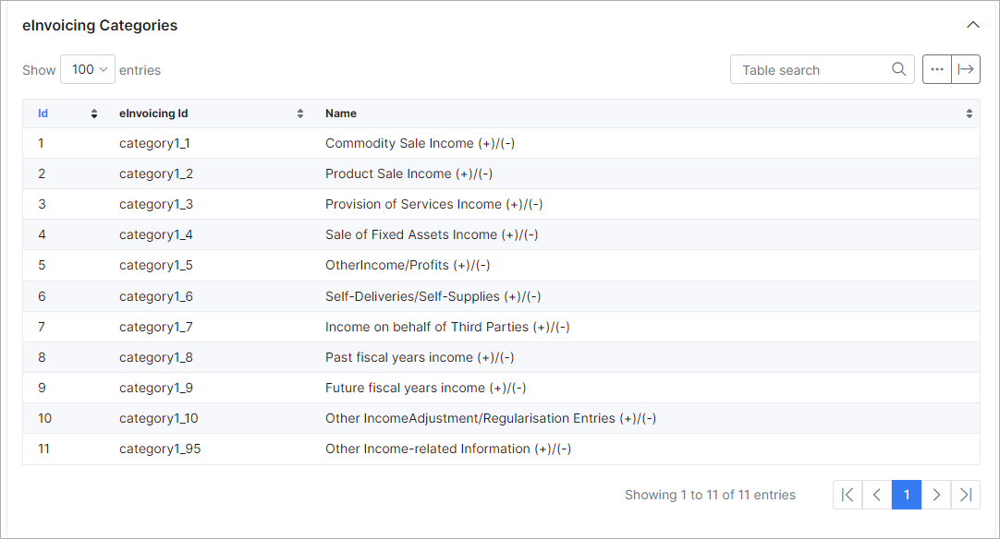
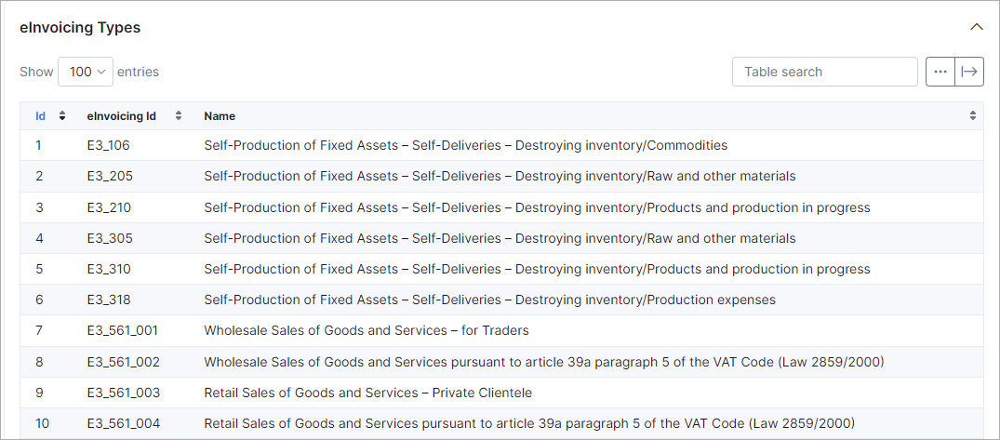
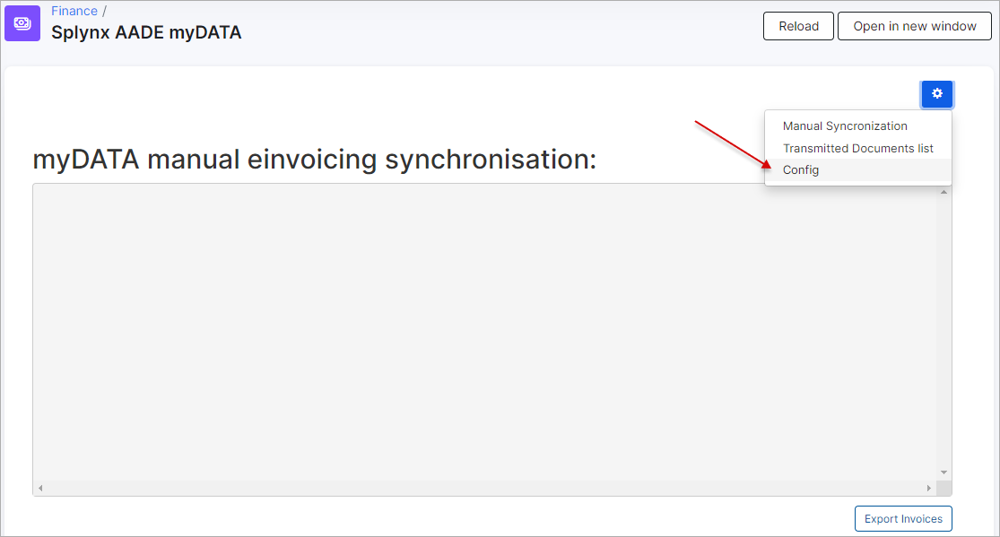

AADE MyData integration (for Greece)
=============================================

This module was designed to help our clients from Greece synchronize invoices in Splynx with AADE myData service as per government requirements.

To install this module navigate to `Config -> Integrations -> Add-ons` and find "splynx-aade-gr" module and install it:

Once this done navigate to `Config -> Integrations -> Modules list` for initial setup:

and click on edit button under the module:

Here you should specify AADE myData API parameters:

* **Username** - registered aade-user-id ;

* **Subscription key** - Ocp-Apim-Subscription-Key.

Also you should configure synchronization settings:

* **Partners ignore list** - select partners which will be ignored through synchronization process;

* **VAT number** - specify your registered VAT number;

* **Issuer country** - GR for Greece;

* **Issuer branch** - If the branch is headquarters or doesn't exist, the branch field must have a value of 0;

* **Invoice series** - Mandatory for some invoice types. "A" by default;

* **VAT Exemption Cause** - Exemption Cause for items with 'Without VAT' tax rate;

* **Default counterpart country** - Counterpart country code to use by default. GR by default;

* **Default counterpart branch** - Counterpart branch to use by default. 0 by default;

* **Synchronize invoices by cron** - enable/disable automatic synchronization of invoices.

Once this done, we need to configure tax rates, invoicing categories abd payment methods:

Let's start with tax rates configurations:

You need to pair existing TAX rates in Splynx with rates loaded from AADE.

Then we can configure invoices categories:

Here categories and types of invoices should be mapped with loaded from AADE categories and types:

Once this done you should configure mapping of payment methods:

After this we have one more place to update settings, it's under `Config -> Integrations -> Splynx AADE myDATA` module:

These settings are individual and may differ for every company. For some invoices types VAT number of the customer is required (on a customer view under field VAT).

All invoices types VAT number of the customer is required, except: **Retail Sales Receipt, Service Rendered Receipt, Simplified Invoice, Retail Sales Credit Note**.

To know how these categories and types should be configured you can download this file which contains sheets for each invoice types. [Download a file](adde.xls)

**! Important note** - invoice which contains positive (100) and negative (-100) items can't be synced to AADE. These items should be separated into different invoices.

To find the list of invoices what were synced to AADE navigate to `Administration -> Logs -> einvocing`:

**einvoicing ID** field contains ID of synced invoice. If this field is empty it means that the invoice wasn't synced.
