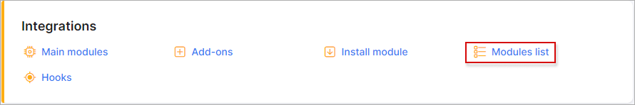
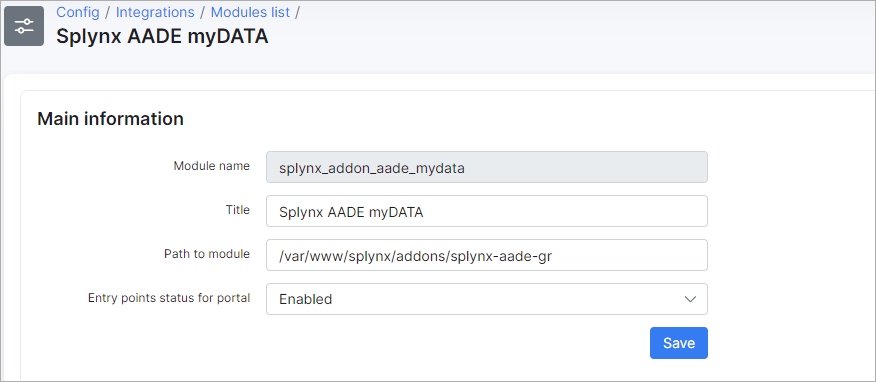
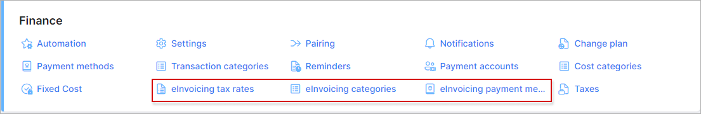
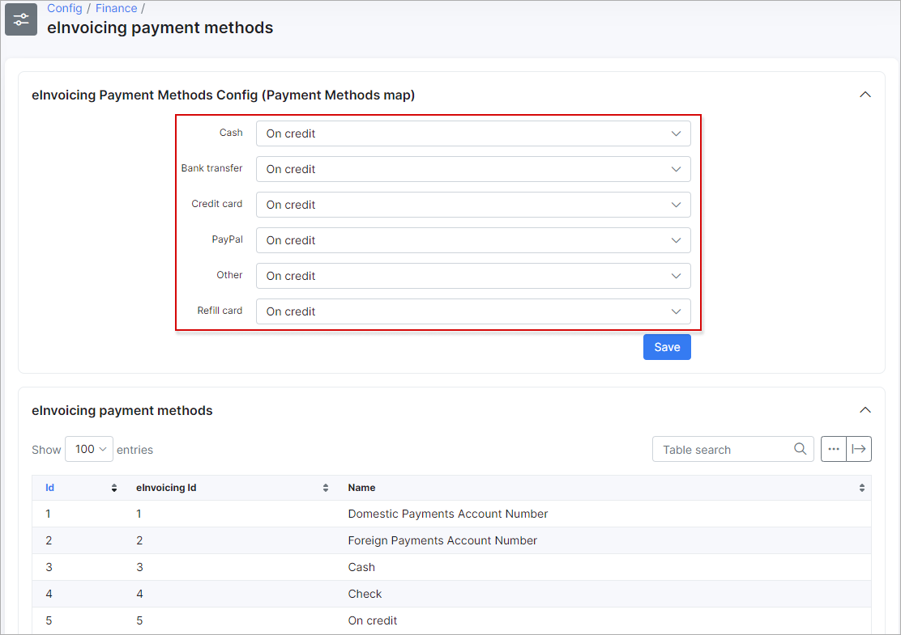
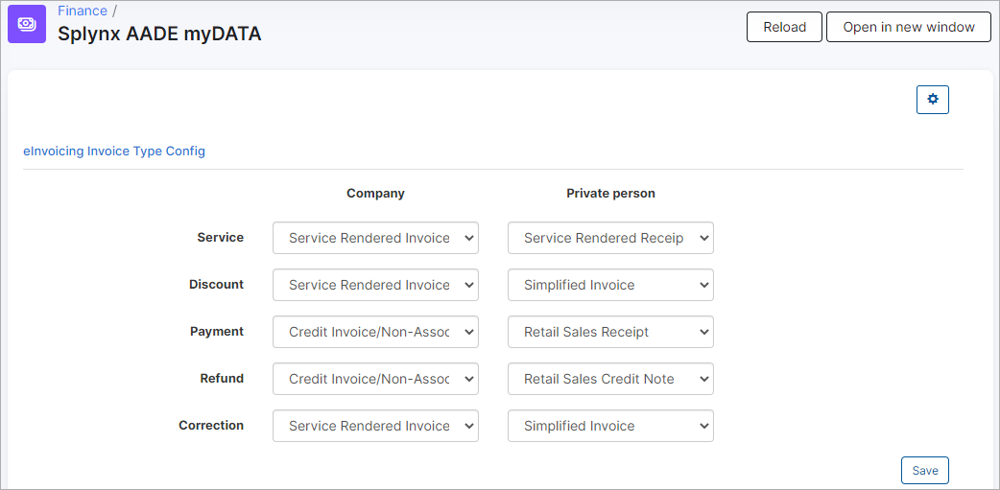

AADE MyData integration (for Greece)
=============================================

This module was designed to help the customers from Greece synchronize invoices in Splynx with AADE myData service as per government requirements.

To install this module navigate to `Config → Integrations → Add-ons` and find `splynx-aade-gr` module and install it:

Once this done navigate to `Config → Integrations → Modules list` for initial setup:

and click on edit button under the module:

Here you should specify **AADE myData API settings**:

* **Username** - registered aade-user-id;

* **Subscription key** - Ocp-Apim-Subscription-Key.

After that, you should configure **synchronization settings**:

* **Partners ignore list** - select partners which will be ignored through synchronization process;

* **VAT number** - specify your registered VAT number;

* **Issuer country** - `GR` for Greece;

* **Issuer branch** - if the branch is headquarters or doesn't exist, the branch field must have a value of `0`;

* **Invoice series** - mandatory for some invoice types (`A` by default);

* **VAT Exemption Cause** - exemption cause for items with `Without VAT` tax rate;

* **Default counterpart country** - counterpart country code to use by default (`GR` by default);

* **Default counterpart branch** - counterpart branch to use by default (`0` by default);

* **Synchronize invoices by cron** - enable/disable automatic synchronization of invoices.

Once this done, you need to configure *elnvoicing* **tax rates**, **invoicing categories** and **payment methods**:

Let's start with **tax rates** configuration:

You need to pair existing TAX rates in Splynx with rates loaded from *AADE*.

Then, please configure **invoices categories**:

In this form the categories and types of invoices should be mapped with the loaded categories and types from AADE:

Once this done you should configure mapping of **payment methods**:

After that, there is one more place to update settings, it's under `Config → Integrations → Splynx AADE myDATA` module:

These settings are individual and may differ for every company. Some types of invoices require a customer's VAT number (on a customer view under field VAT).

All types of invoices require a customer's VAT number, except : **Retail Sales Receipt**, **Service Rendered Receipt**, **Simplified Invoice**, **Retail Sales Credit Note**.

To find out how these categories and types should be configured, you can download a file that contains sheets for each invoice type: [Download](aade_file.zip).

 <icon class="image-icon"></icon> **IMPORTANT** - the invoice which contains positive (100) and negative (-100) items can't be synced to AADE. These items should be separated into different invoices.

To find the list of invoices that have been synchronized with AADE, navigate to `Administration → Logs → einvocing`:

`einvoicing ID` field contains the ID of the synced invoice. If this field is empty, it means that the invoice has not been synced.
