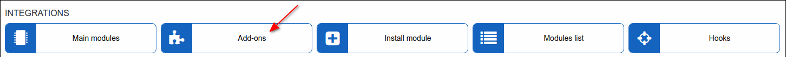

Add-on modules
=================

In this section, we can view, install or delete useful add-ons for integration with Splynx and other helpful tools.

* [Baicells LTE](addons_modules/baicells/baicells.md)
* [Cashdesk module](addons_modules/cashdesk/cashdesk.md)
* [FatturaPA](addons_modules/FatturaPA/FatturaPA.md)
* [FCC 477 export](addons_modules/fcc_export/fcc_export.md)
* [Google maps add-on](addons_modules/google_maps/google_maps.md)
* [Ofipro contabilidad (Spanish)](addons_modules/ofipro/ofipro.md)
* [Quickbooks accounting](addons_modules/quickbooks/quickbooks.md)
* [SageOne module](addons_modules/sageone/sageone.md)
* [Self Registration](addons_modules/self_registration/self_registration.md)
* [Signaturit](addons_modules/signaturit/signaturit.md)
* [Speedtest](addons_modules/speedtest/speedtest.md)
* [Splynx Mailjet](addons_modules/splynx_mailjet/splynx_mailjet.md)
* [splynx-ssh-term](addons_modules/splynx-ssh-term/splynx-ssh-term.md)
* [splynx_remote_support](addons_modules/splynx_remote_support/splynx_remote_support.md)
* [TowerCoverage Integration](addons_modules/towercoverage/towercoverage.md)
* [Xero accounting](addons_modules/xero/xero.md)
