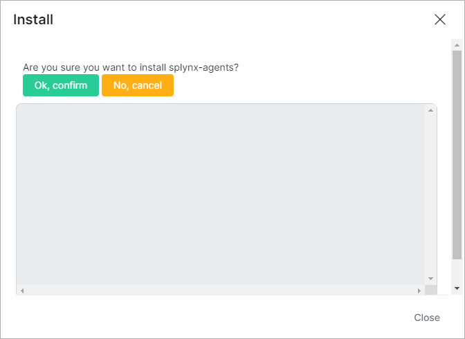
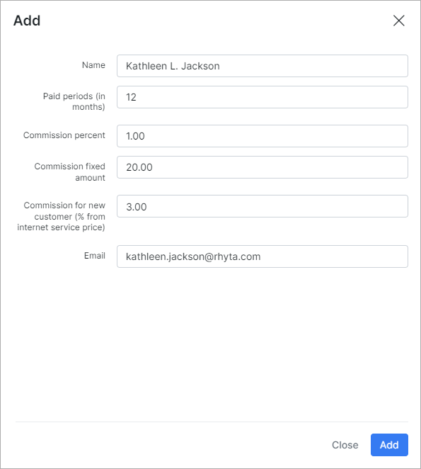
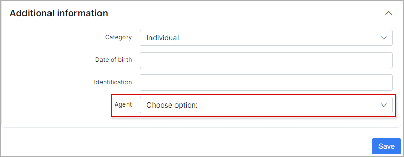

Agents and Resellers add-ons
========

*Agents* is a Splynx add-on module designed for the sales representatives, it helps to organize the commission structure and calculate the percentage from the new deals in your organization.

*Resellers* is a fork of *Agents* add-on and is used only for the resellers' representatives and it has the same functionality.

Offering competitive commissions to sales/resellers team members can motivate them to make more sales and improve their performance. There are many types of compensation structures to choose from, and sales leaders should implement a plan that aligns best with their team’s specific needs.

The first step to activate *Agents* / *Resellers*, is installing the add-on. This can be done in two ways, via CLI on the Splynx server and via the Splynx Web UI.

To install the add-on via CLI, the following commands can be used:

```bash
apt-get update  
apt-get install splynx-agents
// apt-get install splynx-resellers
```

To install the add-on from the Web UI:

Navigate to `Config → Integrations → Add-ons`:


Find there the "splynx-agents" or "splynx-resellers" add-on and click on the install icon in the *Actions* column of the table


Then, click on the "OK, confirm" button to begin the installation process



Once the installation process has completed, all configurations for the add-on can be found in `Config → Modules → List`, simply click on the edit icon of the module and you will be able to change settings of the add-on like the *Paid transaction categories* (the [transaction categories](configuration/finance/transaction_categories/transaction_categories.md), for which agent or reseller commission will be calculated).


**Note:**

**For the selected transaction categories will be automatically added *discount* and *refund* categories for the correct calculations in report.**

## Using the Agents / Resellers module

To create the *agent / reseller*, click on `Finance`, select the necessary module and press *Add* button:


In new window, you can specify the *agent's / reseller's* name, paid periods (in months), commission percent and the email. Also, you can edit the provided info or delete the created account.

**Note:**

**If a zero value is specified in *paid periods* field, the commission will be paid all the time. The start period is the date of the first transaction of the customer or date is grabbed from the filed 'period_from' or 'date' of transaction**



To link the particular *agent / reseller* to specific customer, open the customer profile on information tab, click on the icon to show additional fields, select the necessary account in the appropriate field and press *Save* button.




In `Administration → Reports → Agents (Resellers)` you can find the detailed reports in tabs: the consolidated report by all agents (resellers), the detailed report by specific agent (resellers) and the report by the specific customer. The report is generated by valid customers for the selected period, it shows how much you need to pay commission for some period.


**Note:**

**If the transaction period is longer than the period for which the commission is paid, the commission is calculated only for the valid period. For example: if the client pays for a full year, and we pay the commission for a half of a year, the agent receives the commission for half of a year at once**
