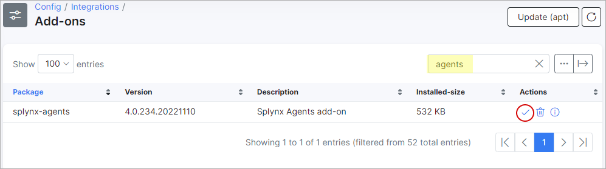
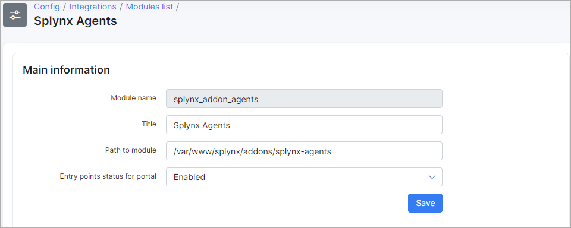
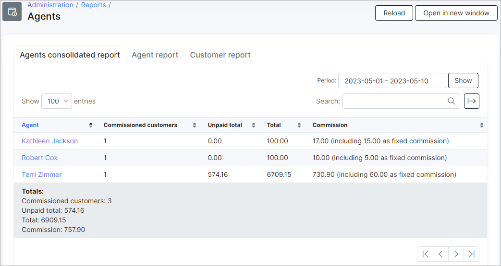
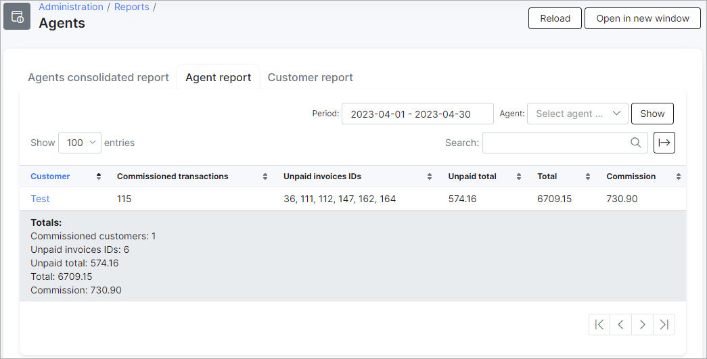

Agents and Resellers add-ons
========

*Agents* is a Splynx add-on module designed for the sales representatives, it helps to organize the commission structure and calculate the percentage from the new deals in your organization.

*Resellers* is a fork of *Agents* add-on and is used only for the resellers' representatives and it has the same functionality.

Offering competitive commissions to sales/resellers team members can motivate them to make more sales and improve their performance. There are many types of compensation structures to choose from, and sales leaders should implement a plan that aligns best with their team’s specific needs.

The first step to activate *Agents* / *Resellers*, is installing the add-on. This can be done in two ways, via CLI on the Splynx server and via the Splynx Web UI.

To install the add-on via CLI, the following commands can be used:

```bash
apt-get update  
apt-get install splynx-agents
// apt-get install splynx-resellers
```

To install the add-on from the Web UI:

Navigate to `Config → Integrations → Add-ons`:


Find there the "splynx-agents" or "splynx-resellers" add-on and click on the install icon in the *Actions* column of the table:



Then, click on the "OK, confirm" button to begin the installation process:


Once the installation process has completed, all configurations for the add-on can be found in `Config → Integrations → Modules list`. Simply click on the edit <icon class="image-icon"></icon> icon of the module and you will be able to change settings of the add-on like the *Paid transaction categories* (it's the [transaction categories](configuration/finance/transaction_categories/transaction_categories.md), for which agent or reseller commission will be calculated).





<icon class="image-icon"></icon> **For the selected transaction categories will be automatically added `discount` and `refund` categories for the correct calculations in report.**

## Using the Agents / Resellers module

To create the *Agent / Reseller* account, click on `Finance`, select the necessary module and press *Add* button:


In the new window, you can specify the *Agent's / Reseller's* **name**, the **paid periods (in months)**, the **commission percent**, the **email** and the **commission fixed amount** (**only for Agents module**).
Also, you can edit the provided info or delete the created account.

<icon class="image-icon"></icon> **If a zero value is specified in `paid periods` field, the commission will be paid all the time. The start period is the date of the first transaction of the customer or date is grabbed from the filed `period_from` or `date` of transaction**.


`Commission percent` - it's the percentage of the amount of transactions during *Paid periods*. The transactions that cover several months are counted only once - in the month from which they start. Mind that if we have transactions that start in June, they will show up in any reports that include June, e.g: May-June, June, June-July. That's why we cannot show `Commission fixed amount` in the next month from the transaction start date, as these transactions will not be shown in the list. For example, the June-July transactions will not be shown in the July report;

`Commission fixed amount` - it's the fixed amount of money per month. The fixed amount is calculated for each calendar month, e.g. if the agent's payments start on 28 June and the agent's period is 3 months, then the fixed amount should be calculated for June, July and August.

<details style="font-size: 15px; margin-bottom: 5px;">
<summary><b>Example with fixed amount</b></summary>
<div markdown="1">

Agent's Paid periods (in months) = 3 month;

transaction #1 for the period from 2021-06-01 to 2021-07-31;
transaction #2 for the period from 2021-08-01 to 2021-09-31;

The `Commission fixed amount` will be accrued for June, July in all reports where transaction #1 is included, e.g. June report, June-July report, June-September report.

The `Commission fixed amount` will be accrued for August in any reports which include transaction #2, e.g. August, August-September, etc.

For September, the `Commission fixed amount` won't be accrued in any report because the accrual period starts with the very first transaction (June 1) and ends in August.

The report for June will show the `Commission fixed amount` for June.
The June-July report will show the `Commission fixed amount` for June.
The report for July will **not** show the accrual of the `Commission fixed amount` for any month, as well as transactions.
The report for July-August or just for August or August-September will show the accrual of the `Commission fixed amount` for August.


</div>
</details>

To link the particular *Agent / Reseller* to specific customer, open the customer profile on the *Information* tab, select the necessary account in the appropriate field and click the `Save` button.


In `Administration → Reports → Agents (Resellers)` you can find the detailed reports in tabs: **the consolidated report by all agents (resellers)**, **the detailed report by specific agent (resellers)** and **the report by the specific customer**.


The report is generated by valid customers for the selected period, it shows how much you need to pay commission to agent/reseller representative for some period. The reports' examples:






<icon class="image-icon"></icon> **If the transaction period is longer than the period for which the commission is paid, the commission is calculated only for the valid period. For example: if the client pays for a full year, and we pay the commission for a half of a year, the agent/reseller representative receives the commission for half of a year at once**.

**For each transaction, the number of months it covers is calculated, whether they are part of the current reporting period (Period filter ) or not. Each month covered by a transaction is counted only once.**

**If an agent has `Paid periods (in months)` = 0 (an infinite period), the final month of accrual is determined by the maximum date of the transaction selected in the report.**


The direct links are available to access the three types of agents/resellers reports, the Splynx account authentication is required:


|   | Agents  | Resellers |
| ------------ | ------------ | ------------ |
| **consolidated report**  |  https://splynx_domain/agents |  https://splynx_domain/resellers |
| **detailed report**  | https://splynx_domain/agents/agent-report| https://splynx_domain/resellers/reseller-report  |
|  **customer's report** | https://splynx_domain/agents/customer-report|  https://splynx_domain/resellers/customer-report |


Also, you can export any report from these three tabs to *Excel*, *CSV* or *PDF* file, just click on <icon class="image-icon"></icon> icon and choose the required format:


