Baicells LTE
============

Baicells LTE is a Splynx add-on which supports [Baicells](http://baicells.com/) equipment. Using this software you can:

* Add the Baicells-system;
* Create and manage SIM-cards, which use the Baicells-system;
* Assign SIM-cards via customer's internet services.  

**Attention!** This add-on is prepaid, so if you haven't bought it and you choose to install it, you will receive a message indicating the restriction as depicted below:

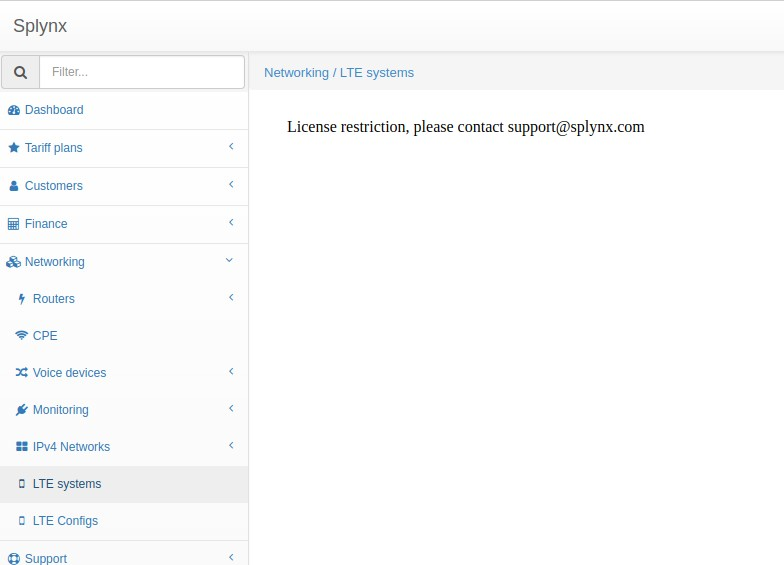

To install the "Baicells LTE" add-on via CLI, you can use the following commands:

```bash
apt-get update
apt-get install splynx-baicells-lte
```
Alternatively, you can install it from the Web UI:

Navigate to `Config -> Integrations -> Add-ons`:

Locate or search for the "Splynx-baicells-LTE" addon:

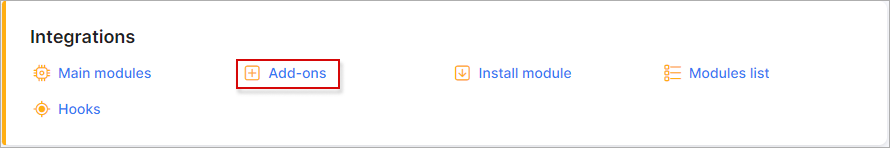

Click on the install icon in the "Actions" column:

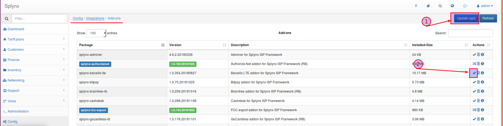

Click on "OK, confirm" to start the installation process:

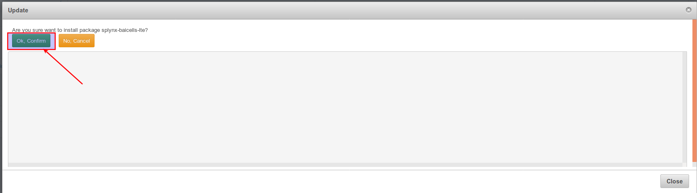

After the installation process has completed, in the *Networking* module, you will see the new sub-sections: *LTE systems* and *LTE Configs*.

First of all, you should create a new LTE system:


After you've created a LTE system, you can create SIM-cards for that system. In order to achieve this you should navigate to _Networking → LTE Config_ and create cards (manually or using the import function):

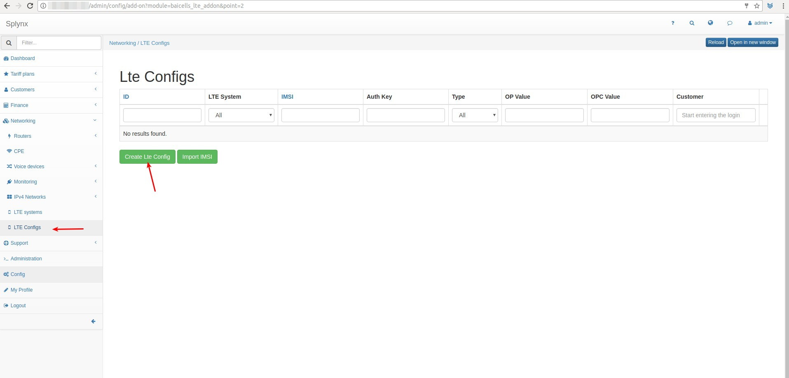


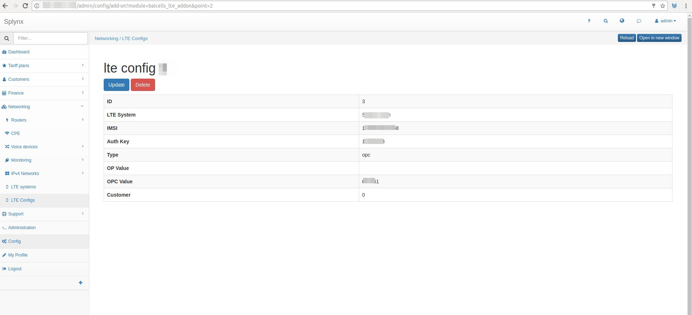

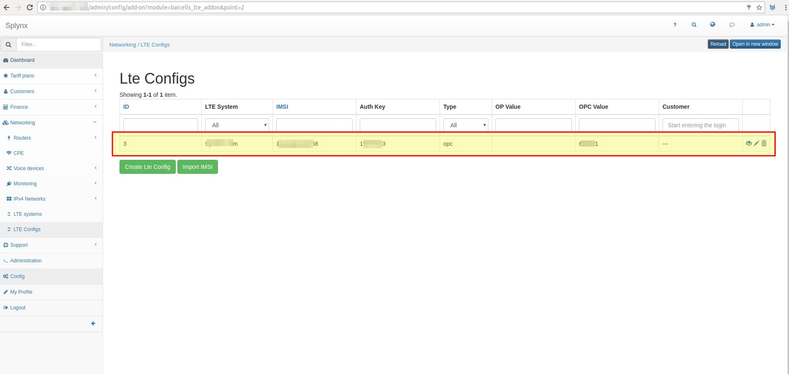

Thereafter, you can create Internet services for customers. Navigate to _Customer → Services_ and create the new Internet service:

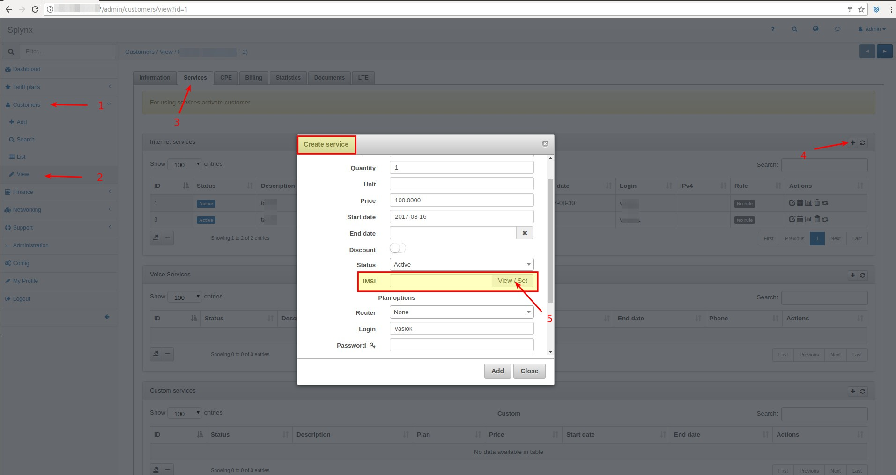

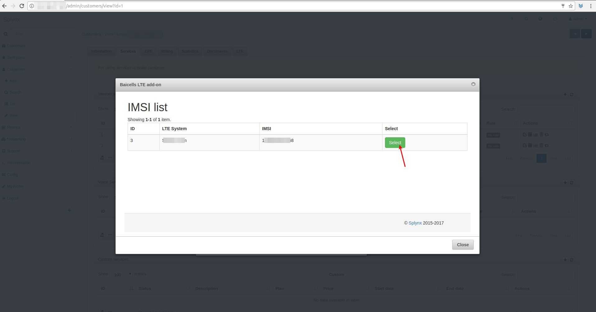

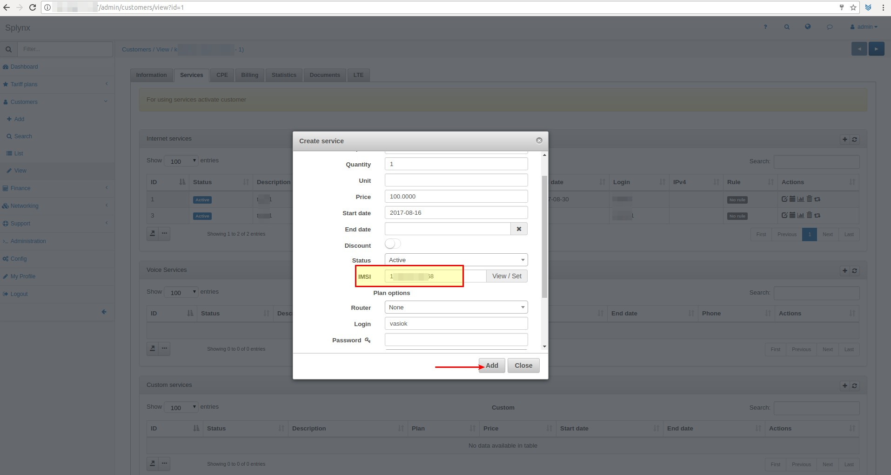

When customer uses LTE IMSI, you can check the IMSI list in the special bookmark:

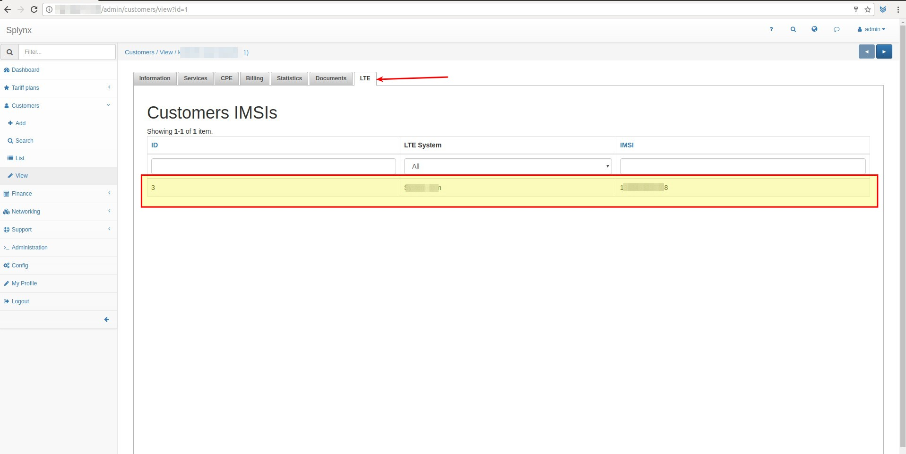

**Troubleshooting!** If something is wrong with the add-on, please check the WebHooks within the Splynx settings under _Config → Hooks,_ , make sure that it has been enabled:

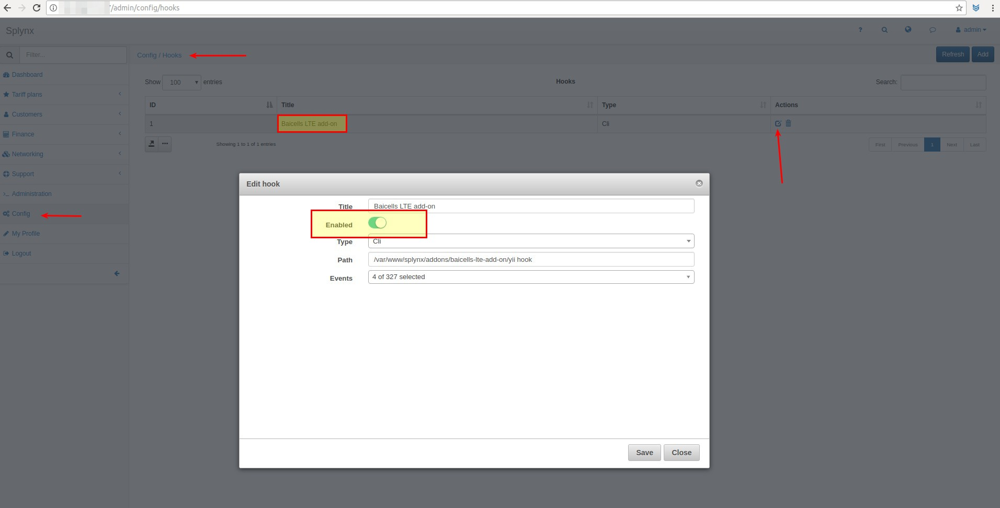
