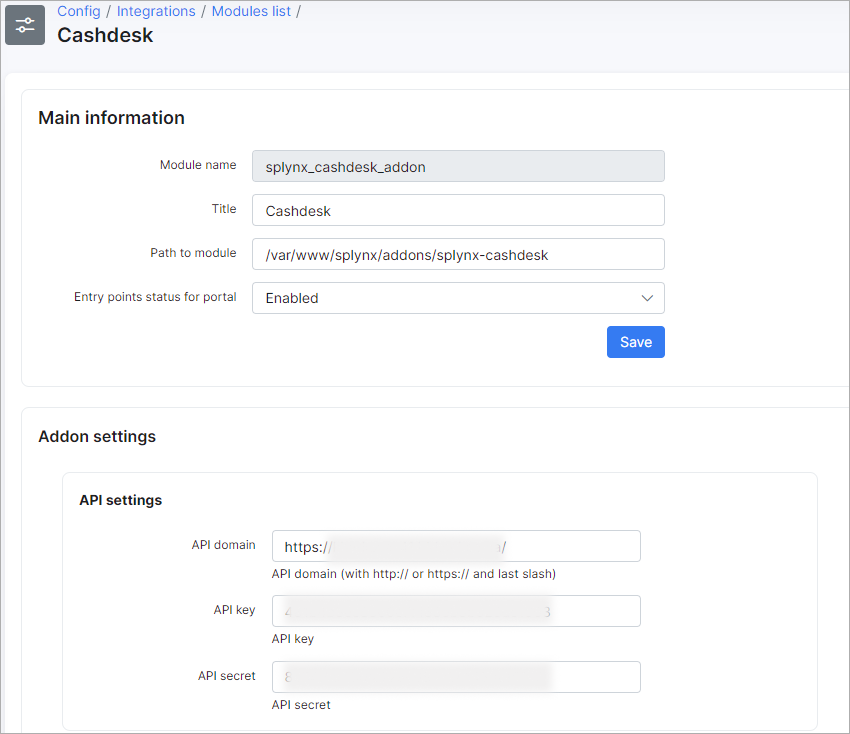
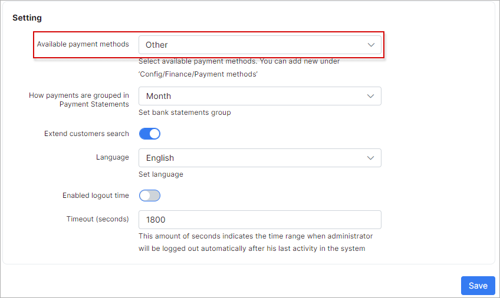
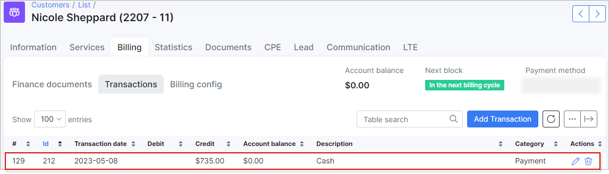

Cashdesk
========

Cashdesk is a Splynx add-on module for processing payments. Administrators can create users for cashdesk and grant them access to the module. Users are not able to change and view any of the customer’s data, except the name/company name, invoice numbers and actual balances. Cashdesk can be used by accountants who don’t necessarily have access to Splynx, but only to process incoming payments. Cashdesk can also be used by resellers. The reseller will see only their customers and will able to enter payments into Splynx when funds are received from customers.  

The first step to activate Cashdesk, is installing the add-on. This can be done in two method, via CLI on the Splynx server or via the Splynx Web UI.

To install the add-on via CLI, the following commands can be used:

```bash
apt-get update  
apt-get install splynx-cashdesk
```
To install the add-on from the Web UI:

Navigate to *Config → Integrations → Add-ons:*


1. Locate or search for the "Splynx-Cashdesk"

2. Click on the install icon in the *Actions* column of the table next to the Cashdesk icon:


3. Click on the `OK, confirm` button to begin the installation process:


Once the installation process has completed, all configurations for the add-on can be found in `Config → Integrations → Modules list`:


Simply click on the *Edit* icon of the Cashdesk module and you will be able to change settings of the add-on like the Available payment methods, etc:





To create a Cashdesk user, it is necessary to create a new administrator with CashDesk access enabled. Other permissions to Splynx access can be defined or left to no permissions to grant access to Cashdesk only. More information on define permissions can be found on the following page: [Administrators and permissions](administration/main/admins_and_permissions/admins_and_permissions.md)


Adding access privileges for the cashdesk-module to a super administrator can be achieved by enabling CashDesk in the super administrator's account.


<icon class="image-icon"></icon> Once the Cashdesk add-on is installed, you can access it by typing the following url in your browser: "http://yoursplynxurl/cashdesk", replacing "yoursplynxurl" with the actual URL of you Splynx server


## Using the Cashdesk module


First, a super administrator must add a deposit for the cash-administrators for operations. To achieve this, you should login as a super administrator (with full access) and Create a deposit:


You can always increase or decrease the amount of the deposit at a later stage:


You can view the history of the deposit changes by clicking on the `History` button:


Deposit Histories can be exported to a CSV file, PDF or another method with the export button at the top of the table:


__________________________

Once a Cashdesk user has logged in, they can search for customers by the customer’s name, login or the number of a required invoice.


After entering the invoice number or customer name in search fields, Cashdesk displays the customer information, like the customer balance and unpaid invoices, etc.

When entering a payment, we can choose the invoice which will be marked as paid.

Before:


After:


When the payment has been added in CashDesk, it will appear in Splynx as a new transaction and a payment, and the invoice will be marked as paid.




All payments of the user currently logged in can be found in the History section of Cashdesk.

For super administrators, the History table and information is extended.


<icon class="image-icon"></icon> *Remember! Only Super administrators can delete payments.*
