Cashdesk
========

Cashdesk is a Splynx module for processing payments. Administrator can create users of cashdesk and provide them access to the module. User is not able to change and view any customer’s data, except his name/company name, invoice numbers and actual balance. The cashdesk can be used by accountants, who doesn’t have to get access to Splynx, but only process the incoming payments. It can be also used by resellers. Reseller will see only his customers and is able to enter payments to Splynx when he receives money from customer.  

The first step for Cashdesk activation is installation. It’s performed by two following commands in Linux CLI where Splynx is installed:

```bash
apt-get update  
apt-get install splynx-cashdesk
```
or you can install it from Web UI:

*Config -> Integrations -> Add-ons:*

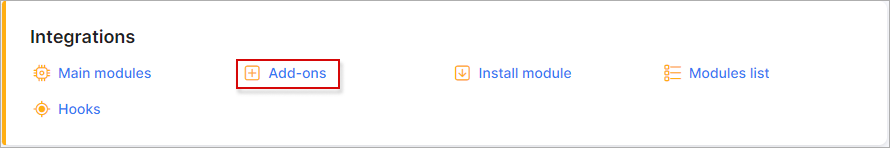

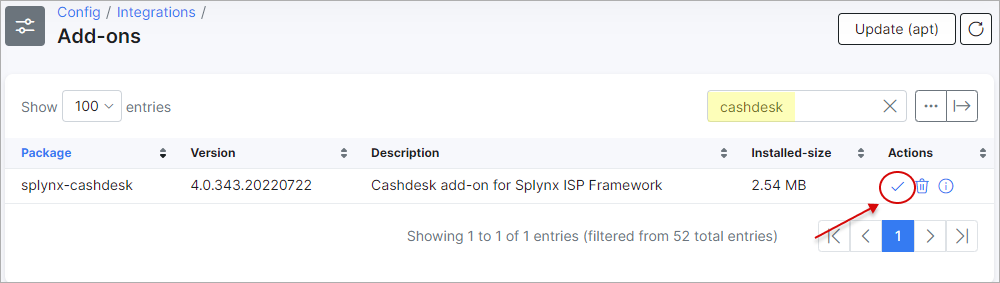

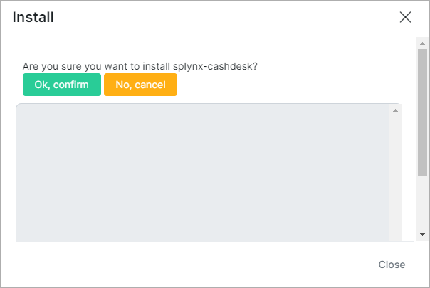

All configs you can find in Config / Modules / List:

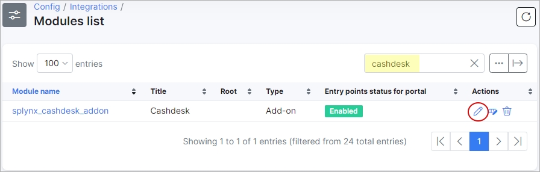

then click edit Cashdesk and you can change Payment method ID:

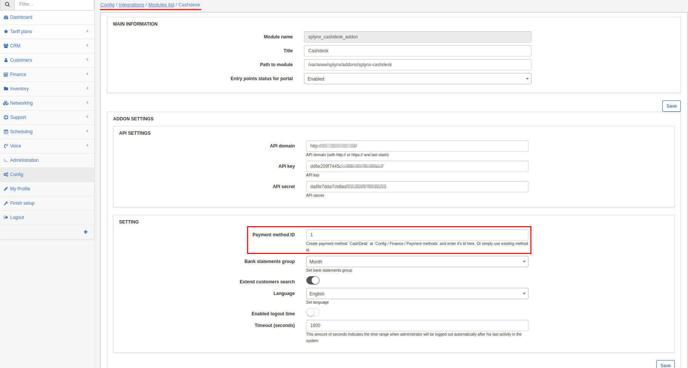

To create a cashdesk user it’s needed to create an administrator and enabled CashDesk access. Other permissions to Splynx access can have define or he can get 0 permission level (defined access Cashdesk only):

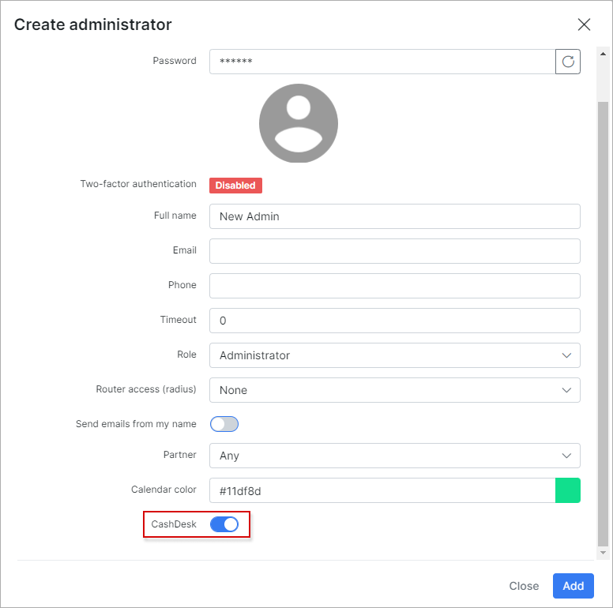

Add access privileges for cashdesk-module to the superadministrator - enable CashDesk in superadministrator account.
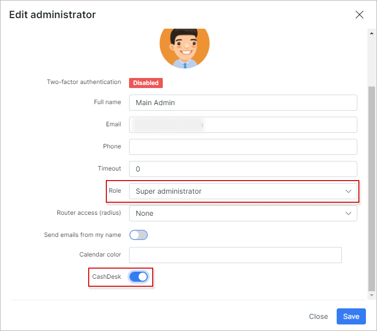

When the Cashdesk is installed, it’s available on "http://yoursplynxurl/cashdesk".

First step, superadministrator must added deposit for cash-administrators for operations. To do this, you should login as superadministrator (he have full access) and Create deposit:
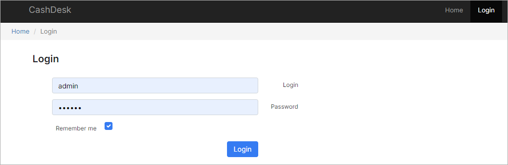
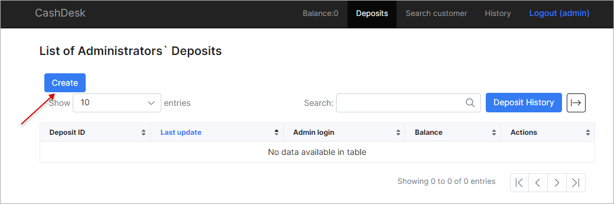
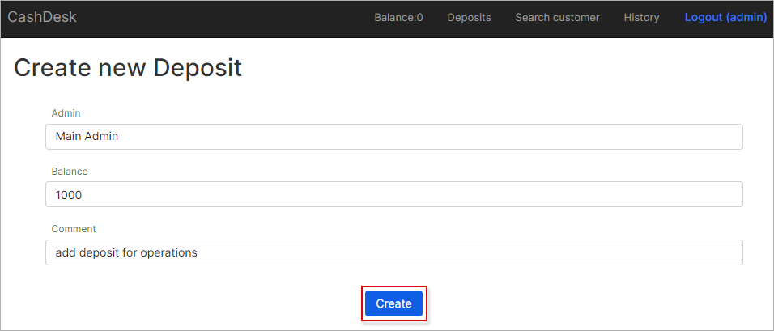
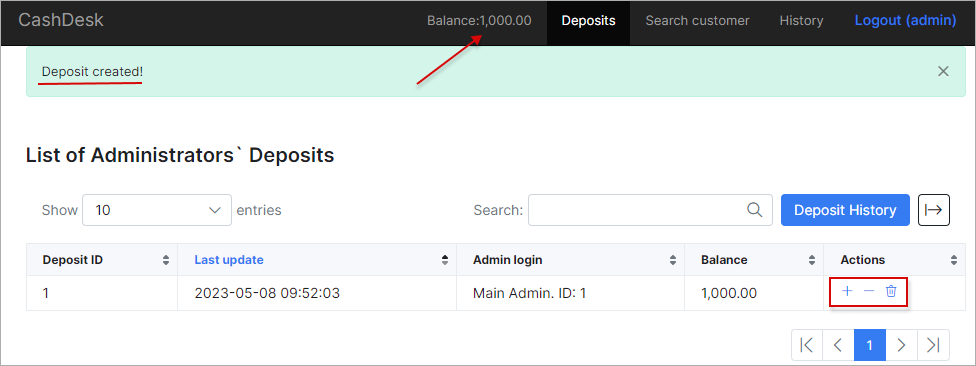

Later, you can increase or decrease the amount of the deposit

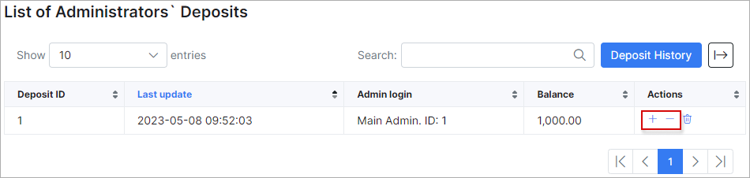

After clicking the [Deposit History] button you can view the history of the deposit changes

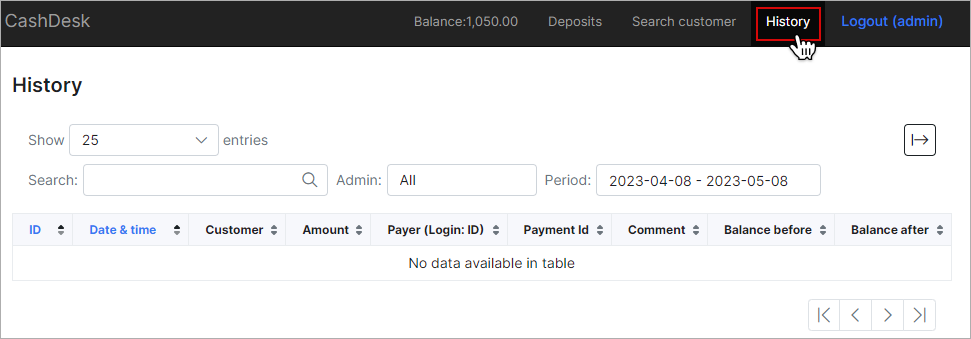

CSV — is export Deposit History to csv-file:
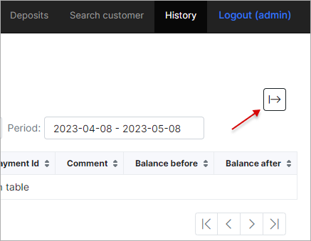

For cashdesk-administrator the first screen is a login page:
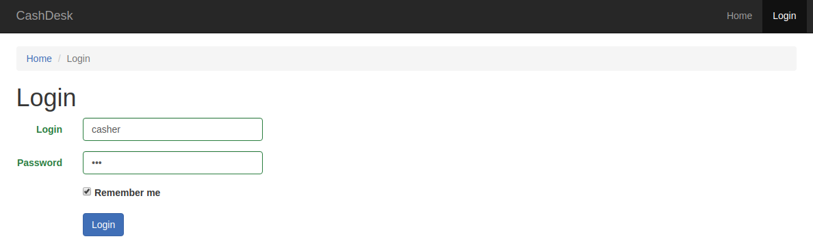

Cashdesk user has logged, he can search customers based on customer’s name, login or number of invoice.

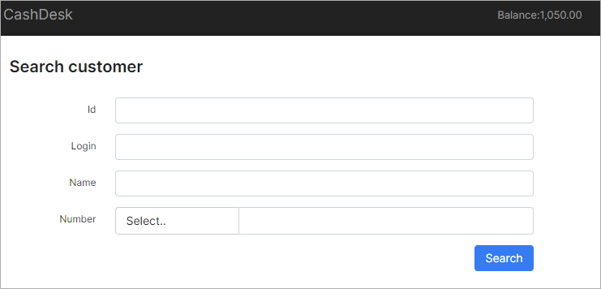

After entering the invoice number or customer name in search field, Cashdesk displays customer information about his balance and unpaid invoices.

When we entering a payment we can choose the invoice which will be marked as paid.


After:

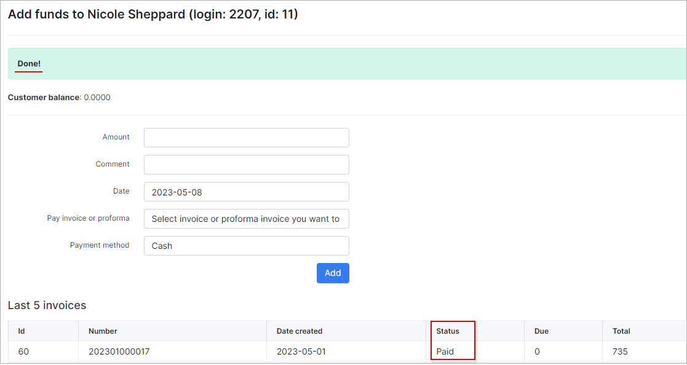

When the payment has been added, it appears in Splynx as a new transaction and a payment and also as a invoice .

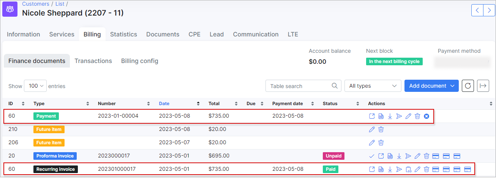

All payments of the user “Casher” can be found in History section of Cashdesk.

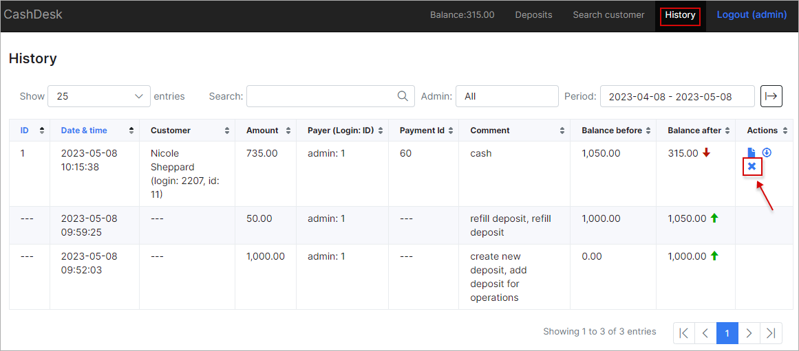

For superadministrator History is extended.

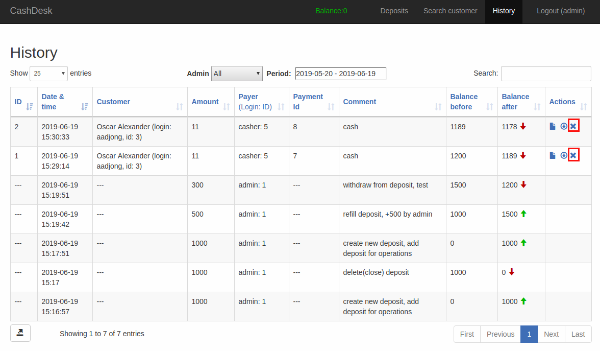

Remember! Only Superadministrator - can delete payments.
