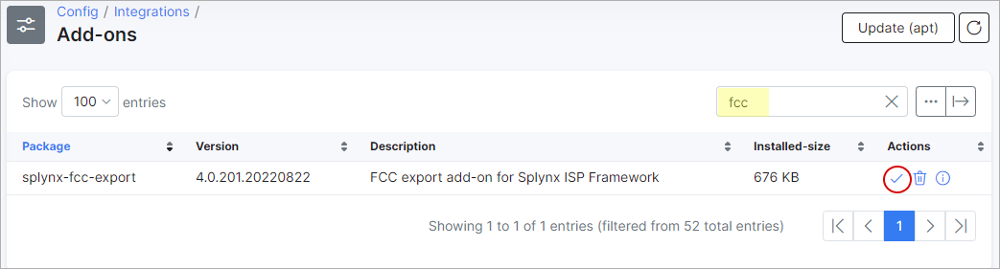
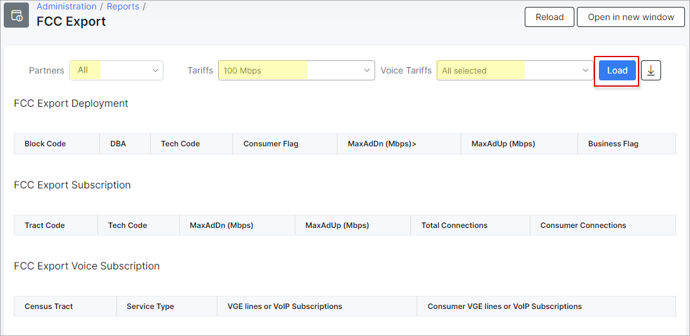
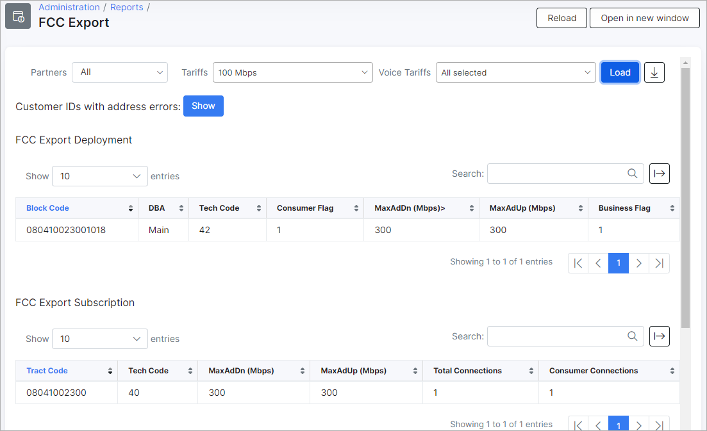

FCC 477 export
==============

"FCC 477 export" is a Splynx module used to generate reports for the Federal Communications Commission (USA) - [https://www.fcc.gov/](https://www.fcc.gov/).

The add-on can be installed in two methods, via CLI or via the Web UI

To install the "FCC 477 export" add-on via CLI, the following commands can be used:

```bash
apt-get update
apt-get install splynx-fcc-export
```
To install it via the Web UI:

Navigate to `Config → Integrations → Add-ons`:


Locate or search for the "splynx-fcc-export" add-on and click on the install icon in the *Actions* column:



The following window will appear for you to either cancel or confirm the installation, click on "OK, confirm" to begin the installation process:


After the installation process has completed, you need to generate a Google API Key to use in the configuration of the add-on - [https://console.cloud.google.com](https://console.cloud.google.com)


Once you've generated an API key, you have to copy it into the Google API Key field of the add-on configuration. To achieve this, navigate *Config → Module Lists →* locate the Splynx FCC module and click on the Edit in the *Actions* column:


Once this configuration is completed, a new section will appear in the “Administration” module under the reports section:


Now we can sync addresses of your customers to “FCC Export” (it’s not necessary, but it will be better for you to improve the performance of the “FCC Export”. Syncing addresses is only necessary when using FCC export for the first time on Splynx):


To run an export, simply select the desired "Partners" and Tariffs, then click on the "Load" button:



If all configurations are correct, upon clicking the "Load" button, you will be presented with the results of the criteria you have specified, with the ability to export the results with the export buttons provided below the tables:


