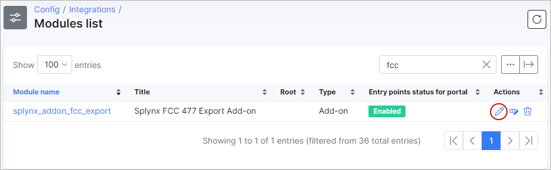

FCC 477 export
==============

"FCC 477 export" is a Splynx module which is used to generate reports for Federal Communications Commission (USA) - [https://www.fcc.gov/](https://www.fcc.gov/).

To install "FCC 477 export" add-on please enter the command:

```bash
apt-get update
apt-get install splynx-fcc-export
```
or you can install it from Web UI:

Config → Integrations → Add-ons:


After installation you need to generate Google API Key - [https://console.cloud.google.com](https://console.cloud.google.com)


Then you have to copy Google API Key in to the *Config → Module Lists → Splynx FCC → Edit:*




Configuration is complete and in menu “Administration” you will see a new icon:


Now you need to sync addresses of your customers to “FCC Export” (it’s not necessarily, but it will be better for you, then “FCC Export” will be working faster. You can do it only once - when you use FCC for the first time):


There you have to choose "Partners" and click to "Load" button:


If everything is correct, you will see the result and export buttons as on the screenshot below:


