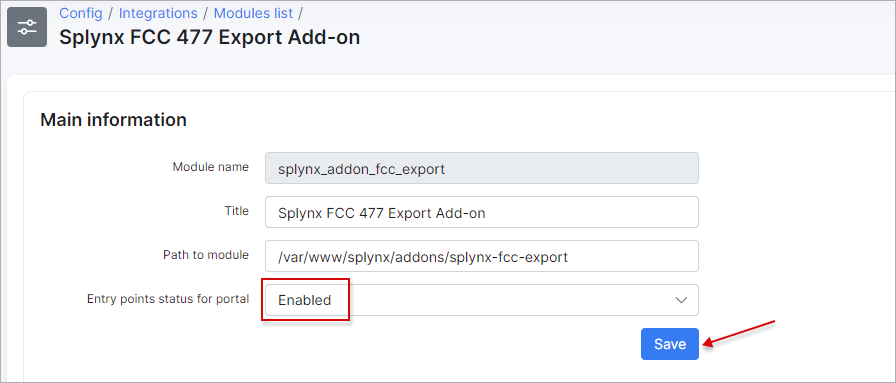
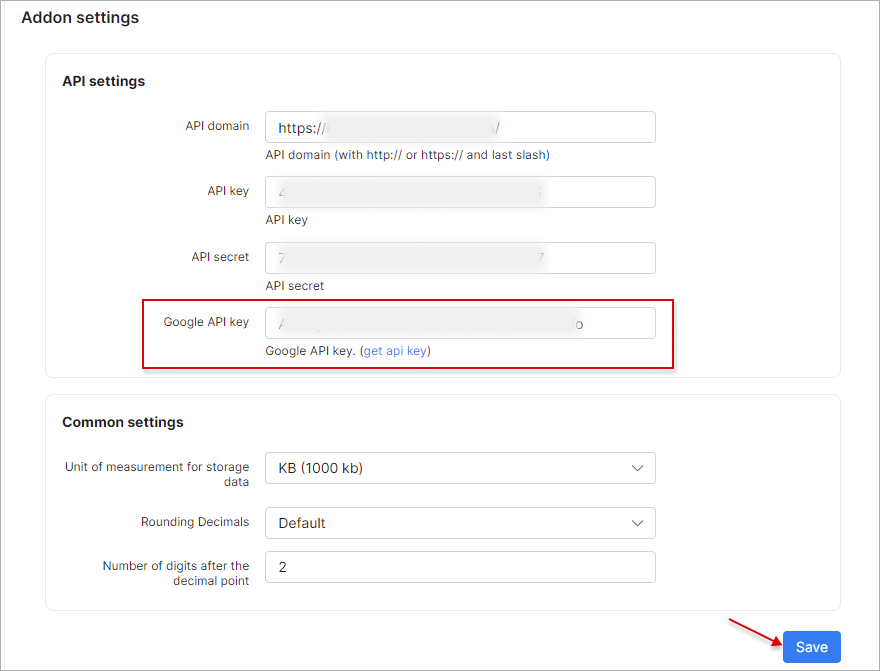
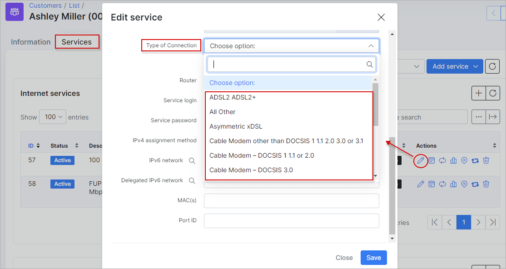
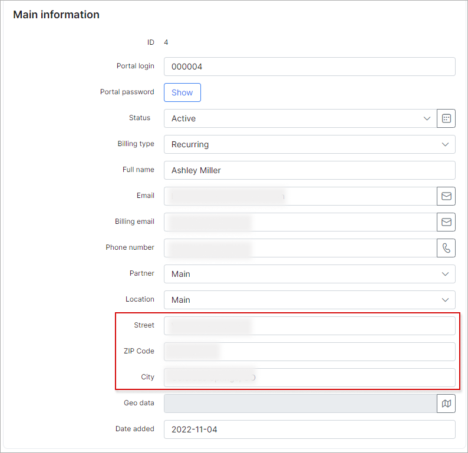
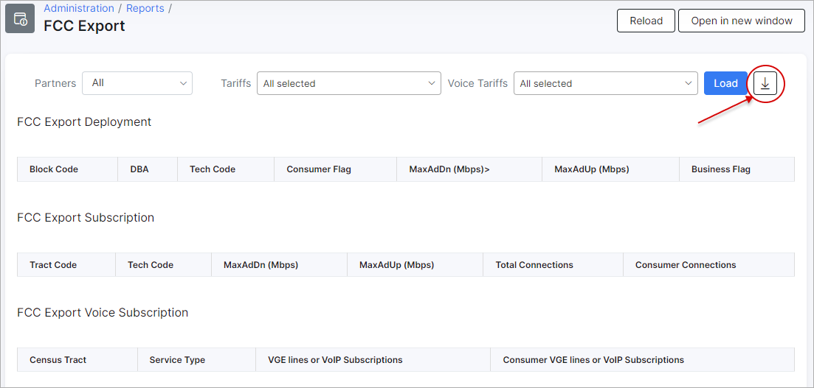
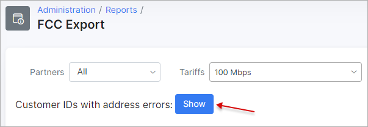
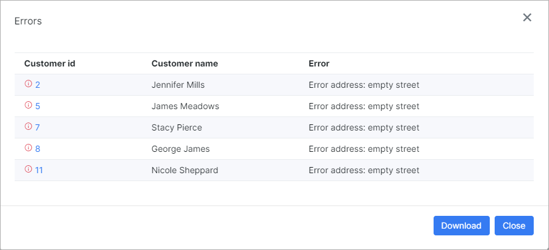

FCC 477 export
==============

**FCC 477 export** is a Splynx module used to generate reports for the *Federal Communications Commission (USA)* - [https://www.fcc.gov/](https://www.fcc.gov/).

The add-on can be installed in two methods: via CLI or via the Web UI.

To install the **FCC 477 export** add-on via CLI, the following commands can be used:

```bash
apt-get update
apt-get install splynx-fcc-export
```
To install it via the Web UI, navigate to `Config → Integrations → Add-ons`:


Locate or search for the `splynx-fcc-export` package and click the *Install* icon in the *Actions* column:


Then, click the `OK, confirm` to begin the installation process:


After the installation process has completed, you need to generate a **Google API key** to use in the configuration of the add-on. Open a page of **Google Cloud Console**  - [https://console.cloud.google.com](https://console.cloud.google.com) and follow the steps below:


Once you've generated the **API key**, you have to copy it into the **Google API key** field of the add-on configuration. To achieve this, navigate to `Config → Integrations → Module Lists`, locate the `splynx_addon_fcc_export` module, and click the *Edit* icon in the *Actions* column:





 <icon class="image-icon"></icon> **IMPORTANT**

 After that, it is necessary to investigate the following parameters:

- check if the required value is selected in the **Type of connection** field under **Services** for the relevant customers:



- check whether the customer has completed the following fields under the *Information* tab: **Street**, **ZIP Code**, and **City**. Please note that in the *City* field, it is mandatory to include the state value as well. For example, use the format `Colorado Springs, CO`, where `CO` represents the state abbreviation.



Once these steps are completed, a new section will appear in `Administration → Reports → FCC Export`:


Now we can sync addresses of your customers to **FCC Export**:

<icon class="image-icon"></icon> It’s not necessary to do it on a regular basis, but it will be better for you to improve the performance of the **FCC Export** module. Syncing addresses is only necessary when using *FCC export* for the first time on Splynx.




To run the export, simply select the desired **Partners** and **Tariffs**, then click the `Load` button:


If all configurations are correct, after you click the `Load` button, you will be presented with the results based on the criteria you set, with the option to export the results using the **Export** buttons below the tables:


In case of an error, double-check the error identifier to understand the reason for the issue and fix it (click on the example to see more information).

<details style="font-size: 15px; margin-bottom: 5px;">
<summary><b>Example</b></summary>
<div markdown="1">





</div>
</details>
