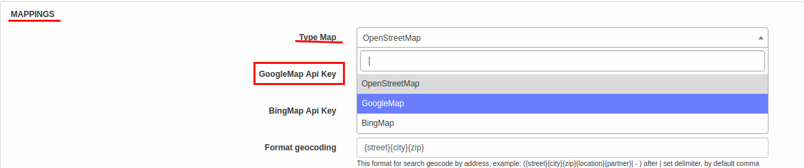

Google maps add-on
==================

Google maps is a Splynx add-on. It's used to help you understand where are your customers, routers, monitoring devices located

From Splynx version 2.3 we are using built in maps(OpenStreetMaps. GoogleMaps, BingMaps). You can configure it on _"Config / Main / Preferences / Mappings"_ . For using Google Maps you just need to set up Google Maps API Key and save config.



To install google maps add-on please enter the command:

```bash
apt-get update
apt-get install splynx-google-maps
```
or you can install it from Web UI:

*Config -> Integrations -> Add-ons:*


After installation, you have to configure add-on under _Config / Integrations / Modules List_


First of all you should paste URL of your server to "API domain" field and paste your Google API key


If you do not have Google API key, then go to Google API portal ([https://developers.google.com/maps/documentation/embed/get-api-key](https://developers.google.com/maps/documentation/embed/get-api-key)) and get it. You can see the details below.

To see map - go to _"Customers / Maps"_


Here you can see coordinate pointers of your customers, routers, monitoring devices. You can apply filters to see only what you need. Customer pointers have different colors. It depends of the customer status (new, active, online, blocked, inactive). You can click on the pointer to see an additional information. Router and monitoring device **can have only one** coordinate pointer. But customer **can have several pointers**.

To edit customer coordinate pointers - open information tab of the customer, press "View/Set"


If the customer has saved address it will appear in the next window


* **Add pointer.** Click on the map to add a pointer. You can click "Geocode" to find address and place the pointer to it. You can add only one pointer at a time. If you need to add more then one - open this window again
* **Move pointer.** Use drag and drop
* **Remove pointer.** Click on the pointer, then press "Delete marker"

After editing press "Save" and "Close". Button "Save" saves pointers immediately. You don't have to press "Save" button from customer's information tab

You can edit coordinate pointers of routers and monitoring devices in the same way.


### How to create Google Maps API key

Open [https://developers.google.com/maps/documentation/embed/get-api-key?pli=1#detailed-guide](https://developers.google.com/maps/documentation/embed/get-api-key?pli=1#detailed-guide)


---

---

---

---

---

---

---


---

