Google maps add-on
==================

The Splynx Google maps add-on is used to help you establish where your customers, routers, and monitoring devices are located.

From Splynx version 2.3, we've started using built in maps (OpenStreetMaps. GoogleMaps, BingMaps). Maps can be configured under `Config / Main / Preferences / Map Settings`. To use Google Maps, you can simply select it as the map type, set up the Google Maps API Key and save config.


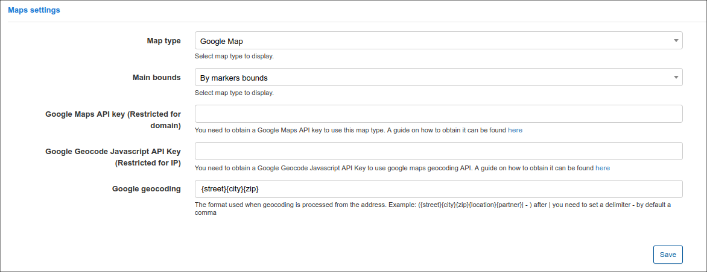

The Google Maps add-on can be installed in two method, via CLI or the Web UI.

To install the google maps add-on via CLI, the following commands can be used:

```bash
apt-get update
apt-get install splynx-google-maps
```
To install it via the Web UI:

Navigate to *Config -> Integrations -> Add-ons:*


Locate or search for the "splynx-google-maps" add-on and click on the install icon in the *Actions* column

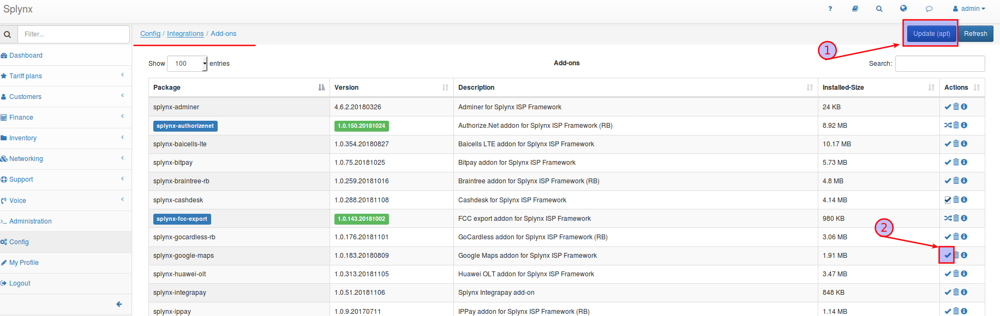

Click on the "OK, confirm" button to begin the installation process

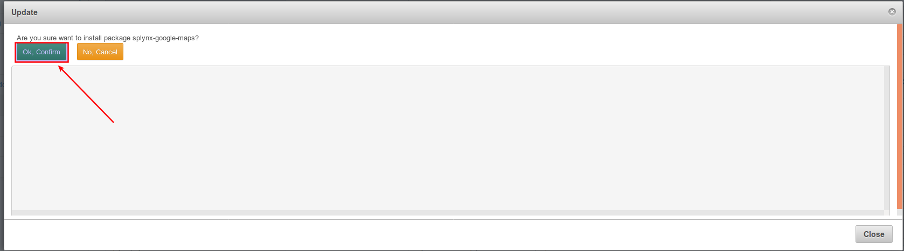

After the installation process has completed, you have to configure the add-on under _Config / Integrations / Modules List_

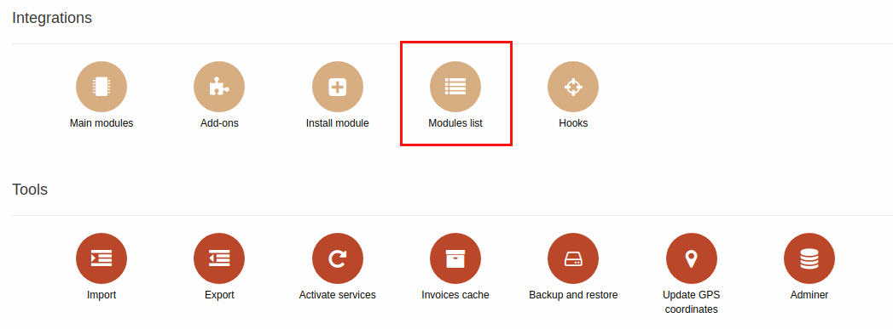

Locate or search for the "splynx-google-maps" addon and click on the edit icon in the *Actions* column

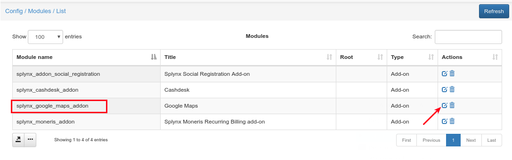

First of all you should type or copy and paste the URL of your server into the "API domain" field and thereafter, copy and paste your Google API key in the field provided

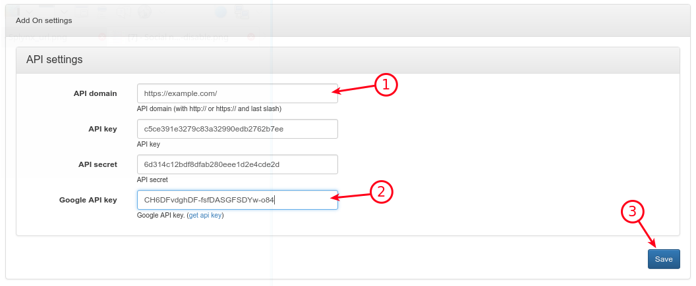

If you do not have a Google API key, browse to the Google API portal ([https://developers.google.com/maps/documentation/embed/get-api-key](https://developers.google.com/maps/documentation/embed/get-api-key)) and retrieve it from there.

### How to create Google Maps API key

Open [https://developers.google.com/maps/documentation/embed/get-api-key?pli=1#detailed-guide](https://developers.google.com/maps/documentation/embed/get-api-key?pli=1#detailed-guide)

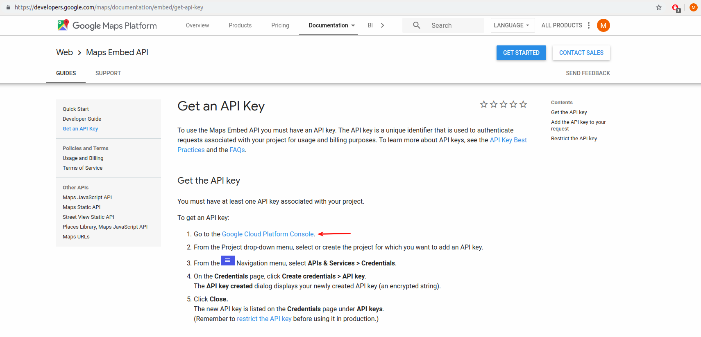
---
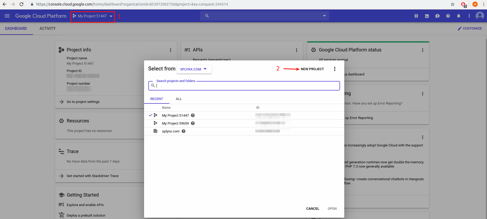
---
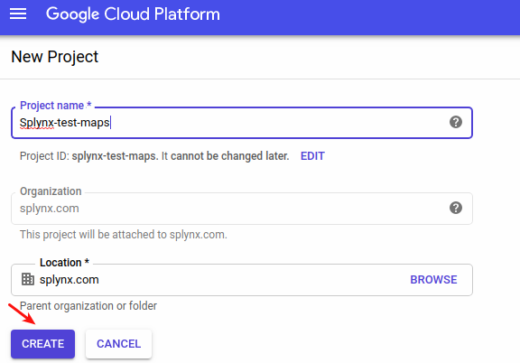
---
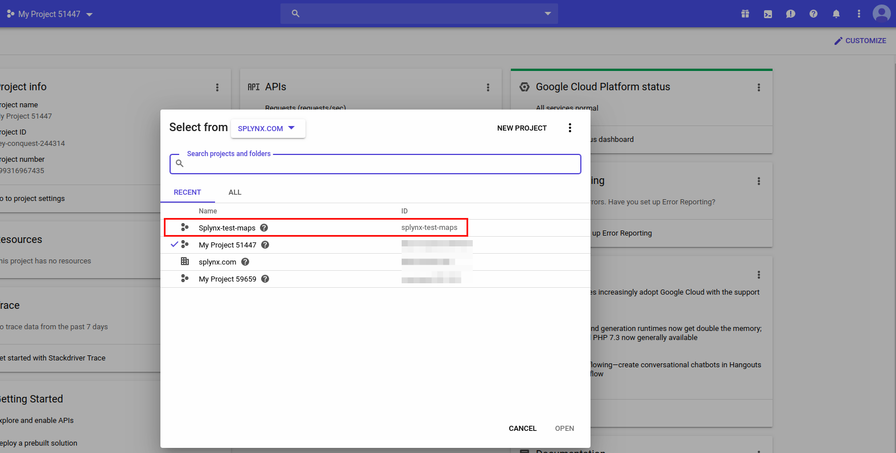
---
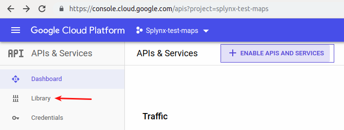
---
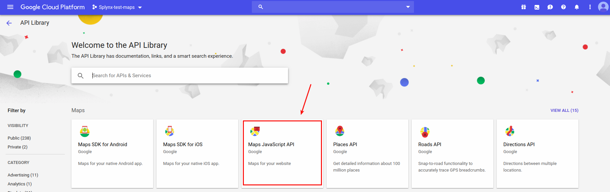
---
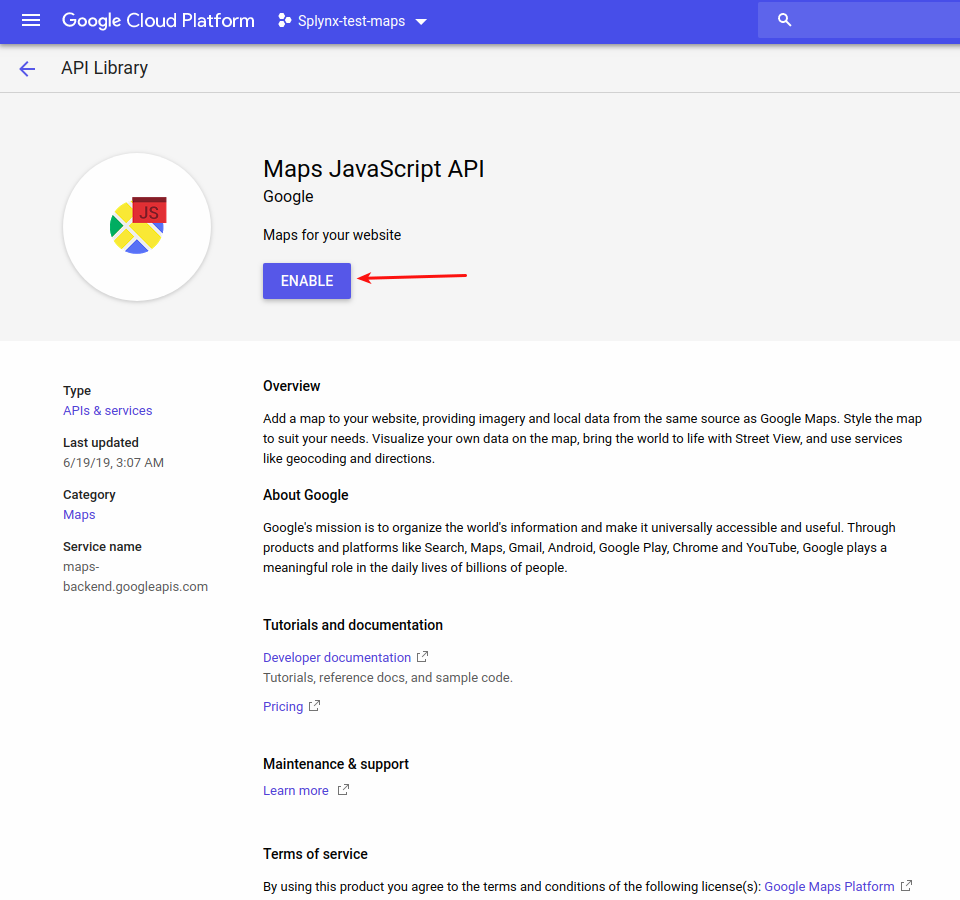
---
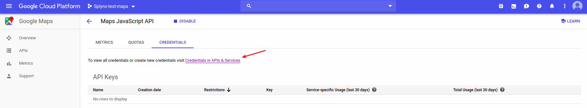

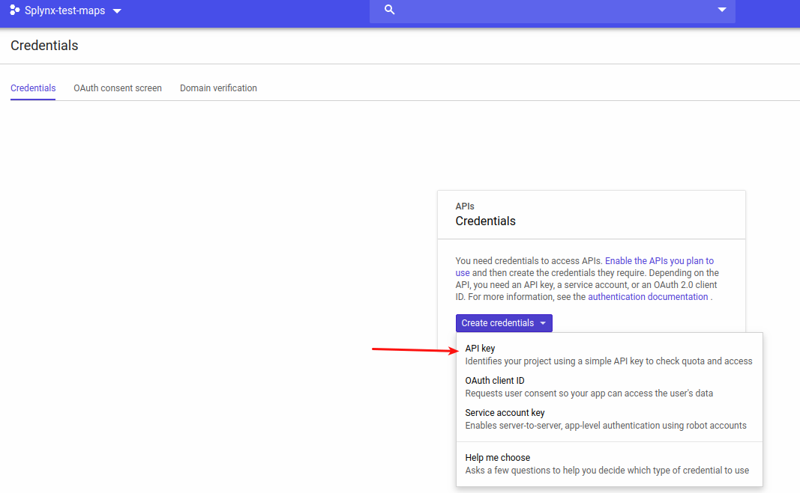
---
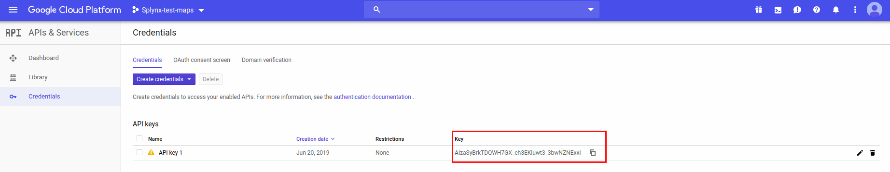

To view or display your map navigate to _"Customers / Maps"_

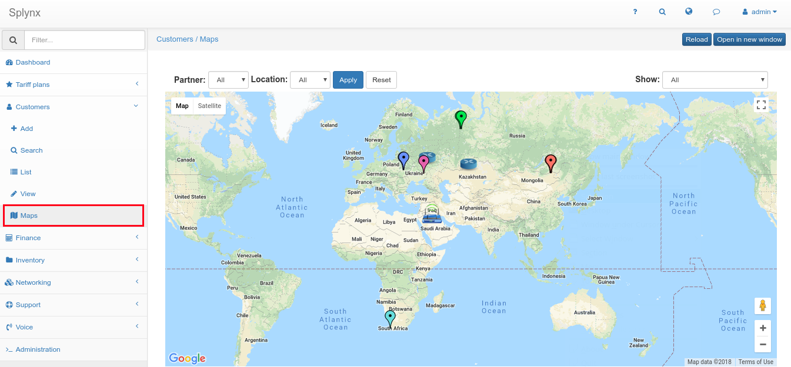

* **NOTE** the "For development purposes only" signatures on the map view are displayed because of our key we've used when configuring our map.(the key is only used for development purposes).

Coordinate pointers of your customers, routers, and monitoring devices can be viewed here. You can also apply filters to the map to only display items of you wish to view. Customer pointers have different colors, this depends on the customer status (new, active, online, blocked, inactive). You can click on the pointer to see additional information. Routers and monitoring devices **can have only one** coordinate pointer. But customers **can have several pointers**.

To edit customer coordinate pointers, navigate to the information tab of the customer, click on the "View/Set" button in the Additional Information section of the "GPS" field.

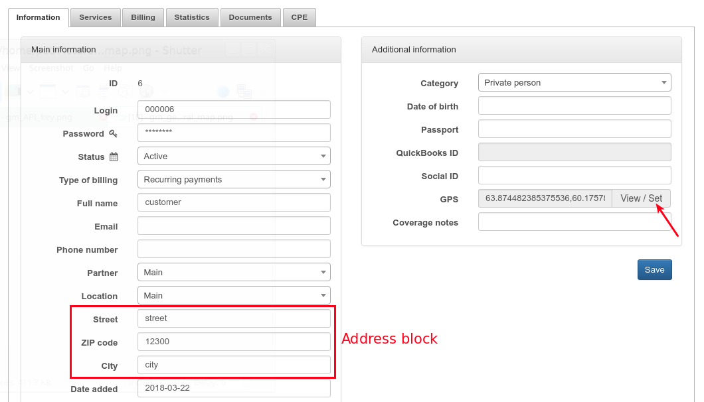

If the customer has a saved address, it will appear in the following window

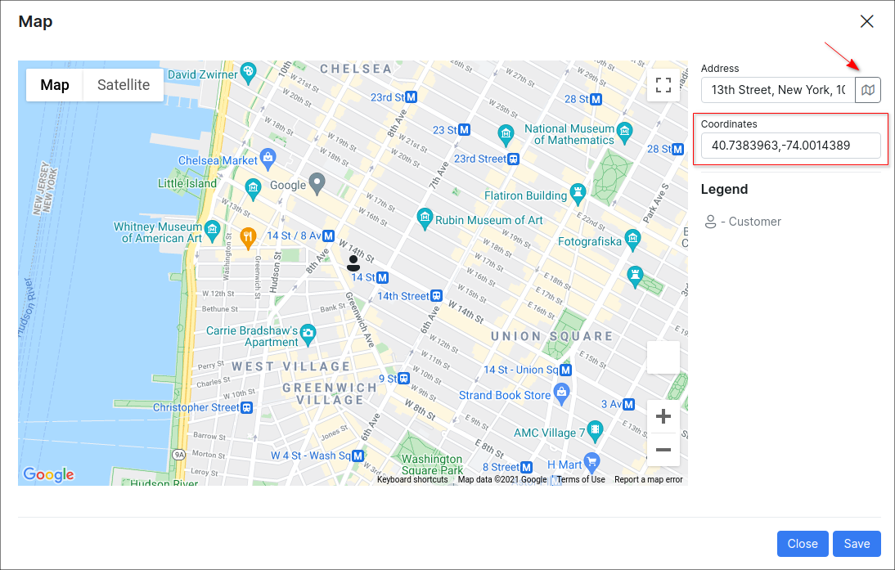

* **Add pointer.** Click on the map to add a pointer. You can click "Geocode" to find the address and place the pointer on it. You can only add one pointer at a time, if you need to add more then one - open this window again
* **Move pointer.**  drag and drop the pointer
* **Remove pointer.** Click on the pointer and press "Delete marker"

After editing click on "Save" and "Close". The "Save" button saves pointers immediately. You don't have to press the "Save" button when returning to the customer's information tab

You can edit coordinate pointers of routers and monitoring devices in the same way.

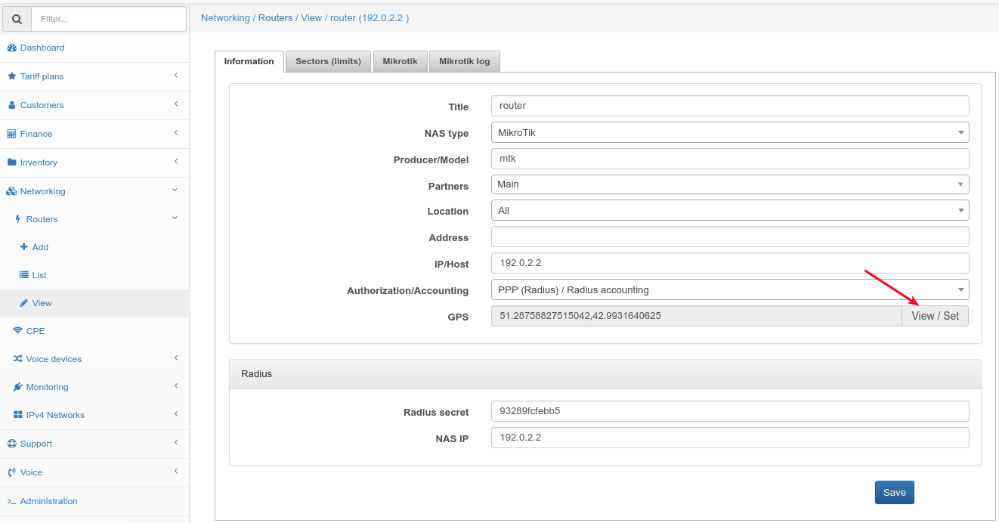

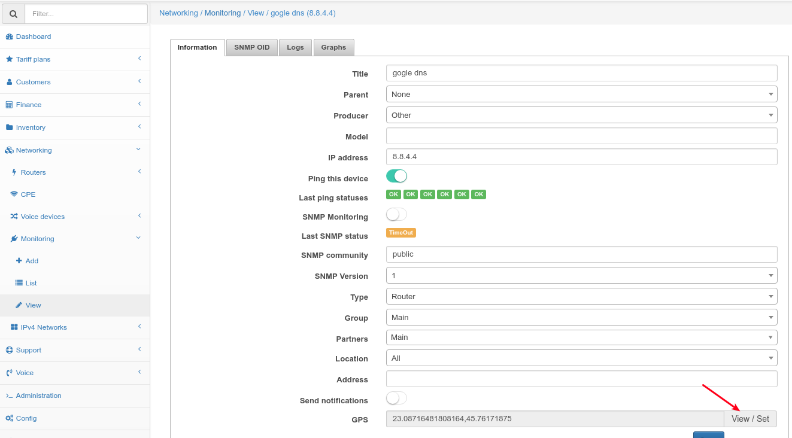

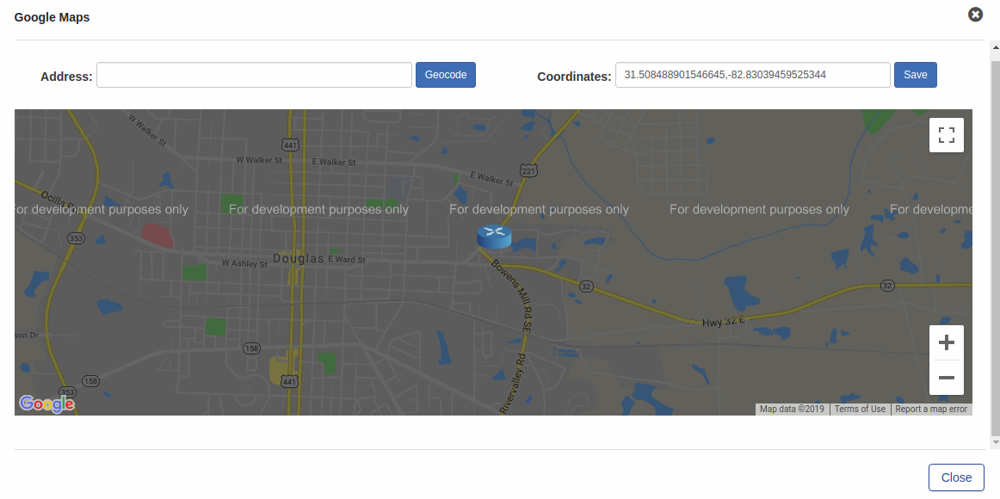
