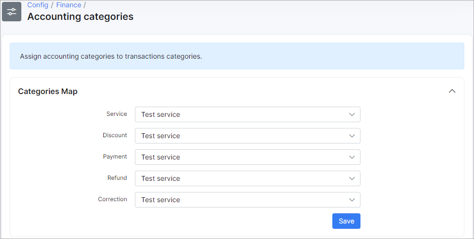

Holded accounting
===============

**Holded** is a Splynx accounting add-on, which allows you to integrate your customers as well as their invoices, credit notes, payments with the [Holded](https://www.holded.com/) cloud-based accounting and business management software.

<icon class="image-icon"></icon> To enable this accounting integration, please, contact our support team: support@splynx.com

## Registration on Holded

To initiate the integration process, you need to have an account on the Holded website at https://app.holded.com/

Choose an already existing organization or create a new one:

## Installation

In Splynx, go to *Config → Integrations → Add-ons*, find ***"splynx-holded"*** and click on the *Install* button in the Actions column:

Confirm the installation by clicking the `Ok, confirm` button:

## Configuration

After successfully installing the add-on, navigate to *Config → Integrations → Modules list* and find the module called ***"splynx_holded_accounting"***. Then, click the *Edit (Config)* button to configure the add-on:

Enter the Holded auth API key in the *API key* field:

<b>Synchronization settings</b>

* **Contact type** - choose a contact type (*Unspecified*, *Client*, *Supplier*, *Opportunity*, *Debtor*, *Creditor*);
* **IBAN** - an additional field for the customer IBAN;
* **Export invoices/credit notes from date** - specify a date in the 'Y-m-d' format. During the synchronization process, any invoices or credit notes dated before the specified date will be ignored;
* **Export payments from date** - specify a date in the 'Y-m-d' format. During the synchronization process, any payments made before the specified date will be ignored;
* **Partners ignore list** - select [partners](administration/main/partners/partners.md) that will be ignored during the synchronization process;
* **Accounting ID for invoice/credit note corrective item** - it will add a corrective item to Holded invoices/credit notes if a total mismatch occurs due to rounding differences;
* **Corrective item name** - specify a name for the item that contains the corrective amount.

You can export each type by cron:

<icon class="image-icon"></icon> You can also access the configuration menu for the Holded add-on by clicking the `Module Config` button under *Finance → Holded Accounting*:

__________________________

When it's done, navigate to *Finance → Holded Accounting* to import mapping settings into Splynx:

## Accounting bank accounts

Then load accounting bank accounts under *Finance → Accounting bank accounts*:

Click the `Load` button to start the loading process:

<icon class="image-icon"></icon> Reload bank accounts after making changes in the accounting software.

## Accounting categories

You can load accounting categories under *Finance → Accounting categories*:

Click the `Load categories` button to start the loading process:

<icon class="image-icon"></icon> Reload categories after making changes in the accounting software.

## Manual accounting synchronization

There is a Holded accounting menu under *Finance → Holded Accounting* where you can perform the Holded manual accounting synchronization:

Here, you can export customers, invoices, credit notes, and payments to Holded:

## Logs

You can view logs for each type of accounting integration (Customers, Invoices, Credit notes, and Payments) under *Administration → Logs → Accounting integrations*:

You can also access the logs by clicking the `Synchronization logs` button under *Finance → Holded Accounting*:

