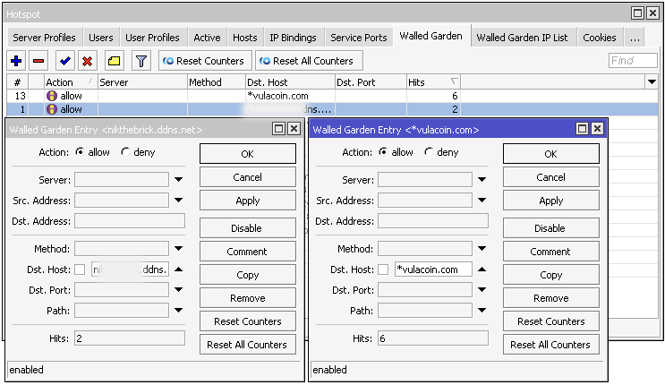
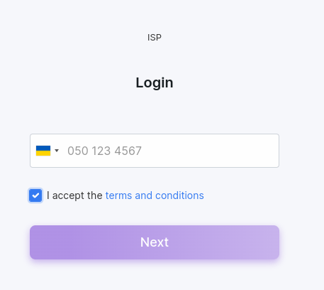

HotSpot add-on configuration
=============================

If you look at the reality today, every visitor has a mobile gadget that connects to the public WiFi network in a place where people stay for a few time, such as a hotel, airport, store etc. The use of HotSpot on the router, in addition to providing the Internet, can bring more benefits to the development of your business. In the HotSpot network, the user can authenticate using any web browser, so there is no need to install any additional software to customer end. As the HotSpot login prompt is a web page, the HotSpot service can effectively be used as an advertising technique of your company.

In this guide, we are going to learn how to install the HotSpot add-on in Splynx, configure MikroTik router and how to perform the **VulaCoin** payments feature integration.


### Install HotSpot add-on

To install the **HotSpot** add-on, navigate to `Config → Integrations → Add-ons`:


Search the `splynx-hotspot` add-on item and click on the *Install* icon located in the *Actions* column. Click on the **OK, confirm** button to begin the installation process.


Alternatively, the add-on can be installed using the following commands via the terminal on your Splynx server:

```
apt update
apt install splynx-hotspot
```

<icon class="image-icon"></icon> The guide **how to install and configure (required) the VulaCoin add-on** can be found in the following [article](payment_systems/vulacoin/vulacoin.md).

#### HotSpot add-on settings

After the installation process has completed, you have to configure the HotSpot add-on, navigate to `Config → Integrations → Modules list`. Search for the `splynx-hotspot` add-on and click on the <icon class="image-icon"></icon> (**Edit**) icon in the *Actions* column to open its config page:


<br>

**Main information and API settings:**


* **API domain** - api domain should be the same as the Splynx URL. The forward slash `/` sign is required at the end;

* **API key, API secret** - auto generated default values. Don't change it unless it is absolutely necessary.

<br>

**Common settings**


* **Splynx url** - your Splynx URL address without the forward slash `/` sign at the end;

* **Default partner** - select the default partner for the created customer;

* **Default location** - select the default location for the created customer.

<br>

**Customer setting**


* **Name** - enable/disable the use of the name field when registering a customer;

* **Email** - enable/disable the use of the email field when registering a customer;

* **Phone length (symbols)** - phone length (symbols). The default value: `13`;

* **Phone placeholder** - phone number pattern. The default value: `+420XXXXXXXXX`.


Note that changes are not saved until you click **Save**.

---

The configuration of add-on **Entry points** can be found in `Config → Integrations → Modules list`, near the `splynx_addon_hotspot` module item in *Actions* column, click on the <icon class="image-icon"></icon> (*Edit entry points*) icon.

More information about *Modules list* can be found [here](configuration/integrations/modules_list/modules_list.md).


### One-time Tariff Plans and Vouchers Configuration

Navigate to `Tariffs plans → One-Time` at the top right, click the **Add plan** button:


Add some plans which will be available for customers, e.g.:


### HotSpot Configuration in MikroTik Router

Start by logging into your MikroTik router. Please make sure **there is no previous configuration on the router before you start**, as this configuration may conflict with the HotSpot setup.

**Specifications:**

We will use Splynx server (public domain and SSL are set) and Mikrotik hAP AC lite. Router (OpenVPN client - `10.250.32.2`) will be connected with Splynx (OpenVPN server - `10.250.32.1`) via OpenVPN.
In HotSpot will be used `10.5.50.0/24` network.
The Android-based cell phone will be a HotSpot client.

Suggested read: [OpenVPN configuration](configuration/tools/openvpn/openvpn.md).


**Step 1**

Define the port for WAN connection to connect to the Internet via DHCP. Navigate to`IP → DHCP Client` and add the DHCP Client, for example, to the **ether1** interface:


**Step 2**

After the OpenVPN certificates are generated in Splynx and imported to MikroTik, add your router to Splynx and check the connection:


**Step 3**

Create two Bridges and combine the WLAN (wlan1, wlan2) and LAN (ether2-ether5) ports with the related bridges:


**Step 4**

In `IP → DNS` specify the address of your DNS server. Put the check mark near the *Allow Remote Requests* option:


**Step 5**

Assign new IP addresses to the *HotSpot* and *LAN-Ethernet* interfaces in `IP → Addresses`. The IP address can be anything you choose, but it must be in a range of IP addresses other than the IP address of the
DHCP server on the Internet. Remember to add `/24` after the IP address - this is the sub-net range in which the interface will operate.


**Step 6**

Enable Wi-Fi interfaces which will be used for *HotSpot* and configure them to accept wireless connections: use the AP Bridge mode, input the SSID (Wireless Name) name of your HotSpot, etc.


**Step 7**

Now start making the HotSpot configuration, for this purpose use the HotSpot Setup wizard. Navigate to the menu `IP → Hotspot → Hotspot Setup` and perform the next steps:

- Choose which interface the HotSpot will run on, in our example it's the HotSpot bridge.


- The next window allows you to choose the local address range of your HotSpot. This will be filled in for you based on the IP address that you assigned to your bridge earlier. Make sure the **Masquerade Network** option is ticked.


- Choose the IP address Pool for your HotSpot network. The value will be filled in automatically, it's based on the wireless interface IP address assigned earlier.


- In our example we are not going to use SSL/HTTPS certificates for HotSpot, so just leave the option set to `none` and press **Next**.


- In our example we don't need SMTP server, so just leave the address as `0.0.0.0`.


- The DNS address will be filled in automatically based on our previous configuration.


- In the field type, e.g.`local.hotspot`, this is the address that HotSpot clients will be redirected to when they want to login. Make sure that this site is not accessible on the Internet (do not use, for example, `yahoo.com`), and the address must include a dot sign in the name.


In this window you can create your first HotSpot username and password, but we'll leave it as it is (don't set any password).


After that the HotSpot server will be created:


**Step 8**

The next step is to replace the default `login.html` file on the router storage to our customized one:


But first of all, you need to download the [configured html file](file_mikrotik.zip) and change the URL address of Splynx to your own:


**Step 9**

The clients authorization uses the RADIUS protocol. Let's configure the interaction between the router and the service by adding a new server to the RADIUS menu, after that make its configuration:

- **Service:** `hotspot`;
- **Address:** `your Splynx IP address`;
- **Protocol:** `udp`;
- **Secret:** `automatically generated value from your router page in Splynx`;
- **Authentication Port:** `1812`;
- **Accounting Port** `1813`;
- **Timeout:** `3000`

Then, navigate to `IP → Hotspot → Server Profiles`, double click on your HotSpot profile and click on the **RADIUS** tab, change settings as shown below:


**Step 10**

Set the correct parameters on the **Login** tab for the HotSpot Server Profile:

- **Login By:** `HTTP CHAP`;
- **MAC Auth. Mode:** `MAC as username and password`.


**Step 11**

In `IP → Hotspot → Server Profiles`, the default profile should be with the next settings:


**Step 12**

In `IP → Hotspot → Walled Garden`, configure the following addresses to **Dst. Address** one by one for access by unauthorized clients::



### Connection to HotSpot and Payments via VulaCoin

<icon class="image-icon"></icon> Double check if the [VulaCoin add-on](payment_systems/vulacoin/vulacoin.md) is installed and configured in Splynx.

Imitating the client's steps, try to connect to the newly created Wi-Fi HotSpot:


To sign in to your HotSpot, enter your phone number and press **Next**:



<icon class="image-icon"></icon> **NOTE:** To receive an SMS with a code, you need to set up an [SMS gataway](configuration/main_configuration/sms_config/sms_config.md) in Splynx.


Then, select your plan. In case the plan is paid you will be redirected to the VulaCoin page to make payment:


<icon class="image-icon"></icon> **NOTE:** The client will be connected to the Internet through an automatically created **prepaid voucher**, an invoice will be created for the paid plan only in Splynx.


