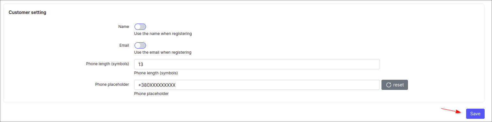
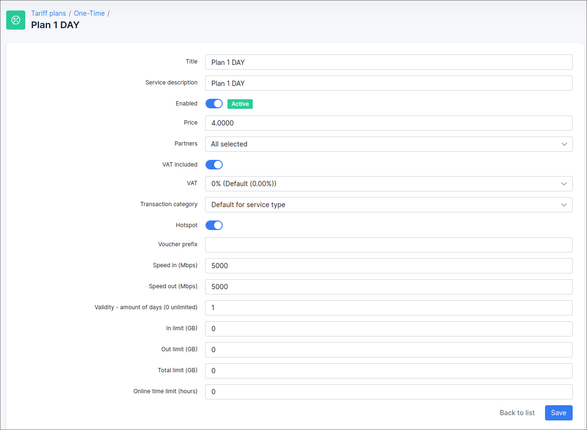
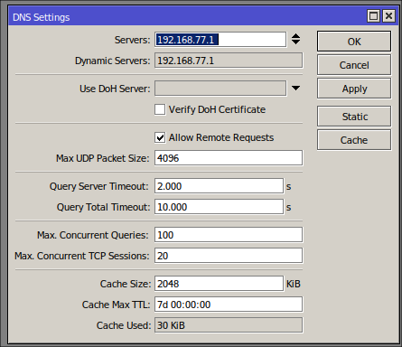
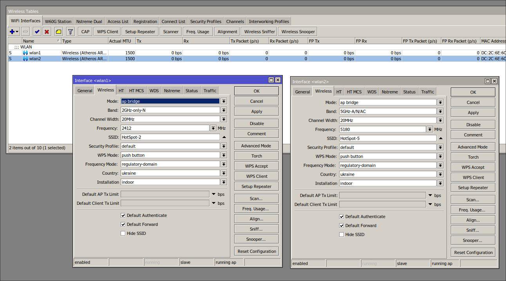
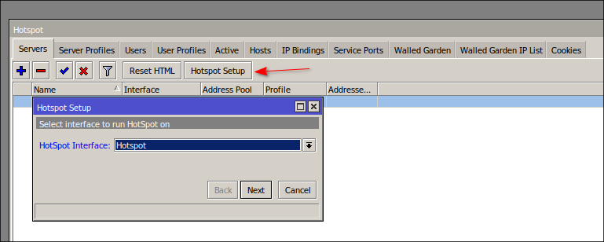
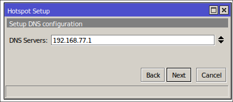
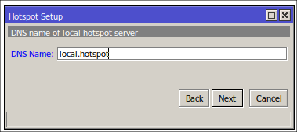

HotSpot add-on with VulaCoin payments support
=============================

If you look at the reality today, every visitor has a mobile gadget that connects to the public WiFi network in a place where people stay for a few time, such as a hotel, airport, university campus etc. The use of HotSpot on the router, in addition to providing the Internet, can bring more benefits to the development of your business. In the HotSpot network, the user can authenticate using any web browser, so there is no need to install any additional software to customer end. As the HotSpot login prompt is a web page, the HotSpot service can effectively be used as an advertising medium of your company.

In this guide, we are going to learn how to install the HotSpot add-on in Splynx, configure MikroTik router and how to perform the VulaCoin payments feature integration.


### Install and Configure HotSpot and VulaCoin Add-ons

#### Add-ons Installation

To install the **HotSpot** add-on, navigate to `Config → Integrations → Add-ons`:


Search the `splynx-hotspot` add-on item and click on the *Install* icon located in the *Actions* column. Click on the **OK, confirm** button to begin the installation process.


Alternatively, the add-on can be installed using the following commands via the terminal on your server:

```
apt update
apt install splynx-hotspot
```

<icon class="image-icon"></icon> The guide **how to install and configure the VulaCoin add-on** can be found in the following [article](payment_systems/vulacoin/vulacoin.md).

#### HotSpot add-on settings

After the installation process has completed, you have to configure the HotSpot add-on, navigate to `Config → Integrations → Modules list`. Search for the `splynx-hotspot` add-on and click on the <icon class="image-icon"></icon> (**Edit**) icon in the *Actions* column to open its config page:


<br>

**Main information and API settings:**


* **API domain** - api domain should be the same as the Splynx URL. The forward slash `/` sign is required at the end;

* **API key, API secret** - auto generated default values. Don't change it unless it is absolutely necessary.

<br>

**Common settings**


* **Splynx url** - your Splynx URL address without the forward slash `/` sign at the end;

* **Default partner** - select the default partner for the created customer;

* **Default location** - select the default location for the created customer.

<br>

**Customer setting**



* **Name** - enable/disable the use of the name field when registering a customer;

* **Email** - enable/disable the use of the email field when registering a customer;

* **Phone length (symbols)** - phone length (symbols). The default value: `13`;

* **Phone placeholder** - phone number pattern. The default value: `+420XXXXXXXXX`.


Note that changes are not saved until you click **Save**.

---

The configuration of add-on **Entry points** can be found in `Config → Integrations → Modules list`, near the `splynx_addon_hotspot` module item in *Actions* column, click on the <icon class="image-icon"></icon> (*Edit entry points*) icon.

More information about *Modules list* can be found [here](configuration/integrations/modules_list/modules_list.md).


### One-time Tariff Plans and Vouchers Configuration

Navigate to `Tariffs plans → One-Time` at the top right, click the **Add plan** button:


Add some plans which will be available for customers, e.g.:





### HotSpot Configuration in MikroTik Router

Start by logging into your MikroTik router. Please make sure there is no previous configuration on the router before you start, as this configuration may conflict with the HotSpot setup.

**Step 1**

Define the first port for WAN connection so the router will connect to the Internet via another router with DHCP. Navigate to `IP → DHCP Client` and add the DHCP Client to the **ether1** interface:


**Step 2**

Create two Bridges and combine the WAN (wlan1, wlan2) and LAN (ether2-ether5) ports with the related bridges:


**Step 3**

In `IP → DNS` specify the address of your DNS server:



**Step 4**

Assign new IP addresses to the interfaces - `IP → Addresses`. The IP address can be anything you choose, but it must be in a range of IP addresses other than the IP address of the
DHCP server on the Internet. Remember to add `/24` after the IP address - this is the sub-net range in which the interface will operate.


**Step 5**

Specify the interface to be created the HotSpot and configure it to accept wireless connections: turn on **wlan1/wlan2** and use the AP Bridge mode, input the SSID (Wireless Name) name of your HotSpot.



**Step 6**

Now start making the HotSpot configuration, for this purpose use the HotSpot Setup wizard. Navigate to the menu `IP → Hotspot → Hotspot Setup` and perform the next steps:

Choose which interface the HotSpot will run on, in our example it's the HotSpot bridge.



The next window allows you to choose the local address range of your HotSpot. This will be filled in for you based on the IP address that you assigned to your bridge earlier. Make sure the **Masquerade Network** option is ticked.


Choose the IP address Pool for your HotSpot network. The value will be filled in automatically, it's based on the wireless interface IP address assigned earlier.


In our example we are not going to use SSL/HTTPS certificates for HotSpot, so just leave the option set to `none` and continue.







### VulaCoin Integration
