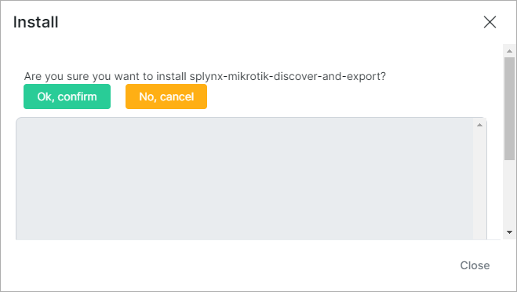
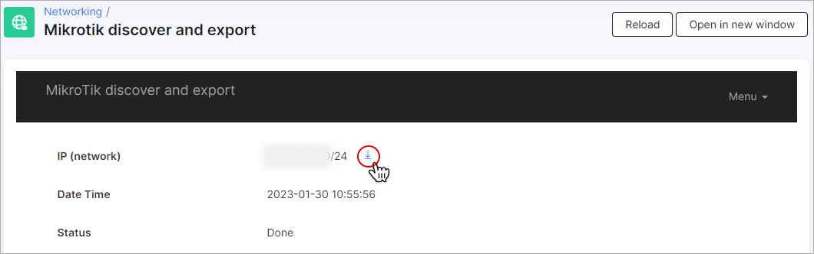

Mikrotik discover and export
========================================

A large number of Mikrotik devices and no prior inventory system can seem like a mammoth task to undertake in order to import all such devices into the inventory system.

The *Mikrotik discover and export* add-on solves this problem and greatly reduces this labour-intensive task by collecting all the necessary info in one spreadsheet.

## Installation

Under *Config → Integrations → Add-ons* locate or search for the *splynx-mikrotik-discover-and-export* package and click the *Install* button:

Confirm the installation by clicking the `Ok, confirm` button:

_______________________________________________________

After installation, navigate to *Networking → Mikrotik discover and export*:

You will be presented with the home screen of *Mikrotik discover and export* where you can configure network and attribute parameters.

<icon class="image-icon"></icon> For the convenience of working with the networking data, click on the `Open in new window` button.

### Network

* **IP (network)** - specify a subnet range or IP address from which to gather data;
* **Username/Password (SSH/API)** - enter the username and password that Splynx will use to attempt to log into the MikroTik router via SSH/API;
* **Port SSH** - the SSH port (indicated by default);
* **Port API** - the API port (indicated by default);
* **Connection timeout (seconds)** - if a device does not answer after the specified timeout (in seconds), its data will not be included for the export;
* **Type** - specify the type of connection (*'API'*, *'SSH'* or *'API or SSH'*).

### Attributes settings

In this section, you should specify attributes as conditions for a customized export.

For each group of attributes, you should specify the following:

- **Path** - the path to the necessary parameter or attribute;
- **Search value** - value to be obtained;
- **Attribute for condition** - specify an attribute for the export condition;
- **Equal or LIKE** - whether the *Value for condition* (see below) should be completely equal (*Equal*) or only the first value should be used as an export condition;
- **Value for condition** - specify a value for the export condition.

You can remove or add an attribute group by clicking the `-` or `+` button:

When all the necessary data is added, click the `Export` button to start the network data export.

The export process will start:

Once the export is finished, you will be able to download the specified network data in CSV format:

_______________________________________________________

All export history can be found in the *Export list*:

<icon class="image-icon"></icon> You may need to click on `Refresh` to update the data in the table.

The *ID* of the export entry, the *Date and Time* of the export, its *IP (subnet), and its *Status* are all displayed here.

### Actions

<icon class="image-icon"></icon> - Examine the export information, which includes the *IP (network)*, *Date and Time* of the export, and *Status*. The data can be downloaded in CSV format: 

<icon class="image-icon"></icon> - Download the network data in CSV format.

<icon class="image-icon"></icon> - Remove the export entry.

<icon class="image-icon"></icon> The table can be exported in any of the specified formats and ways:

Click on `Home` to go back to the home screen:

_________________________________________________________
With some modifications like modifying the product ID the CSV can be used to import Inventory items by using the upload tool.
[Config → Tools → Import](configuration/tools/import/import.md):

