Ofipro contabilidad (Spanish)
=============================

\##

Instalación del módulo

\##

Para poder trabajar con Ofipro deberemos añadir un nuevo campo "id_ofipro". Para ello, vamos a _Configuración → Campos adicionales_ y lo añadimos. Dado que es un campo necesario para poder hacer las exportaciones, podemos establecerlo como requerido. También es necesario que los clientes tengan un DNI real.

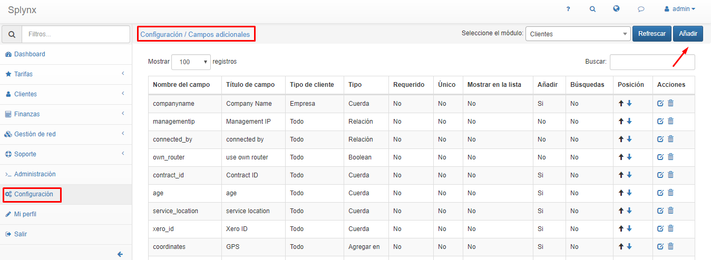

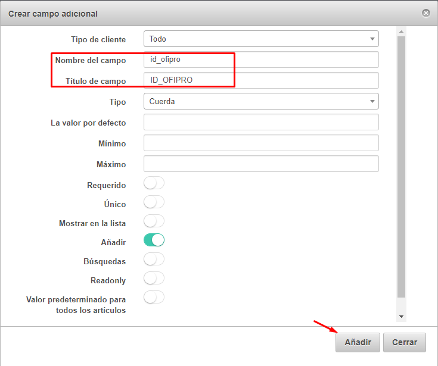

Una vez creado este campo, podemos pasar a las exportaciones. Vamos a _Finanzas → Facturas_ y seleccionamos el periodo de las facturas que queremos exportar y tras esto pulsamos en exportar.

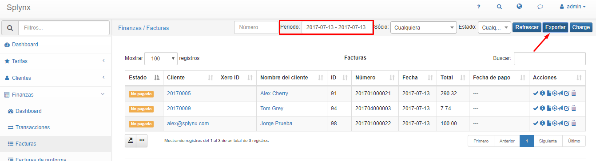

Seleccionamos tipo de exportación _ID Externo_ y como ID externo _splynx-ofipro y pulsamos en exportar._

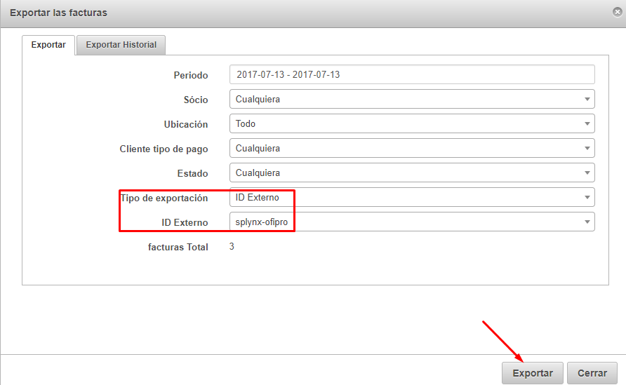

Si todos los datos están correctos, se completará la exportación y nos dará en el historial el mensaje _Listo.._ entonces lo descargamos para pasar a la importación en ofipro.

Una vez descargardo, extraemos los ficheros en una carpeta.

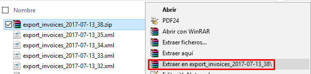

Y ahora pasamos a abrir Ofipro. En primer lugar deberemos añadir si no esta previamente añadida una serie que corresponda con la de las facturas de splynx, en nuestro caso la seria I.

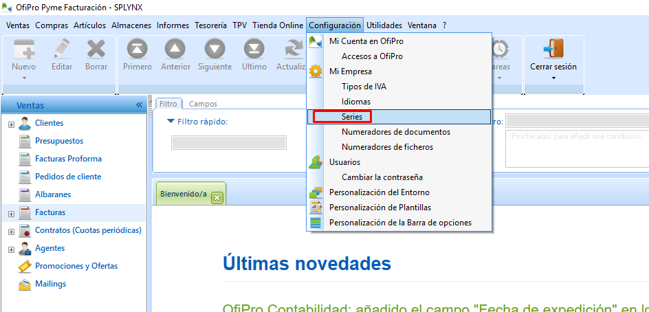

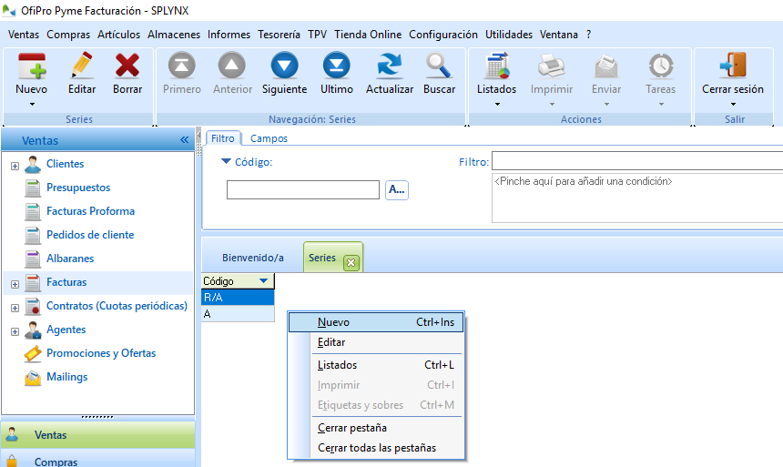

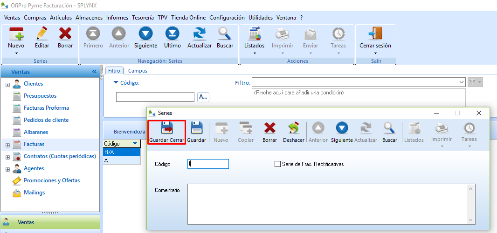

Tras esto pasamos a la importación pulsando en utilidades, importar datos en formato XML, seleccionamos la carpeta y pulsamos en importar.

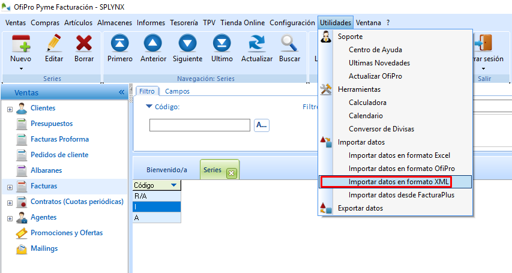

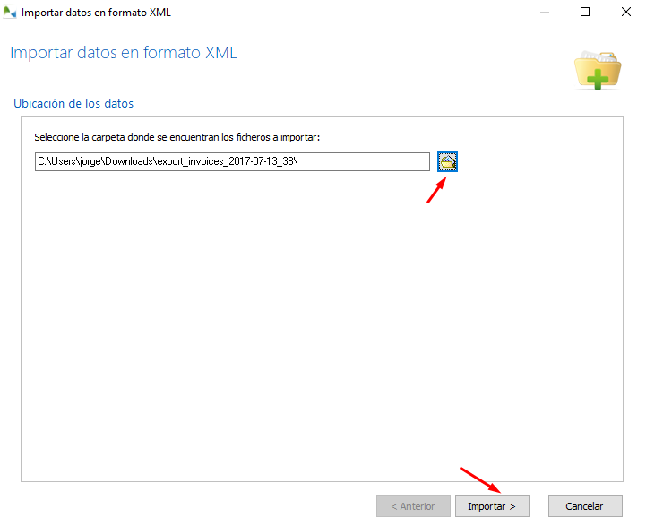

Si todo se ha importado correctamente aparecerá una imagen como la siguiente. Si no saldrán los diferentes errores que deberemos corregir.

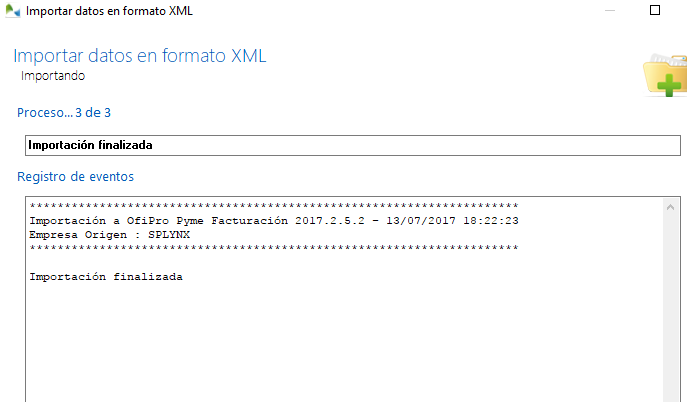

Una vez importado, no solo se importan las facturas sino que la primera vez también se importan los clientes y los artículos(tarifas).

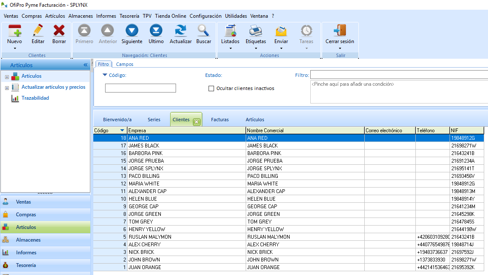

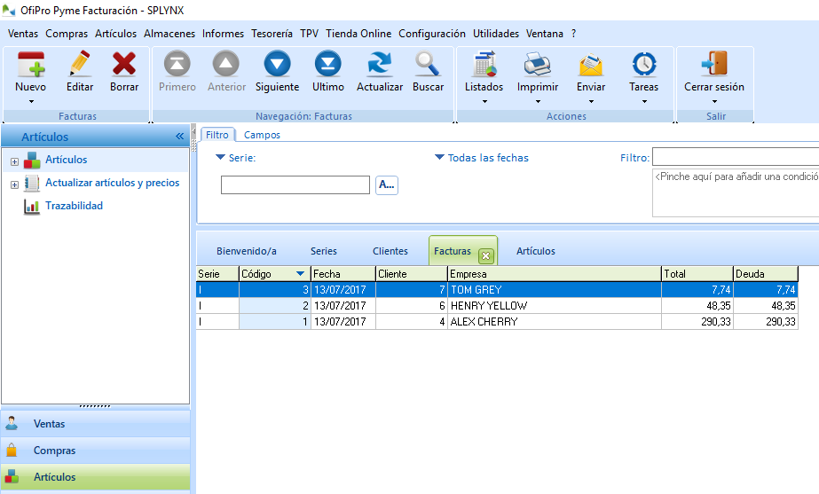

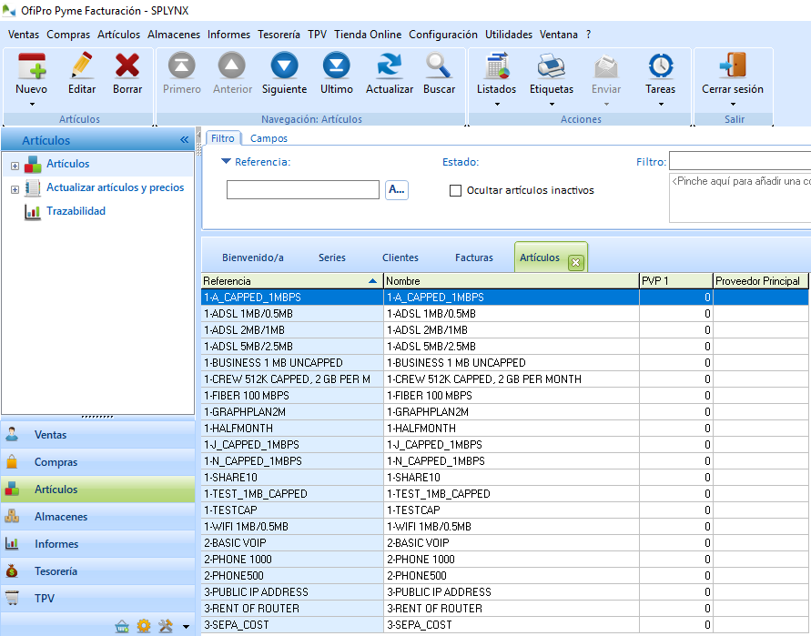

<iframe frameborder=0 height=270 width=350 allowfullscreen src="https://www.youtube.com/embed/kfq61RsuDBw">Video on youtube</iframe>