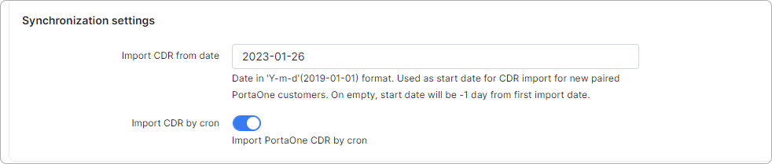
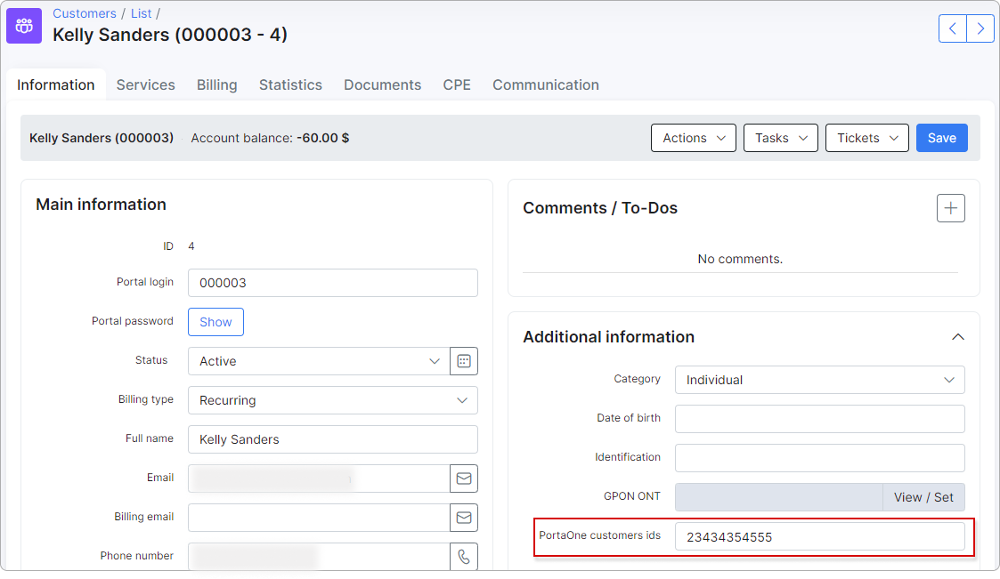

PortaOne
================================================

The PortaOne add-on is used to import customers' calls from the PortaOne software system into Splynx.

Individual calls and their prices (CDRs) can be shown in Splynx as Statistics within the customer profile and their Customer Portal. These calls can also be included in a customer’s PDF invoices.

## Installation

The add-on can be installed via one of two methods: via CLI or the Web GUI.

To install the PortaOne add-on **via CLI**, the following commands should be used:

```bash
apt-get update
apt-get install splynx-portaone
```

To install the addon **via the Web GUI**:

1. Navigate to Config → Integrations → Add-ons.

2. Locate or search for the "splynx-portaone" add-on and click on the install icon in the Actions column:


3. Click on the OK, confirm button to begin the installation process:


## Basic configuration

Navigate to Config → Integrations → Modules list and search for splynx_addon_portaone.

Then click the Edit (Config) button to perform the basic configuration:


### API settings


<icon class="image-icon"></icon> The API domain, API key and API secret are already pre-populated by default after the add-on installation and don’t require any configuration.

### PortaOne API settings


* **API URL** - PortaOne API URL;
* **Login** - your login to access the PortaOne API;
* **Password** - your password to access the PortaOne API; 

<icon class="image-icon"></icon> PortaOne requires you to change the password regularly.

* **Token** - your token to access the PortaOne API.

<icon class="image-icon"></icon> The password is not required if the token is provided.

The PortaOne software system:


### Synchronization settings



* **Import CDR from date** - the date (in 'yyyy-mm-dd' format) used as the start date for the CDR import for newly paired PortaOne customers. If left empty, the start date will be one day before the first import date;
* **Import CDR by cron** -  import PortaOne CDRs using cron. CDRs will be imported from PortaOne to Splynx daily at 01h00. If disabled, no CDRs will be imported from PortaOne.

## Customer account settings
The *PortaOne customers ids* field will automatically appear after the add-on installation under the customer's *Additional information*.

When the basic configuration is done, add the PortaOne ID for each customer that should import calls:



The customer’s phone number should also be set in the relevant voice service:


## Voice processing configuration

The next step is to configure the Auto CDR processing.

An import data source should be created in [*Config → Voice → Import data source*](configuration/voice/import_data_source/import_data_source.md).

- Set a relevant name.
- Select “Local” as the Data source type.
- Use the following default path:
/var/www/splynx/addons/splynx-portaone/data/files


Then navigate to [*Config → Voice → Auto CDR processing*](configuration/voice/auto_cdr_processing/auto_cdr_processing.md) and create an Auto CDR processing entity where we should define the data source to import from as well as the PortaOne handler (auto-created by the addon):


The system will now auto-process voice calls from the addon local folder using the defined interval.