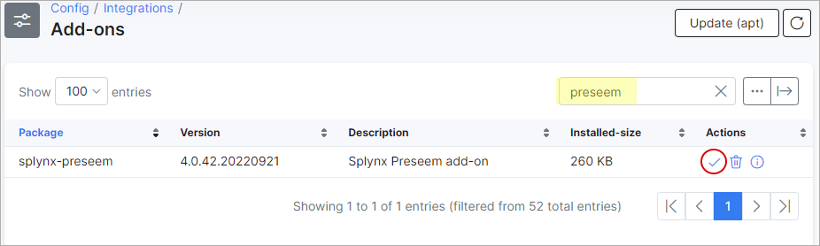
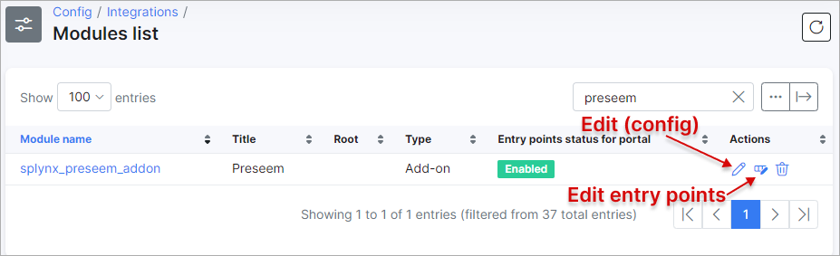
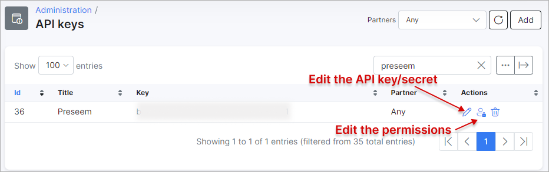
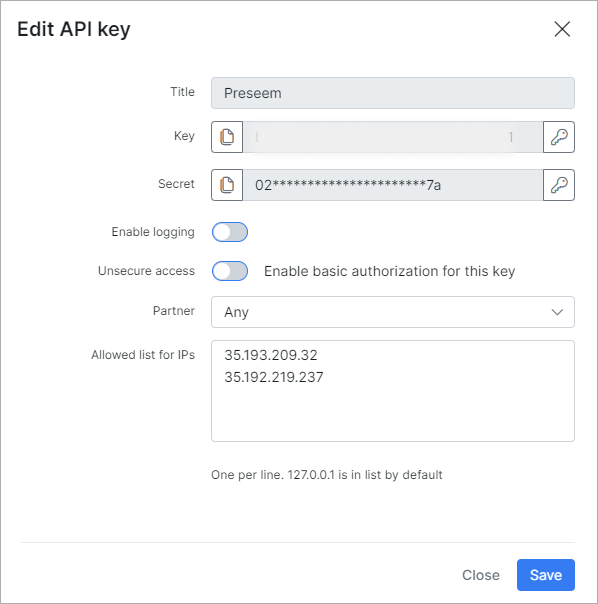
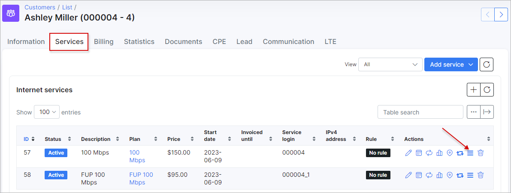
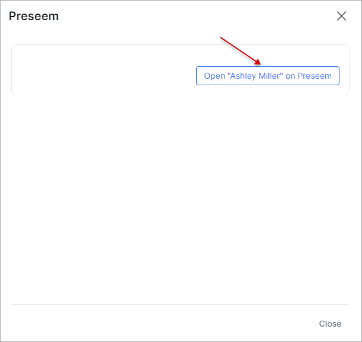

Preseem add-on
========
Preseem is the add-on module designed for the integration your Splynx customers, services and network infrastructure with [Preseem service](https://www.preseem.com). Preseem service offers a QoE (Quality of Experience) monitoring ([instead of network monitoring](https://preseem.com/2017/07/network-monitoring-vs-subscriber-qoe/)) and optimization platform for wireless internet service providers (WISPs). It enables WISPs to understand the QoE the network delivers down to a tower, sector, and subscriber level and eliminates typical "my Internet is slow" requests and fixes other network problems.


To install the add-on use one of the two methods: via CLI on the Splynx server or via the Splynx Web UI.

To install the add-on via CLI, the following commands can be used:

```bash
apt-get update  
apt-get install splynx-preseem
```

To install the add-on from the Web UI:

Navigate to `Config → Integrations → Add-ons`:


Find there the "splynx-preseem" add-on and click on the install icon in the *Actions* column of the table



Then, click on the "OK, confirm" button to begin the installation process

[](img_000003.png)

Once the installation process has completed, all configurations for the add-on can be found in `Config → Modules → List`, simply click on the necessary icon of the module and you will be able to change settings of the add-on



## How the Preseem module works

After add-on installation in your Splynx system will be created [API key/secret](administration/main/api_keys/api_keys.md) with such permissions:

|  |   |   |
| :------------: | :------------: | :------------: |
| Tariff Plans  | Internet |  View |
|  FUP | Compiler  |  View |
|  FUP |  Policies |  View |
|  FUP | Capped Data  |  View |
|  FUP | CAP Tariff  | View  |
|  FUP |  FUP Limits |  View |
|  Customers | Customer  |  View |
|  Customers | Customers Online  | View  |
|  Customers |  Customer Internet services |  View |
|  Networking | Routers  | View  |
|  Networking | Router contention  |  View |
|  Networking |  MikroTik |  View |
|  Networking |  Monitoring |  View |
|  Networking |  IPv4 Networks | View  |
|  Networking |  IPv4 Networks IP | View  |
|  Networking | CPE  |  View |
|  Networking |  CPE AP | View  |
|  Networking |  IPv6 Networks | View  |
|  Networking |  IPv6 Networks IP (Addresses) |  View |
|  Administration | Locations  |  View |

The IP addresses that can connect to the Splynx API are: **35.193.209.32**, **35.192.219.237**.





Preseem polls Splynx on information about sites, device, accounts and services via an API from the Preseem cloud using the following data models:

| Network Devices  |
| ------------ |
| **Devices** from the **Networking/Hardware** section of Splynx are read into Preseem based on their **type** |
| The **Location** in Splynx is used to set the **Tower** in Preseem |
| The **title** in Splynx is used to set the **Sector** name in Preseem.  If two devices have the same title, the IP address is appended to the description  |
| The **IP Address** in Splynx is used as the management IP address in Preseem.  Preseem will try to connect to this IP address to SNMP poll the device.  |
| Preseem will set a 10Gbps shaper on the IP Address of all devices in UIPC to prevent management traffic from being shaped to the default rate.  |

| Tariff Plan  |
| ------------ |
| The **Download Speed** and **Upload Speed** in Splynx are used to set the **download speed** and **upload speed** of **packages** in Preseem  |
| The package speeds can be multiplied by a constant factor by configuring a service rate multiplier in Preseem.  Currently this configuration can only be done by Preseem, but in the future it will be available in the Preseem web app  |

| Customer data  |
| ------------ |
| Each active **Service** on the customer in Splynx is mapped to an **Account** in Preseem. The **Account ID** in Preseem is set to **{Customer ID}.{Service ID}** in Splynx, e.g.  *a client with ID 107 in Splynx with services 1051 and 1052 will result in two accounts in Preseem with identifiers 107.1051 and 107.1052*; Optionally, the **Login** field on the **Service** in Splynx can be used as the **Account ID** in Preseem. |
| The **Full name** in Splynx is the **Account Name** in Preseem.  If there are more than one **services** for the customer, the **service description** is appended to the account name in Preseem  |
| The **Service** assigned to the **customer** is used to set the upload and download rates for the account in Preseem  |
| By default, **disabled** Splynx **customers** are not read by Preseem.  This behavior can be changed by Preseem so that disabled services are blocked or slowed down.  Currently this configuration can only be done by Preseem, but in the future it will be available in the Preseem web app  |
| By default, **blocked** Splynx **customers** are shaped to their regular service speed by Preseem.  This behavior can be changed by Preseem so that blocked services are blocked or slowed down.  Currently this configuration can only be done by Preseem, but in the future it will be available in the Preseem web app  |
| **Services** in Splynx with a status of **Stopped** are not read by Preseem  |
| The **Plan** assigned to the service is used to set the upload and download speeds that Preseem will enforce. The plan speeds can be overridden by setting **additional attributes** on the service called **preseem_shape_downstream** and **preseem_shape_upstream**. The plan speeds can be multiplied by a constant factor by configuring a service rate multiplier in Preseem.  Currently this configuration can only be done by Preseem, but in the future it will be available in the Preseem web app |
| Preseem will obey the **FUP Policies** set in Splynx to override its default shaping and blocking behavior for a service  |
| The upload and download rates in Preseem will be shared by the **IP Address** of each **service** as well as any **Additional IPv4  networks** and **Delegated IPv6 prefixes** assigned to the service.  CPE management IP addresses are included in the shaper if they are inspected by the Preseem appliance  |
| Any **MAC addresses** set on the **Service** in Splynx are used to help map the customer to its **account** and **AP** in Preseem  |
| **Inventory** assigned to an account as a CPE will be used to help map the customer to its **account** and **AP** in Preseem  |

Changes in Splynx are synced to Preseem within 5 minutes.

## Using the Preseem module

After the add-on has been installed, provide the Preseem support team with
- the [Splynx URL](configuration/system/company_information/company_information.md);
- the Key and Secret from the API key configuration

to finish configuring an integration.

Moreover, Preseem can read your APs and routers from Splynx. To do this, it needs to know which Device Types map to which type of equipment.
This can be found in `Config → Networking → Monitoring`. Simply send a screenshot of these settings or let Preseem support engineer know which Device Type IDs should be used for APs and routers because such info is not available via the Splynx API.


In order to open some customer's preseem page, open the customer list in Splynx, select a preferred account, choose *SERVICES* tab and on available internet service click on *preseem* button in *Action* column:




