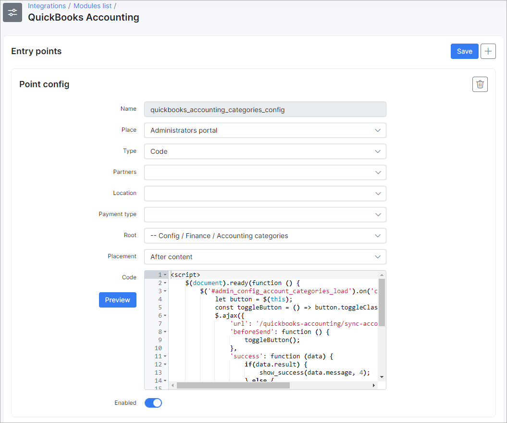
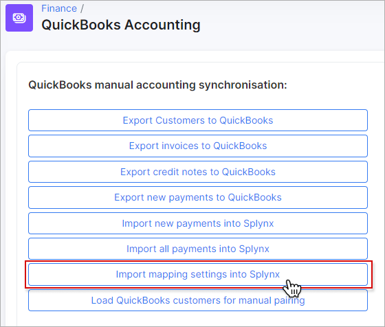
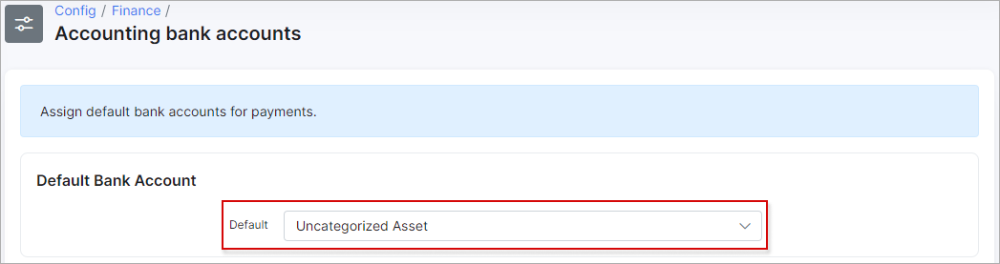
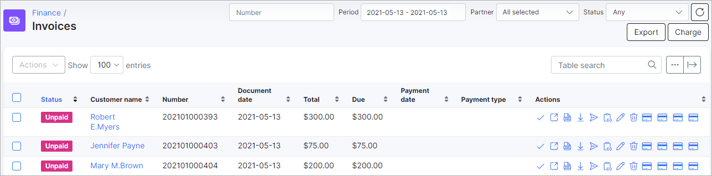
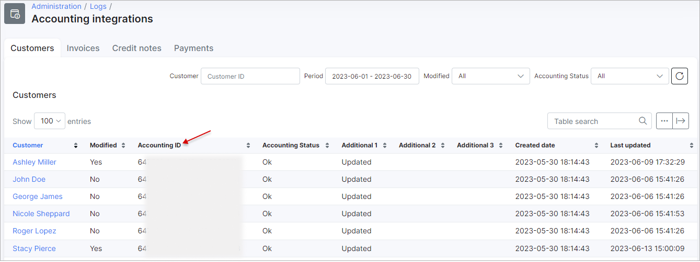
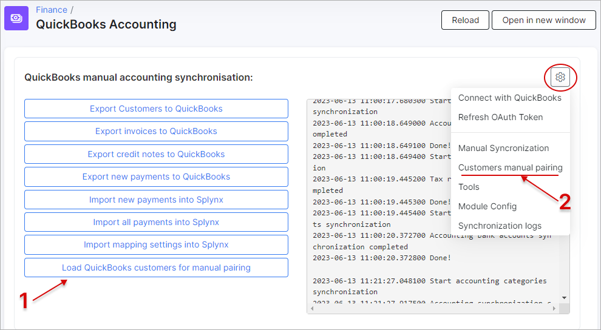

Quickbooks accounting
==========================================

_Splynx QuickBooks_ is the add-on of Splynx which is used to synchronize customers, invoices and payments with the [Quickbooks accounting gateway](https://quickbooks.intuit.com/).

<icon class="image-icon"></icon> **It's recommended do not configure the add-on on your own.**
**Please, contact our support team before starting the accounting integration.**

The add-on can be installed in two ways:
* via the command-line interface (CLI) and the following commands:

```
apt update
apt install splynx-quickbooks
```
* via the Web UI of your Splynx server in `Config → Integrations → Add-ons`:


After the installation process is completed, the `QuickBooks Accounting` item will appear under the `Finance` section: 


After that, it is necessary to obtain a Quickbooks Online account to start the integration (the screenshots related to Quickbooks were taken from its developer sandbox environment).


Create your company:


The settings of QuickBooks Accounting add-on is located in `Config → Integration → Modules list`. Click the `Edit` button under the *Actions column*:


To open the configuration of add-on entry points, click the *Edit entry points* icon:


___________________________________________

The general configuration of the QuickBooks integration module can be viewed and edited here:


### Accounting API settings


**Splynx domain** - the Splynx domain must be the same as the API domain URL but without the last slash "/". **HTTPS is required!**;

**Country code** - choose the required country code (US, FR or Other);

**US tax code** - (for US companies only) specify the tax code which will be applied to invoices. The id can be obtained from `Config → Finance → Accounting tax rates`;

**Currency code** - the currency that will be used for customers, invoices and payments.
_______________________________

### Synchronization settings


**Payment method ID** - select the payment method for imported payments;

**Payment statement grouping** - group payment statements by "Month" or "Day";

**Partners ignore list** - select the partners whose customers, invoices, and payments will be ignored in the sync process. The customers, invoices and payments of the selected partners **WILL NOT** be synced with QuickBooks;

**Payments synchronization direction** - define the direction of syncing payments: *QuickBooks → Splynx*, *Splynx → QuickBooks* or *Bidirectional*;

**Payments push to QuickBooks** - select the payment methods to sync with QuickBooks. This selection only applies if the selected method for syncing payments is set to *Splynx → QuickBooks*.

<icon class="image-icon"></icon> **Please refrain from selecting QuickBooks in the list of payment methods to sync, as doing so will result in payments being pulled from QuickBooks.**

**Import payments from date** - specify the date in `Y-m-d` format, e.g. 2023-05-01, which will be used as the start date for importing all prepayments to Splynx;

**Export finance documents from date** - set a date in `Y-m-d` format, e.g. 2023-01-01 from which the finance documents will be synchronized. Any finance documents created before this date will be ignored during the export. The synchronization process will check the *Date* field in the finance document.

**Create payments without invoices/credit notes** - the toggle allows you to enable/disable the creation of payments in Splynx when a customer doesn't have an invoice or credit note (e.g., for partial payments in QuickBooks). When the toggle is disabled, only payment statements will be created in Splynx. This toggle is used for payments import. 

<icon class="image-icon"></icon> **In some cases can lead to duplicate payments. Use this option with caution.**

**Customer name pattern** - used to set a customer's name pattern during the sync to *QuickBooks* where it will be represented as `Display name as`. The next variables can be used: `{id}, {login}, {name}, {email}`. By default: `{name}`.


<details style="font-size: 15px; margin-bottom: 5px;">
<summary><b>Example: Display name</b></summary>
<div markdown="1">


</div>
</details>

______________________________

### Cron settings


<icon class="image-icon"></icon> All cron toggles are disabled by default.

**Customers** - enables/disables automatic syncing of customers;

**Invoices** - enables/disables automatic syncing of invoices;

**Payments** - enables/disables automatic syncing of payments.

<icon class="image-icon"></icon> It is recommended to leave all settings in the "Cron Settings" section disabled for the initial set up of the add-on to avoid automatically syncing all these elements via cron jobs. The first import and export should be done manually in `Finance → QuickBooks Accounting`.


## Starting with QuickBooks

Click the `QuickBooks Accounting` item under the *Finance* section:


First, we need to connect the add-on to our Quickbooks account:


Click the `Connect with QuickBooks` button, enter your account credentials and press `Connect` to allow Splynx to view and update the date on the QuickBooks side:


When it's connected, the token will be created:


We can add/edit Taxes, Products and Services in Quickbooks:


The taxes should be the same as the taxes in Splynx (`Config → Finance → Taxes`) to work properly.
___________________________

Now, in `Finance → QuickBooks Accounting` run _Import mapping settings into Splynx_




```
2021-05-13 09:04:28.413400 Start accounting categories synchronization
2021-05-13 09:04:31.119300 Accounting synchronization completed
2021-05-13 09:04:31.119500 Done!
2021-05-13 09:04:31.119900 Start tax rates synchronization
2021-05-13 09:04:32.157200 Tax rates synchronization completed
2021-05-13 09:04:32.157300 Done!
2021-05-13 09:04:32.157400 Start accounting bank accounts synchronization
2021-05-13 09:04:33.162500 Accounting bank accounts synchronization completed
2021-05-13 09:04:33.162600 Done!
```

_______________________

After successful synchronization, make changes to *Accounting categories*, *Accounting bank accounts* and *Taxes settings* in `Config → Finance`:


### Accounting categories

In `Config → Finance → Accounting categories`, all accounting categories from QuickBooks (`Sales →  Products and Services`) must be assigned to transactions categories (`Config →  Finance → Transaction categories`) in Splynx:


### Accounting bank accounts

As soon as the relevant categories are configured, we can proceed with bank accounts. Navigate to `Config → Finance → Accounting bank accounts`.

Assign the QuickBooks bank accounts (`Accounting →  Chart of Accounts types`) to payment methods (`Config → Finance → Payment methods`) in Splynx, also the default bank account should be selected.




### Accounting tax rates

And the last one - `Config → Finance → Accounting tax rates`.

For US company select "NON" for zero values and "TAX" for other values.


In `Config → Integration → Modules list → QuickBooks Accounting`, set the tax rate accounting id and the currency:


For other countries, select the matching between taxes in Splynx and in Quickbooks:


<icon class="image-icon"></icon> **Finance documents cannot be updated for France.**

_________________________________________

When the accounting settings are done, we can export our customers from Splynx to Quickbooks or match existing clients in the databases:


We can check if all clients were pushed to QuickBooks:


Once the customers' export is completed, we can export invoices/credit notes:

<icon class="image-icon"></icon> Invoices in Splynx without transactions/marked as **Deleted**/with negative total amount will not be synced to Quickbooks.

<details style="font-size: 15px; margin-bottom: 5px;">
<summary><b>What Is A Credit Note?</b></summary>
<div markdown="1">

The credit notes can be used in any situation that would require an invoice to be changed and re-issued. For example, the credit note should be issued when there is a need to cancel all or part of an invoice that has already been charged. This is done to keep accounting records straight since invoices cannot be deleted or edited once issued. Credit notes allow you to delete the amount of the invoice from your financial records without deleting the invoice itself in cases when the invoices deleting is unlawful.

</div>
</details>

<br/>


__________________________

Then export payments from Splynx to Quickbooks (depends on *Payments synchronization direction setting* in add-on configuration). You can check received payments via report.


______________________________

Now you can issue Invoices/Credit notes in Splynx and process Payments. This information will be sent to Quickbooks online immediately. All changes are also synced immediately between the two systems.

Let's issue 3 invoices in Splynx:



Done! they've been synced to Quickbooks as well!


After processing payments in Splynx, the information is also synced to Quickbooks. 

Let's pay 2 invoices in Splynx:


Payments are sent to QuickBooks in few seconds:


## Quickbooks logs

Sync logs are located in `Administration → Logs → Accounting integrations`


If a customer/invoice (credit note)/payment has an "Accounting ID", this indicates that it was synced. If not, it was not synced.



The same logic is for invoices/credit notes and payments: if accounting ID is present, it was synced.

## Quickbooks tweaks

In `Config → Integration → Modules list → QuickBooks Accounting` when clicking on the gear icon, you will see the dropdown menu with additional settings related to the QuickBooks add-on:


**Connect with QuickBooks** - if the QuickBooks Accounting addon was disconnected from the QuickBooks account, you can reconnect it here;

**Refresh OAuth Token** - setting to refresh the OAuth token;

**Manual Synchronization** - used to go back to manual synchronization window;

**Customers manual pairing** - the setting is used to open the pairing window when there are existing customers in both Splynx and QuickBooks. Please note the currency set in the QuickBooks add-on configuration. If the currency of QuickBooks customers is different, synchronization errors may occur for their related data;

In addition, there is a `Load QuickBooks customers for manual pairing` button. This feature pulls the customer list from QuickBooks into Splynx and allows the admin to manually pair the customers without having to create them in either platform again. Firstly, load the customers, and then perform manual pairing.




**Tools** - this menu is used for resetting the accounting database. All items that were selected previously in `Accounting categories`, `Accounting bank accounts` and `Accounting tax rates` will be erased. It is mainly used when the organization changes. Before changing the organization, the accounting database must be reset:


**Module Config** - the link is used to open the QuickBooks add-on configuration page (`Config → Integration → Modules list → QuickBooks Accounting`);

**Synchronization logs** - the link is used to open the QuickBooks logs page (`Administration → Logs →  Accounting integrations`).