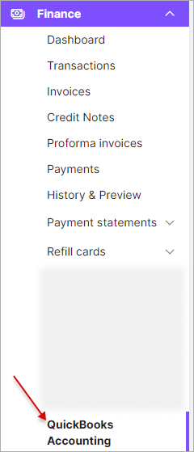
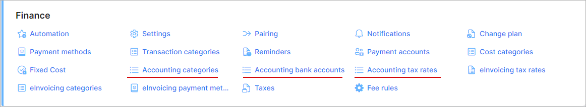
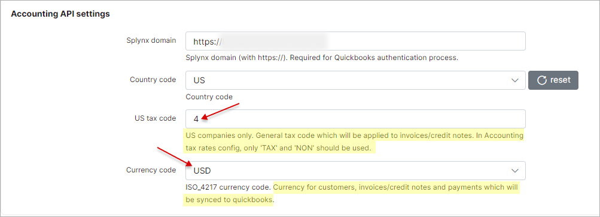
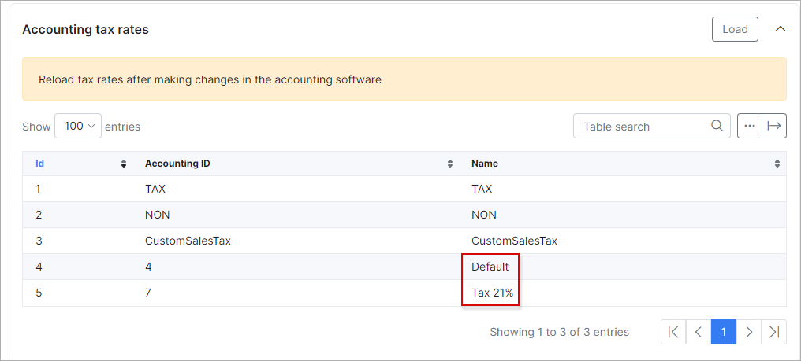

Quickbooks accounting (Add-on is outdated and not supporting)
==========================================

**(Add-on is outdated and not supporting)**

The installation of Add-on is performed with two commands:
```
apt update
apt install splynx-quickbooks
```

After installation, the QuickBooks addon appears on Splynx under Finance menu:


We need to get a Quickbooks Online account to start the integration.


When the account is created and Splynx Quickbooks Add-on is installed on Splynx server, we can start syncing it together.

First of all, we need to connect Add-on to our Quickbooks account:


Click on "Here" link and follow to QB login page:


Whent it's connected, Add-on shows connected message

Now we need to setup few things in CLI of Linux server where Splynx is running.

Open file /var/www/splynx/addons/quickbooks/config/params.php and set the correct URL, Sandbox = false and your country code:

Now we can add Taxes in Quickbooks, set Payment Methods and sync it with Splynx server:


Splynx add-on displays the Tax codes that we need to put again to

/var/www/splynx/addons/quickbooks/config/params.php




The same thing is with Payment types:


When this is done, we can sync our customers from Splynx to Quickbooks or match existing clients in databases:



We can check if all clients were pushed to QuickBooks:

To sync Invoices and Payment on the fly we need to enable WebHooks inside Splynx settings, please open menu Config → Hooks:

Now we are ready to issue Invoices in Splynx and process Payments. This information will be sent to QB online immediately. All changes are also synced immediately between two systems.

Let's issue 3 invoices in Splynx:

Got it, they are moved to Quickbooks as well!

We can open the Invoice in Splynx and see that it has a QB ID that identifies it in QuickBooks software:

After processing payment in Splynx, information is also moved to Quickbooks. Let's pay 2 invoices in Splynx:

Payments are sent to QuickBooks in few seconds:

Of course, all information is set in correct accounts in Accounting part of QB and Taxes are also calculated properly:

