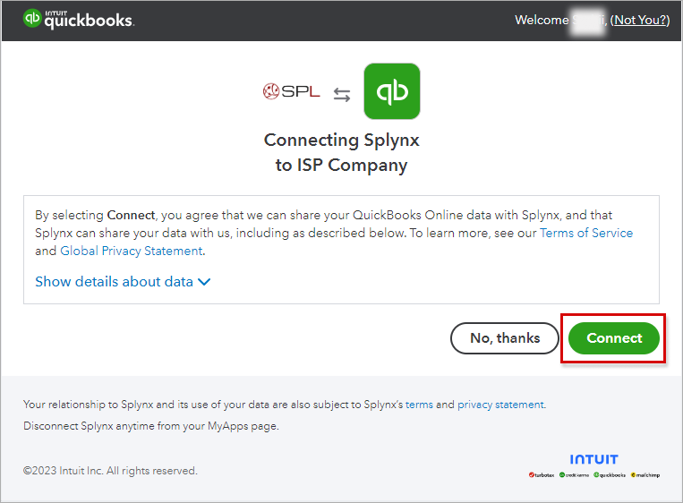

Quickbooks accounting (Add-on is outdated and is no longer supported)
==========================================

**(Add-on is outdated and is no longer supported)**

The installation of Add-on is performed with the following two commands:
```
apt update
apt install splynx-quickbooks
```

After the installation process has completed, the QuickBooks addon will appear on Splynx under the Finance module:


It is necessary to obtain a Quickbooks Online account to start the integration.


Once the account is created and the Splynx Quickbooks Add-on is installed on the Splynx server, we can start syncing it together.

First of all, we need to connect the Add-on to our Quickbooks account:


Click on the "Here" link and follow to the QB login page:


When it's connected, the Add-on status will show "connected"


Thereafter, we need to setup a few elements in the CLI of the Linux server where Splynx is running from.

Open the /var/www/splynx/addons/quickbooks/config/params.php file and set the correct URL, Sandbox = false and your country code:


Now we can add Taxes in Quickbooks, set Payment Methods and sync it with the Splynx server:


The Splynx add-on displays the Tax codes that we will need to add to the /var/www/splynx/addons/quickbooks/config/params.php file again, via CLI


The same should be done for Payment types:


When this is done, we can sync our customers from Splynx to Quickbooks or match existing clients in the databases:


We can check if all clients were pushed to QuickBooks:


To sync Invoices and Payments, we need to enable WebHooks within Splynx settings, navigate to `Config → Hooks`:


Now we are ready to issue Invoices in Splynx and process Payments. This information will be sent to QB online immediately. All changes are also synced immediately between the two systems.

Let's issue 3 invoices in Splynx:


Done! they've been synced to Quickbooks as well!


We can open the Invoice in Splynx and see that it has a QB ID that identifies it in the QuickBooks software:


After processing payments in Splynx, the information is also synced to Quickbooks. Let's pay 2 invoices in Splynx:


Payments are sent to QuickBooks in few seconds:


Of course, all information is set in the correct accounts in the Accounting part of QB and Taxes are also calculated properly:

