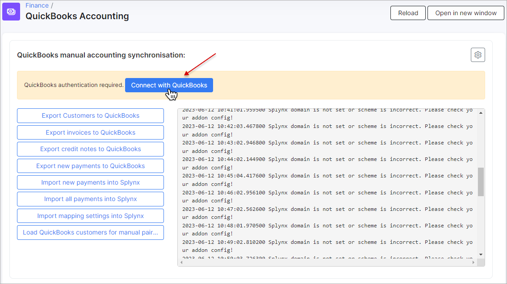
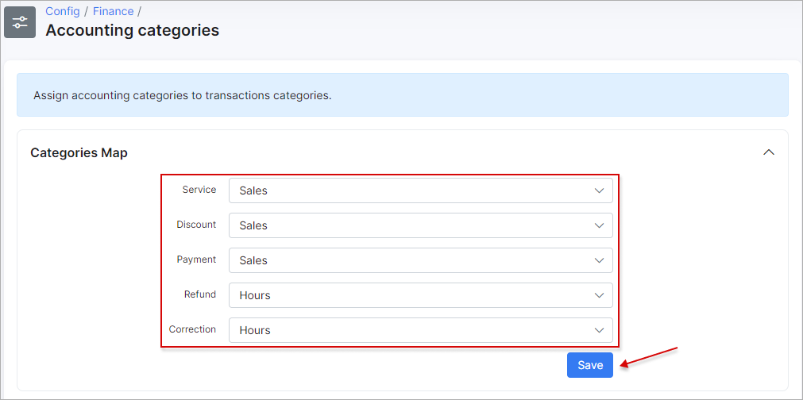
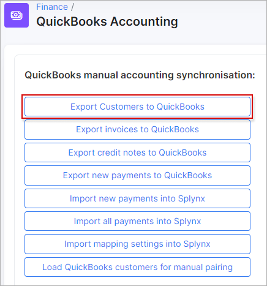
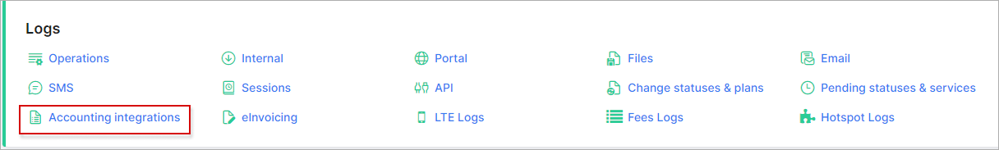
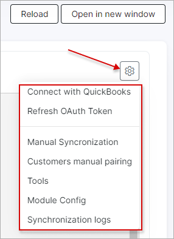
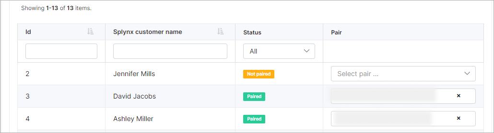
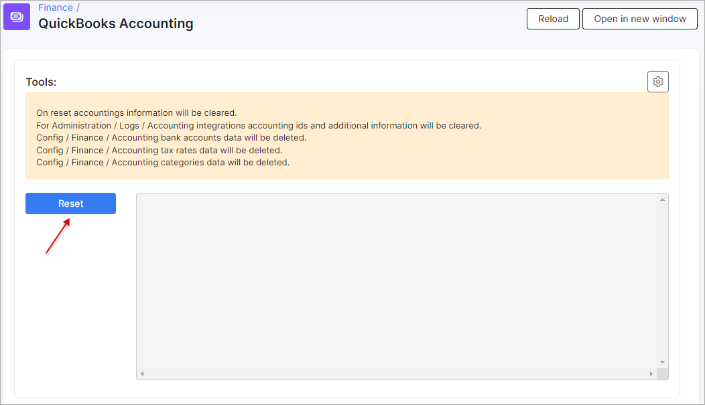

Quickbooks accounting
==========================================

_Splynx QuickBooks_ is the add-on of Splynx which is used to synchronize customers, invoices and payments with the [Quickbooks accounting gateway](https://quickbooks.intuit.com/).

### Important:

**It's recommended do not configure the add-on on your own.**
**Please, contact our support team before starting the accounting integration.**

The add-on can be installed in two ways:
* via the command-line interface (CLI) and the following commands
```
apt update
apt install splynx-quickbooks
```
* via the Web UI of your Splynx server in `Config → Integrations → Add-ons`


After the installation process has completed, click on `Finance` item on the sidebar of Splynx and in the drop-down menu click on `QuickBooks Accounting`.


After that, it is necessary to obtain a Quickbooks Online account to start the integration (the screenshots related to Quickbooks were taken from its developer sandbox environment).


And create your company


The settings of QuickBooks Accounting add-on is located in `Config → Integration → Modules list`, click on the edit button in the Actions column:


To open the configuration of add-on entry points click on _Edit entry points_ icon:


The general configuration of the QuickBooks integration module can be viewed and edited here:


### Accounting API settings:

**Splynx domain** - the Splynx domain must be the same as the API domain URL but without last slash "/". **HTTPS is required!**;

**Country code** - Choose the required country code (US, FR or Other);

**US tax code** - (for US companies only) specify the tax code which will be applied to invoices. The id can be obtained from `Config → Finance → Accounting tax rates`;

**Currency code** - the currency that is used for customers, invoices and payments.

### Synchronization settings:

**Payment method ID** - select the payment method for imported payments;

**Bank statements group** - group bank statements by "month" or "day";

**Partners ignore list** - select the partners of which will be ignored in sync process. Customers, invoices and payments of the partners selected here **WILL NOT** be synced with QuickBooks;

**Payments synchronization direction** - define the direction of syncing payments: _QuickBooks → Splynx_, _Splynx → QuickBooks_ or _Bidirectional_;

**Payments push to QuickBooks** - select the payment methods to sync to QuickBooks, this selection only applies if the selected method to sync payments is set to _Splynx → QuickBooks_.
_Please note that you do not have to select QuickBooks in the list of payment methods to sync as this will grab payments from QuickBooks._;

**Import payments from date** - specify the date in `Y-m-d` format, e.g. 2021-05-01, which will be used as the start date for importing all prepayments to Splynx;

**Export invoices from date** - set a date in `Y-m-d` format, e.g. 2021-01-01 from which the invoices will be synchronized. The invoices that have been created by this date will be ignored during export. Will be checked by the invoice field `Date`.

**Create payment without invoice** - a toggle allows to enable creating payment in Splynx when customer doesn't have invoice (e.g. for the partial payments in *QuickBooks*) or, in disabled status - only bank statement (-s) will be created in Splynx. Used on payments import. Attention: in some cases can lead to duplicate payments. Use this option with caution;

**Customer name pattern** - used to set a customer's name pattern during sync to *QuickBooks* where it will be represented as `Display name as`. The next variables can be used: `{id}, {login}, {name}, {email}`. By default: `{name}`.


<details>
<summary><b>name display example</b></summary>
<p markdown="1">


</p>
</details>


### Cron settings

**Customers** - enables/disables automatic syncing of customers;

**Invoices** - enables/disables automatic syncing of invoices;

**Payments** - enables/disables automatic syncing of payments.

_It is recommended that all settings in the "Cron Settings" section should be disabled for the initial set up of the add-on to avoid syncing all these elements automatically via cron jobs, the first import and export should be done manually in `Finance → QuickBooks Accounting`_

### Let's start with QuickBooks

Click on `Finance` item on the sidebar of Splynx and in the drop-down menu click on `QuickBooks Accounting`.


First of all, we need to connect the Add-on to our Quickbooks account:



Click on the button _Connect with QuickBooks_, enter your account credentials and press _Connect_ to allow Splynx to view and update the date on the QuickBooks side:


When it's connected, the token will be created:


We can add/edit Taxes, Products and Services in Quickbooks:


The taxes should be the same as the taxes in Splynx (`Config → Finance → Taxes`) to work properly.

Now, in `Finance → QuickBooks Accounting` run _Import mapping settings into Splynx_


After successful synchronization,
```
2021-05-13 09:04:28.413400 Start accounting categories synchronization
2021-05-13 09:04:31.119300 Accounting synchronization completed
2021-05-13 09:04:31.119500 Done!
2021-05-13 09:04:31.119900 Start tax rates synchronization
2021-05-13 09:04:32.157200 Tax rates synchronization completed
2021-05-13 09:04:32.157300 Done!
2021-05-13 09:04:32.157400 Start accounting bank accounts synchronization
2021-05-13 09:04:33.162500 Accounting bank accounts synchronization completed
2021-05-13 09:04:33.162600 Done!
```
make chnages to _Accounting categories_, _Accounting bank accounts_ and _Taxes settings_ in `Config → Finance`


Let's look at this in more details.
In `Config → Finance → Accounting categories` all accounting categories from QuickBooks (`Sales →  Products and Services`) must be assigned to transactions categories (`Config →  Finance → Transaction categories`) in Splynx



As soon as the relevant categories are configured, we can proceed with bank accounts `Config → Finance → Accounting bank accounts`. We will follow the same steps, assign the QuickBooks bank accounts (`Accounting →  Chart of Accounts types`) to payment methods (`Config → Finance → Payment methods`) in Splynx, also the default bank account should be selected.

.

And the last one - `Config → Finance → Accounting tax rates`:
For US company select "NON" for zero values and "TAX" for other values


And in `Config → Integration → Modules list → QuickBooks Accounting` set the tax rate accounting id and the currency:


For other countries - select the matching between taxes in Splynx and in Quickbooks:


_Pay attention that the invoices cannot be updated for France._

When the accounting settings are done, we can export our customers from Splynx to Quickbooks or match existing clients in the databases:



We can check if all clients were pushed to QuickBooks:


Once the customers export has completed, we can export the invoices:

**NOTE:**

- The invoices without transactions or marked as **Deleted** in Splynx will not be synced to Quickbooks;

- The invoices in Splynx with negative total amount will be exported to Quickbooks as **Credit Note** or **Credit Memo** (the name depends on the company location).


<details>
<summary>What Is A Credit Note?</summary>
<div markdown="1">

The credit notes can be used in any situation that would require an invoice to be changed and re-issued. For example, the credit note should be issued when there is a need to cancel all or part of an invoice that has already been charged. This is done to keep accounting records straight since invoices cannot be deleted or edited once issued. Credit notes allow you to delete the amount of the invoice from your financial records without deleting the invoice itself in cases when the invoices deleting is unlawful.

</div>
</details>

And after that export the payments from Splynx to Quickbooks (depends on _Payments synchronization direction setting_ in add-on configuration), you can check received payments via report.


Now we are ready to issue Invoices in Splynx and process Payments. This information will be sent to Quickbooks online immediately. All changes are also synced immediately between the two systems.

Let's issue 3 invoices in Splynx:


Done! they've been synced to Quickbooks as well!


After processing payments in Splynx, the information is also synced to Quickbooks. Let's pay 2 invoices in Splynx:


Payments are sent to QuickBooks in few seconds:


### Quickbooks logs

Sync logs are located in `Administration → Logs → Accounting integrations`



If a customer/invoice/payment has an "Accounting ID", this indicates that it was synced, if not, it was not synced.


The same logic is for invoices and payments, if accounting ID is present - it was synced.

### Quickbooks tweaks

In `Config → Integration → Modules list → QuickBooks Accounting` when to click on the gear icon, we will see the drop down menu with additional settings related to QuickBooks add-on:



**Connect with QuickBook** - if the QuickBooks Accounting addon was disconnected from the QuickBooks account, you can reconnect it here;

**Refresh OAuth token** - setting to refresh the OAuth token;

**Manual Synchronization** - used to go back to manual synchronization window;

**Customers manual pairing** - setting is used to open pairing window when there are existing customers in Splynx as well as in QuickBooks. Notice what the currency is set in QuickBooks add-on configuration, if Quickbooks customer currency is different, there will be synchronization errors for their related data;

In addition, there is a "Load QuickBooks customers for manual pairing" button. This feature pulls the customer list from QuickBooks into Splynx and allows the admin to manually pair the customers without having to create them in either platform again. Firstly, load customers and then, perform manual pairing.




**Tools** - this menu is used for resetting the accounting database, all items that were selected previously in `Accounting categories`, `Accounting bank accounts` and `Accounting tax rates` will be erased. It is mainly used when the organization changes. Before changing the organization, the accounting database must be reset:



**Module Config** - the link is used to open the QuickBooks add-on configuration page (`Config → Integration → Modules list → QuickBooks Accounting`).
