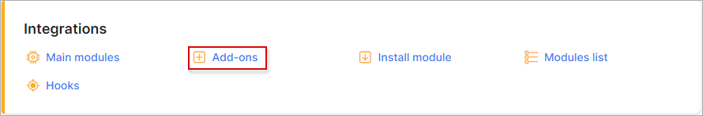
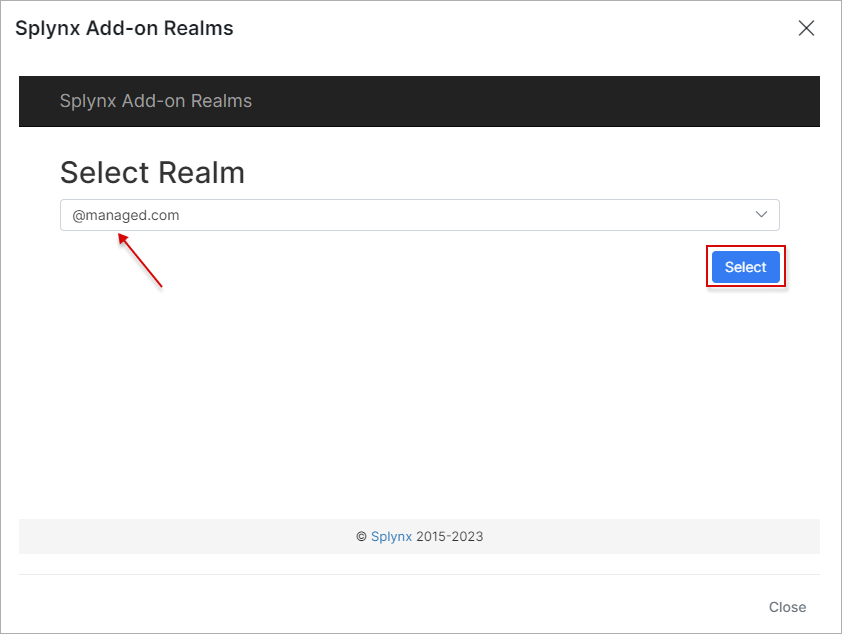

Realms add-on
=========

The *Realms* add-on module is designed to simplify the process of grouping customers that use one or different [partners](administration/main/partners/partners.md) according to the logical areas. The *Realm* - the ending after `@`(at) sign that is used as customer login in their Internet service, e.g. `john@managed.com`, where `@managed.com` is a *Realm* entity.

### Add-on installation

The add-on can be installed in two methods, via the CLI or the Web UI of your Splynx server.

To install the add-on via CLI, the following commands can be used:

```
apt-get update
apt-get install splynx-realms
```
To install the add-on from the Web UI:

Navigate to `Config → Integrations → Add-ons`:



Locate or search for the `splynx-realms` add-on and click on the *Install* icon in the *Actions* column:


Click on the **OK, confirm** button to begin the installation process:


### Add-on settings

After the installation process has completed, all parameters for the add-on can be found in `Config → Integrations → Modules list`.


Locate or search for the `splynx-realms` add-on module and click on the
<icon class="image-icon"></icon> (*Edit*) icon in the *Actions* column,


Double check if **Entry points status for portal** parameter is `Enabled`.


The configuration of add-on **Entry points** can be found in `Config → Integrations → Modules list`, near the `splynx-realms` module item in *Actions* column, click on the <icon class="image-icon"></icon> (*Edit entry points*) icon. More information about *Modules list* can be found [here](configuration/integrations/modules_list/modules_list.md).

## Using the Realms add-on

**Add new Realm values to the existing Partner (-s)**

Navigate to `Config → Administration → Partners`:


Locate the necessary *Partner* and click on the <icon class="image-icon"></icon> (*Edit*) icon.


In the new window in the **Realms** field, specify the required values and save changes.

**NOTE:**

- Each value should be started with a new line. The `@` (at) sign can be optionally added at the beginning of the value as well, it will not lead to such characters duplication in the `Service login` formation;

- One partner can have multiple *Realms*. The *Realms* names are not unique, it means that same *Realm* can be used by many *Partners*.


**Select the particular Realm in Internet service**

Open `Customers → List`, search the needed customer and open their profile, navigate to **Services** tab and click on the <icon class="image-icon"></icon> (*Edit*) icon near the Internet Service


In new window, find **Realm** field and click on the <icon class="image-icon"></icon> button.


Afterwards, choose the necessary *Realm* value from drop-down list and press the <icon class="image-icon"></icon> button and save changes. It's **possible to choose only *Realm* that belong to specific partner with which the customer is associated**.




Then, double check if the `Service login` has been changed.


**NOTE:**

- In order to remove the *Realm* value from the `Service login` field, you can select empty item from drop-down list of available values


or erase the particular *Realm* value in *Partner* configuration window. Do not forget to save changes.


**Show all customers according to the specific Realm**

Navigate to `Customers → List` and in the **Search** field type the name of *Realm* to show the customers relation:


In case **Realm** field is disabled in the list of customers, click on the breadcrumbs <icon class="image-icon"></icon> icon at the bottom of the table and enable the same-name toggle.


додати у статтю Partners лінку на Realms
