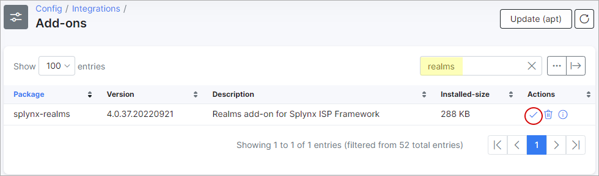
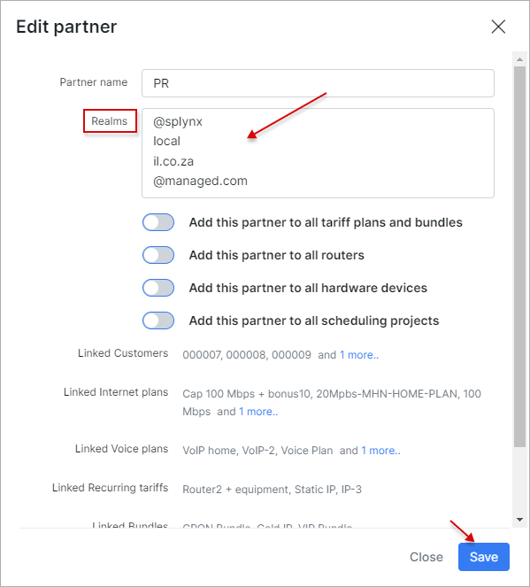
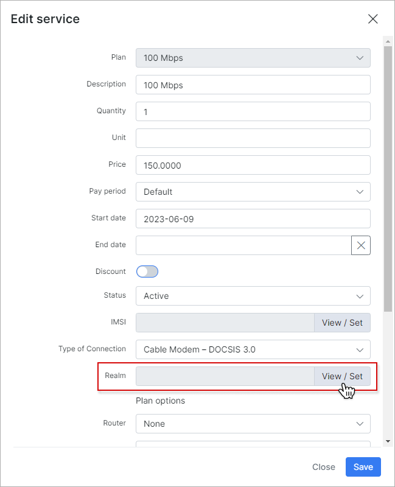
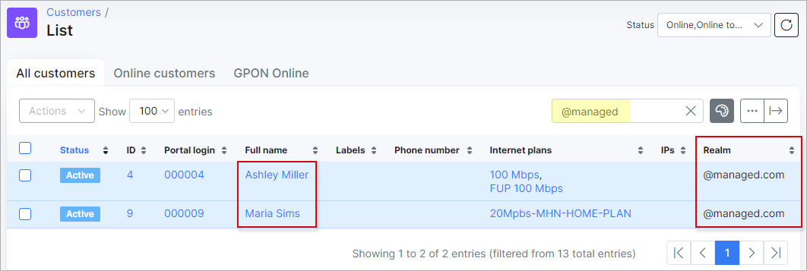

Realms
=========

The *Realms* add-on module is designed to simplify the process of grouping customers that use one or different [partners](administration/main/partners/partners.md) according to the logical areas. The *Realm* - the ending after `@`(at) sign that is used as customer login in their Internet service, e.g. `john@managed.com`, where `@managed.com` is a *Realm* entity.

## Installation

The add-on can be installed in two methods: via the CLI or the Web UI of your Splynx server.

To install the add-on via CLI, the following commands can be used:

```
apt-get update
apt-get install splynx-realms
```
To install the add-on from the Web UI, navigate to `Config → Integrations → Add-ons`:


Locate or search for the `splynx-realms` add-on and click the *Install* icon in the *Actions* column:



Click the `OK, confirm` button to begin the installation process:


## Configuration

After the installation process has completed, all parameters for the add-on can be found in `Config → Integrations → Modules list`.


Locate or search for the `splynx-realms` add-on module and click the
<icon class="image-icon"></icon> (*Edit*) icon in the *Actions* column:


Double check if **Entry points status for portal** parameter is `Enabled`.


The configuration of add-on **Entry points** can be found in `Config → Integrations → Modules list`, near the `splynx-realms` module item in the *Actions* column. Click the <icon class="image-icon"></icon> (*Edit entry points*) icon. More information about *Modules list* can be found [here](configuration/integrations/modules_list/modules_list.md).

## Using the Realms add-on

**Add new Realm values to the existing Partner (-s)**

Navigate to `Administration → Splynx → Partners`:


Locate the necessary *Partner* and click the <icon class="image-icon"></icon> *Edit* icon:


In the new window in the **Realms** field, specify the required values and save changes.

<icon class="image-icon"></icon> **NOTE:**

- Each value should start on a new line. Additionally, you have the option to include the `@` (at) sign at the beginning of the value. However, be aware that this won't result in duplicated characters in the `Service login` format;

- One partner can have multiple *Realms*. The *Realms* names are not unique, it means that the same *Realm* can be used by many *Partners*.



**Select the particular Realm in the Internet service**

Open `Customers → List`, locate the necessary customer and open their profile. Navigate to **Services** tab and click the <icon class="image-icon"></icon> *Edit* icon near the Internet Service:


In a new window, find the **Realm** field and click the `View/Set` button.



Afterward, select the appropriate *Realm* value from the drop-down list, click the `Select` button and save the changes. 

<icon class="image-icon"></icon> You can only choose a Realm that is associated with a specific partner the customer is affiliated with.


Then, check if the `Service login` has been changed:


<icon class="image-icon"></icon> **NOTE:**

- To **remove the Realm value** from the *Service login* field, simply select the empty item from the drop-down list of available values:


Or **erase** the particular *Realm* value in the *Partner* configuration window. Please do not forget to save the changes:


**Show all customers according to the specific Realm**

Navigate to `Customers → List` and in the **Search** field type in the name of a *Realm* to show the customers' relation:



In case the **Realm** field is disabled in the list of customers, click the breadcrumbs <icon class="image-icon"></icon> icon at the top right of the table and enable its toggle:


