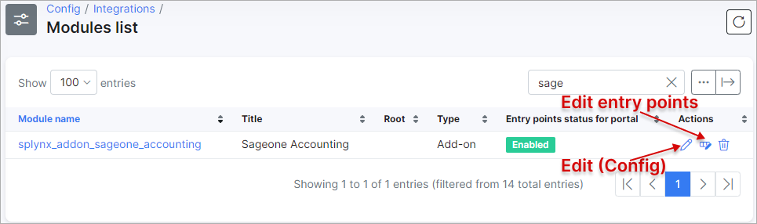
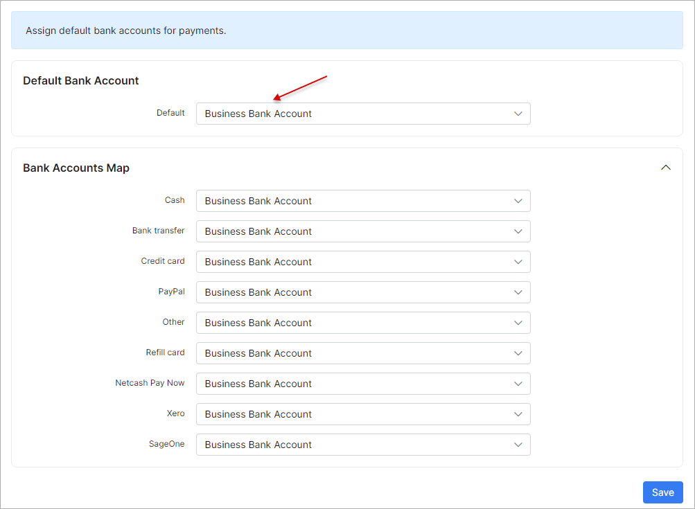
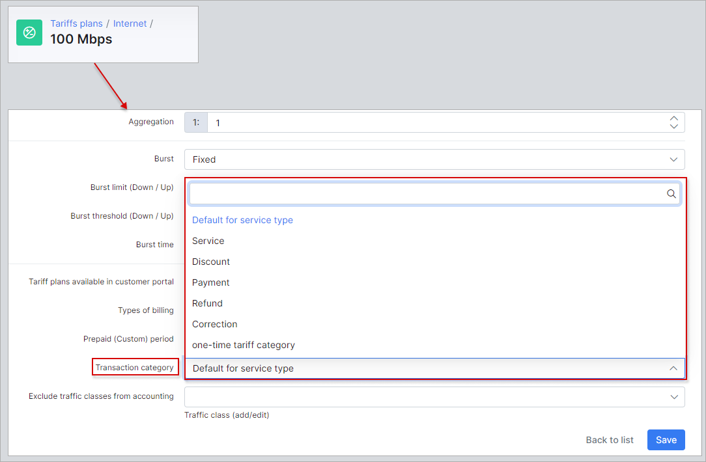

Splynx and SageOne accounting integration
=========================================

The SageOne add-on in splynx was designed to improve efficiency and be able to execute all actions in one platform. We have integrated all the abilities of SageOne into Splynx for your convenience. Syncing customer data, invoices, and payments can now be done effortlessly by your powerful Splynx server.

The following steps can be used to integrate your splynx server to your SageOne platform.

## 1. Connect the two Platforms
* **Install the SageOne addon in Splynx** - Navigate to `Config / Integrations / Addons`, search for sage one and click on the install icon:

* **Configure addon settings** - navigate to `Config / Integrations / Module list`, search for SageOne and click on the edit icon:

Enter your password in the fields provided under the "SageOne API Settings" section:

### Note:
**The company ID will be fetched from SageOne upon saving the username and password. Once the ID appears within Splynx, this is an indicator that the platforms have connected successfully.**

## 2. Define the payment methods to push to SageOne from Splynx
* **Payments are processed within Splynx and sent to SageOne. Credit cards, cash, debit orders, Paypal payments, etc.** - Navigate to the `Synchronization settings` section, select SageOne as the payment method ID and which payments to push to SageOne from Splynx:

*It is recommended that all settings in the "Cron Settings" section of the page are disabled for the initial set up of the addon to avoid syncing all these elements automatically via cronjobs, the first import and export should be done manually*

* **Exclude payments processed in SageOne from the payments to push to SageOne in Splynx. (If SageOne will be used as a payment gateway)**

*Please note that you do not have to select SageOne in the list of payment methods to sync as this will grab payments from SageOne.*

* **Create and link a Bank account in Splynx and SageOne** -

**SageOne**

**Splynx**

Navigate to `Config / Finance / Accounting bank accounts`, scroll to the "Accounting bank accounts" section and click on the load button.

 

The Bank account created within SageOne will appear:

Once the bank account has loaded, scroll to the top of the page and select this account as the default to push all payments to that has been processed in Splynx.

## 3. Define items within SageOne with the correct VAT

* **Understanding transaction categories** -  All types of tariff plans within splynx create its own transaction and each transaction for tariff plans are by default set to a service type of transaction. This behavior can be modified and is necessary to do when using the SageOne addon in order to successfully pair items with transaction categories.

* **Define items in SageOne and sync it to Splynx** - These are items you will use to pair/sync it to transaction categories within splynx.

The first step is to create the items within SageOne.
Items created in SageOne should have relativity to services within Splynx.

For instance, if you have prepaid and recurring Fibre tariff plans within Splynx, you should have/create these items within SageOne.

In essence, for each different **type** of service in Splynx, there should be a corresponding item within SageOne. Think of items in SageOne as the grouping mechanism for types of costs from Splynx.

 

Then we will create transaction categories within Splynx that correspond to the items created within SageOne.

Navigate to `Config / Finance / Transaction categories`, here you edit the default service category or simply add new categories for each item created within SageOne.

After creating all the relevant categories, it is then necessary to assign these categories to the different types of services. You can assign categories to a type of services, i.e, one category for all internet services and one for all voice services, etc, or you can assign categories to each of the different tariffs plans, i.e, one category for a wifi tariff and another for a fiber tariff.

To assign transaction categories by tariff plans, it is necessary to enable the transaction category fields within the tariff plans. To do this, simply scroll to the bottom of the `Transaction categories` page and enable this feature for the desired types of tariffs.

Once you have enabled these fields for the desired types of tariffs, you can simply navigate to the tariffs and assign categories to individual plans. For example, we will assign the fiber category to the fiber internet plan.

Navigate to `Tariffs / Edit the desired internet plan / Scroll to the bottom of the page and select/change the category in the provided field from the default category to the desired/corresponding category you have created.`:

Once all your transaction categories have been created and assigned to the different plans, we can now proceed to connect the categories within Splynx to items within SageOne.

`Navigate to Config / Finance / Accounting Categories`:

Once here, the first step is to load the categories/items from SageOne. To do so, scroll to the bottom of the page and click on the Load button in the Accounting categories sections:

Once the categories have been loaded we can now proceed to map them to the relevant transaction categories, simply select the relevant accounting category to the corresponding transaction category:

*Please note that these settings will only apply to new tariff plans created, so it is necessary to configure the existing tariff plans accordingly.*

Once this is done, you can test the functionality by simply creating a test invoice or perhaps canceling the last charges and re-charging for services:

### Cancel charges:

Delete batch:

### Recreate invoices:

### View Invoices:

### View transactions with new transaction categories:

## 4. Push customers within Splynx to SageOne and merge the accounts/customers between the two platforms

It is necessary to sync all customers between the two platforms. To do so, navigate to `Config / Integrations / Splynx SageOne Accounting`

*Please note that this step is only necessary for the initial set up of the SageOne addon as we have disabled the Cron settings in the second step of the configuration of the addon. Once this step has been completed the first time, all cron functions can be enabled to allow the system to sync data automatically.*

The first step is to export customers from Splynx to SageOne, simply click on export customers to SageOne:

View Customers within SageOne to confirm the export was successful:

## 5. Push customer invoices from Splynx to SageOne

After we have successfully exported customers to SageOne, the next step is to export all customer invoices. To do so, navigate to `Config / Integrations / Splynx SageOne Accounting`

*Please note that this step is only necessary for the initial set up of the SageOne addon as we have disabled the Cron settings in the second step of the configuration of the addon. Once this step has been completed the first time, all cron functions can be enabled to allow the system to sync data automatically.*

Click on export invoices:

Check SageOne to ensure the export was successful:

As shown below, customer balances have already changed due to invoices.

Check the customer within SageOne to verify the invoices:

## 6. Push payments from Splynx to SageOne

The next step is to export payments to SageOne from splynx.

To do so, navigate to `Config / Integrations / Splynx SageOne Accounting`, click on"export payments to SageOne":

*Please note that this step is only necessary for the initial set up of the SageOne addon as we have disabled the Cron settings in the second step of the configuration of the addon. Once this step has been completed the first time, all cron functions can be enabled to allow the system to sync data automatically.*

Check SageOne to verify the export and check customer balances as well as the bank account status:

Payments can then be allocated and processed within SageOne:

## 7. Sync payments from SageOne to Splynx (if needed)

Using SageOne as a payment gateway in Splynx is possible, but when using it this way it is very important to be careful to avoid making any duplicated.

Navigate to SageOne / respective customer / customer invoices / create reciept:

Check bank accounts statuses:

Now we can go to Splynx to synchronize this payment that is present in SageOne.

Navigate to `Config / Integrations / Splynx SageOne Accounting`, click on "Import all payments into Splynx"

As shown above, all payments are synced and only non-existing payments are added into Splynx.

Synchronized payments from SageOne should now be confirmed in Splynx by marking the outstanding invoice as paid.

 As you can see the customer account balance is changed and the payment has been added but the invoice is still marked as unpaid. Simply navigate to the customer's billing tab and mark the respective invoice as prepaid.

Simply navigate to the customer's billing tab and mark the respective invoice as prepaid.

Now we can check the list of transactions to verify all is correct:
Navigate to the customers transactions tab and check if the transactions have been added accordingly:

To avoid having to mark invoices as paid after importing payments from SageOne, please ensure that the "Autopay invoices from account balance" function is enabled:

Now we can check the full list of payments for customers in Splynx by navigating to `Finance / Payments`, here you will see all payments and the origin:

---------------------

All activities of the SageOne addon can be tracked and checked regularly. To make sure the addon is functioning as expected and for any other reasons.

One can check the activities of the addon by navigating to ` Administration / Logs / Accounting Integrations`:

## Some examples of errors which could occur:

Scenario 1
An invoice was synchronized, deleted in Splynx (for example invoice was incorrect and you have deleted it and create a new one with the same number) and you are attempting to sync invoices to SageOne:

Fix: Remove the invoice from within the SageOne account or if you are unable to remove it from SageOne re-create the invoice in Splynx with a new invoice number.

For a video tutorial provided by Alex Vishnyakov, please view the video below:

<iframe frameborder=0 height=270 width=350 allowfullscreen src="https://www.youtube.com/embed/7q_BzL2LQbk">Video on youtube</iframe>
