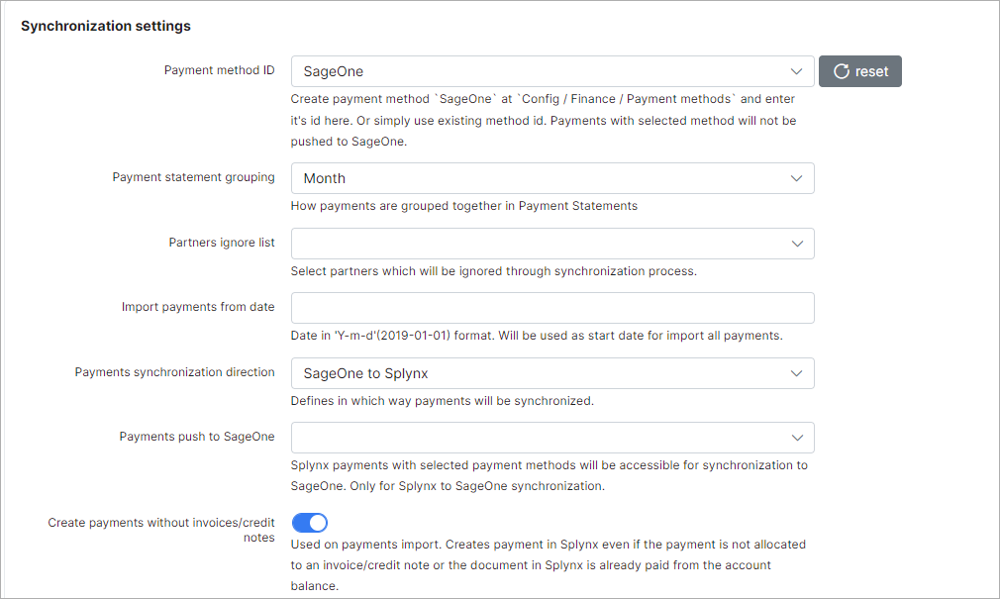
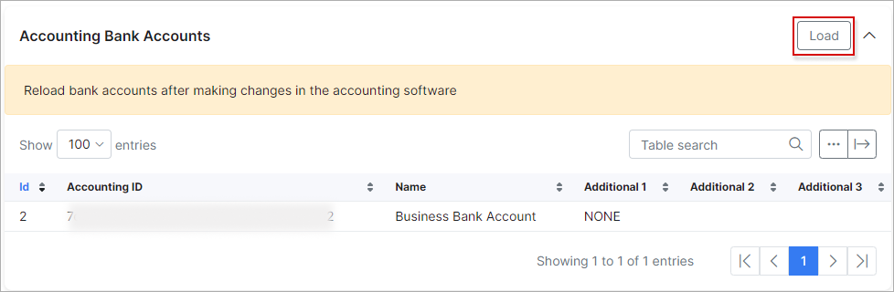
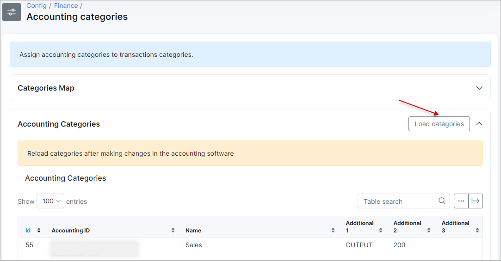
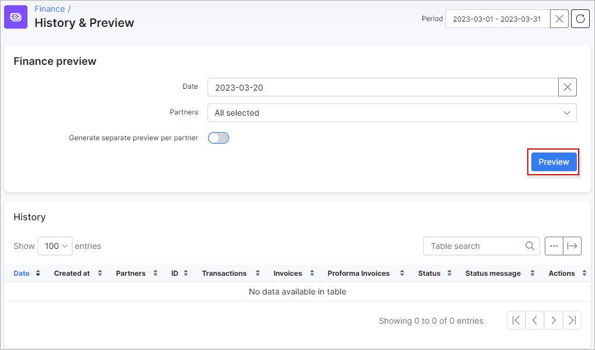
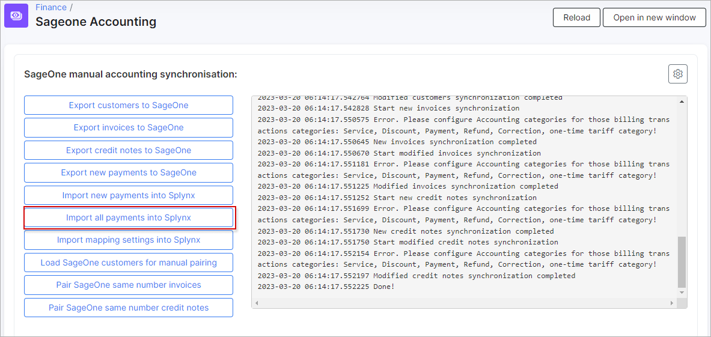
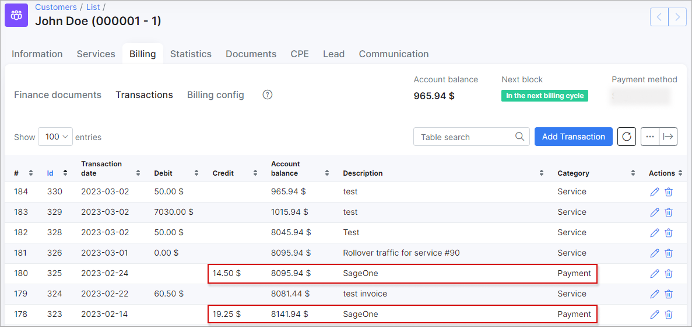

Splynx and SageOne accounting integration
=========================================

The SageOne add-on in Splynx was designed to improve efficiency and the ability to perform all activities on one platform. We have integrated all SageOne features into Splynx for your convenience. Syncing customer data, invoices, and payments can now be done effortlessly by your powerful Splynx server.

### Important:

**SageOne integration is available only for SageOne South Africa**

**It's recommended do not configure the add-on on your own.**
**Please, contact our support team before starting the accounting integration.**

---------------------

The following steps can be taken to integrate your Splynx server with your SageOne platform:

## 1. Connecting the two platforms
* **To install the SageOne addon in Splynx** - Navigate to `Config / Integrations / Addons`, search for `splynx-sageone` and click on the install icon:

* **Configure addon settings** - navigate to `Config / Integrations / Module list`, search for `splynx_addon_sageone_accounting` and click on the edit <icon class="image-icon"></icon> icon:

Enter SageOne login and password in the fields provided under the **SageOne API settings** section:

### Note:
**The company ID will be fetched from SageOne upon saving the login and password. Once the ID appears in Splynx it is an indicator that the platforms have connected successfully.**

### Synchronization settings:

The general configuration of the SageOne integration module can be viewed and edited here. Double check if **Entry points status for portal** option is enabled and **API domain** value is set correctly (with last slash).

- **Payment method ID** - ;
- **Bank statements group** - ;
- **Partners ignore list** - ;
- **Import payments from date** - ;
- **Payments synchronization direction** - ;
- **Payments push to SageOne** - ;
- **Create payment without invoice** - a toggle allows to enable creating payment in Splynx when customer doesn't have invoice (e.g. for the partial payments in SageOne) or, in disabled status - only bank statement (-s) will be created. Used on payments import. **Attention:** in some cases can lead to duplicate payments. Use this option with caution;
- **Create payment for paid invoice** - a toggle allows to enable creating payment in Splynx when the invoice has already been paid (actually for invoice with any status), in disabled status - payment will be created only for **Not paid** invoice. Used on payments import. The option is useful when payment (receipt) in SageOne was incorrectly linked to the invoice, the invoice or the total amount were incorrect etc. The current option doesn't include the partial payments, in order to create payments for everything, the **Create payment without invoice** option should be enabled as well. **Attention:** in some cases can lead to duplicate payments. Use this option with caution;
- **Customer name pattern** - ;
- **Active** - ;
- **Accepts Electronic Invoices** - ;
- **Auto Allocate Receipts to Oldest Invoice** - ;
- **Allow this customer to view invoices online** - ;
- **Use Inclusive Amounts** - ;
- **Invoice fix Item id** - ;
- **Export invoices from date** - ;
- **Use system document number** - ;
- **Use Credit Notes** - .

### Cron settings

These are the global settings to automatically sync items between the two platforms, in any selected direction of syncing.

- **Customers** - enables/disables automatic syncing of customers;
- **Invoices** - enables/disables automatic syncing of invoices;
- **Payments** - enables/disables automatic syncing of payments;
- **Payments synchronization dates** - enables/disables payments sync by cron on selected dates in drop-down list. The toggle **Payments** should be enabled.

If any of the above items are not enabled to sync automatically, we can manually sync items via the Web UI under `Config → Integrations → Splynx Sageone Accounting`, with the export and import functions.

## 2. Define the payment methods to push to SageOne from Splynx
* **Payments are processed within Splynx and sent to SageOne. Credit cards, cash, debit orders, Paypal payments, etc.** - Navigate to the `Synchronization settings` section, select *SageOne* as the `Payment method ID` and which `Payments push to SageOne` from Splynx:

**NOTE:**

* **It is recommended that all settings in the "Cron settings" section of the page are disabled for the initial set up of the add-on to avoid syncing all these elements automatically via cron jobs, the first import and export should be done manually**

* **Exclude payments processed in SageOne from the payments to push to SageOne in Splynx (if SageOne will be used as a payment gateway) because it will grab payments from SageOne**

<icon class="image-icon"></icon> **How to create and link a Bank account in Splynx and SageOne:**

**On SageOne side**

**On Splynx side**

Navigate to `Config / Finance / Accounting bank accounts`, scroll to the **Accounting bank accounts** section and click on the load button. The Bank account created in SageOne will appear in the table:

Once the bank account has been loaded, scroll to the top of the page and select the necessary account as the default one to which all payments processed in Splynx will be transferred. The default bank account should be selected for each payment method listed in *Bank Accounts Map*.

In case the bank account list is not loaded, open `Config / Integrations / Splynx Sageone Accounting` and press the **Import mapping settings into Splynx** button, then try again.

click here to see the screenshot

## 3. Define items within SageOne with the correct VAT

**Understanding transaction categories:** all types of tariff plans within Splynx create its own transaction and each transaction for tariff plans are by default set to a service type of transaction. This behavior can be modified and it is necessary to do when using the SageOne addon in order to successfully pair items with transaction categories.

**Define accounting categories items in SageOne and sync it to Splynx** (`Items / Add an Item`) - these items you will use to pair/sync with [transaction categories](configuration/finance/transaction_categories/transaction_categories.md) in Splynx.

The first step is to create the items within SageOne.
Items created in SageOne should have relativity to services within Splynx.

For instance, if you have prepaid and recurring *Fibre* tariff plans in Splynx, you should have/create these items in SageOne.

In essence, for each different **type** of service in Splynx, there should be a corresponding item in SageOne. Think of items in SageOne as the grouping mechanism for types of costs from Splynx.

Then we will create transaction categories within Splynx that correspond to the items created within SageOne.

Navigate to `Config / Finance / Transaction categories`, here you can edit the default transaction categories or simply add new categories for each item created in SageOne.

After creating all the relevant categories, then it's necessary to assign these categories to the different types of services (accounting categories in SageOne). You can assign one category to a full type of services, e.g. one category for all Internet services and one for all voice services, etc, or you can assign the separate category to each of the different tariffs plans, e.g., one category for a *wifi* tariff and another for a *fiber* tariff.

To assign transaction categories by tariff plans, it is necessary to enable the transaction category fields within the tariff plans. To do this, simply scroll down to the bottom of the `Transaction categories` page and enable this option for the desired types of tariffs.

Once you have enabled these fields for the desired types of tariffs, you can simply navigate to the tariffs and assign categories to individual plans. For example, we will assign the *fiber* category to the *fiber* internet plan.

Navigate to `Tariff plans / Internet`, find in the list the desired Internet plan and click on *Edit* icon, scroll down to the bottom of the page, in the field `Transaction category` change the default category to the corresponding category you have created.

Once all your transaction categories have been created and assigned to the different plans, we can now start to link the categories in Splynx to the (accounting categories) items in SageOne.

`Navigate to Config / Finance / Accounting Categories`:

Once here, the first step is to load the categories/items from SageOne. To do so, scroll to the bottom of the page and click on the Load button in the Accounting categories sections:

In case the accounting categories list is not loaded, open `Config / Integrations / Splynx Sageone Accounting` and press the **Import mapping settings into Splynx** button, then try again.

click here to see the screenshot

Once the categories have been loaded we can now proceed to map them to the relevant transaction categories, simply select the relevant SageOne accounting category for each corresponding transaction category in Splynx :

**NOTE:** In case the monthly invoices are [generated](finance/history_and_preview/history_and_preview.md) in Splynx, its transactions won't be related to the newly created transaction categories. This setting will be applied only for new created transactions.

Click here to see how to cancel the last charge and perform the new service re-charge

1. **To delete the created invoices and its transactions:** open `Finance / History & Preview` in the *History* table find the necessary item of charged invoices, click on the **Cancel** icon and confirm the action;

2. **To remove finance history records:** a new **Delete** icon will then appear in place of the **Cancel** icon. Click on the **Delete** icon and confirm the action to remove batch files;

3. **To generate new invoices:** select the correct date in the filed **Date**, press **Preview** button and choose the **Invoice date**. After that press **Confirm** button;

4. **Double check the generated invoices and its transactions with new categories:** the invoices can be checked for specific period in `Finance / Invoices` section, the transaction, accordingly, in `Finance / Transactions`.

## 4. Push customers from Splynx to SageOne and merge the customers between two platforms

In order to sync all customers between two platforms, navigate to `Config / Integrations / Splynx SageOne Accounting`.

**NOTE:** This step is only required for the initial set up of the *SageOne* add-on, as we have disabled the Cron settings in the second step of the configuration of the add-on. Once the step **Export customers to SageOne** has been completed for the first time, all cron functions can be enabled to allow the system to sync data automatically.

To export customers **from Splynx to SageOne**, simply click on **Export customers to SageOne** button:

Check exported customers in SageOne to confirm the export was successful:

## 5. Push customer invoices from Splynx to SageOne

After we have successfully exported customers to SageOne, the next step is to export all customer invoices. To do so, navigate to `Config / Integrations / Splynx SageOne Accounting`.

**NOTE:** This step is only required for the initial set up of the *SageOne* add-on, as we have disabled the Cron settings in the second step of the configuration of the add-on. Once the step **Export invoices to SageOne** has been completed for the first time, all cron functions can be enabled to allow the system to sync data automatically.

<icon class="image-icon"></icon> **Attention:** The invoices without transactions or marked as **Deleted** in Splynx will not be synced to SageOne.

Click on **Export invoices to SageOne** button:

Check exported invoices in SageOne to confirm the export was successful:

As shown below, customer balances have already changed due to invoice.

Check the customer in SageOne to verify the invoices:

## 6. Push payments from Splynx to SageOne

The next step is to export the payments from Splynx to SageOne.

To do so, navigate to `Config / Integrations / Splynx SageOne Accounting`, click on **Export new payments to SageOne** button:

**NOTE:**  This step is only required for the initial set up of the *SageOne* add-on, as we have disabled the Cron settings in the second step of the configuration of the add-on. Once the step **Export new payments to SageOne** has been completed for the first time, all cron functions can be enabled to allow the system to sync data automatically.

Check the exported payments and the customer balance as well as the bank account status (`Banking / Lists / List of Banks and Credit Cards / Activity tab`) in SageOne to confirm the export was successful:

The payments can then be allocated and processed within SageOne:

## 7. Sync payments from SageOne to Splynx (if needed)

Using SageOne as a payment gateway in Splynx is possible, but it is very important to be careful to avoid making any duplicated payments.

Navigate to `Customers / Lists / List of Customers` find in the list the required customer and click to the name to edit (or `Actions / Edit`). Click on **Invoices** tab, an unpaid invoices will be listed here (the option to **Include Paid Invoices** is present as well). Click on **detail** of the selected invoice to process. Then, click on **Options**, in drop down menu choose **Create Receipt** option.

Check the balance of the bank account in `Banking / Lists / List of Banks and Credit Cards `.

Now we can synchronize this payment that is present in SageOne to Splynx.

<icon class="image-icon"></icon> **Attention:** The `Payments synchronization direction` option should be set to `SageOne to Splynx` or `Bidirectional` in `Config / Integrations / Modules list / Splynx Sageone Accounting`.

Navigate to `Config / Integrations / Splynx SageOne Accounting`, click on **Import all payments into Splynx** button.

After the payments import is completed, double check the invoice and its transaction in customer's profile (`Billing / Invoices` and `Billing / Transactions` tabs). The status of the invoice should be `Paid` and the description of the payment transaction - *SageOne*.

If the customer receipt has been created and processed on *SageOne* side without being linked to the *Unpaid* invoice and the step **Import new payments into Splynx** has been performed - the invoice will remain unpaid (the balance will not top up as well). To fix this it's necessary to do the manual pair of the new bank statement with *Unpaid* invoice in Splynx. Navigate to `Finance / Bank statements / History / SageOne (some date) ` find the related statement and click on *Manual pair* icon. In new window specify the invoice number to pair with and click on *Manual pair* icon again. In next window specify the *Payment type* and press **Pair** button (pay attention what types of payments are ignored in `Payments push to SageOne` drop down list in add-on config. This option is used for Splynx to SageOne sync).

Now we can check the list of transactions to verify all is correct: navigate to the customer transactions tab and check if the transaction have been added accordingly:

---------------------

## SageOne accounting integration logs

All actions of the SageOne add-on can be monitored regularly to ensure that the add-on is working as expected. To check the list of add-on activities, navigate to `Administration / Logs / Accounting Integrations`:

## Troubleshoot

Here you can find some examples of errors that may occur

**Scenario 1:**
*An invoice was synchronized to SageOne, then it was deleted in Splynx (e.g. invoice was an incorrect and you have deleted it and create a new one with the same number) and you are attempting to sync invoices to SageOne again*

**Solution:** Remove the invoice from the SageOne account or if you are not able to remove it from SageOne - re-create the invoice in Splynx with a new invoice number.

You might also be interested in a video tutorials about SageOne integration

Click here to expand

(*based on Splynx v3.0 and SageOne add-on v1.0.90.20200417*)

<iframe width="350" height="270" src="https://www.youtube.com/embed/7q_BzL2LQbk" title="YouTube video player" frameborder="0" allow="accelerometer; autoplay; clipboard-write; encrypted-media; gyroscope; picture-in-picture" allowfullscreen></iframe>

<iframe width="350" height="270" src="https://www.youtube.com/embed/ctuNzm_qWgs" title="YouTube video player" frameborder="0" allow="accelerometer; autoplay; clipboard-write; encrypted-media; gyroscope; picture-in-picture" allowfullscreen></iframe>

