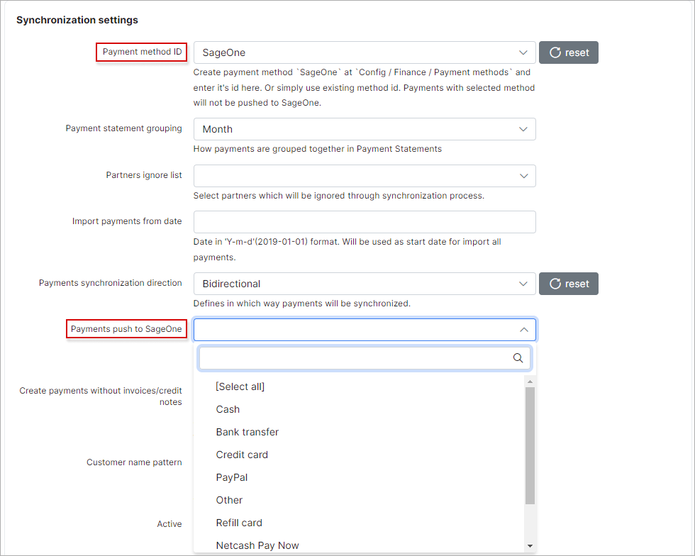
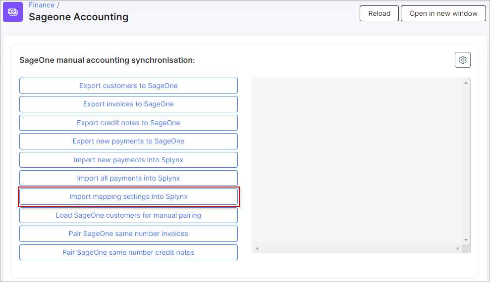
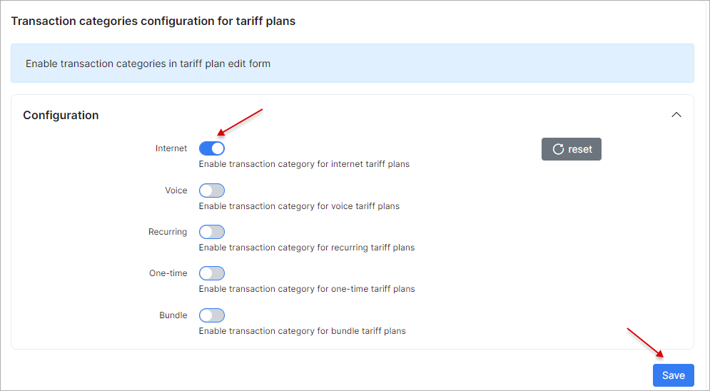
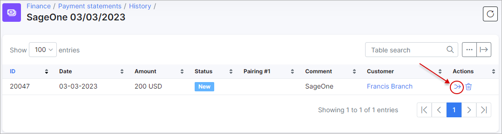
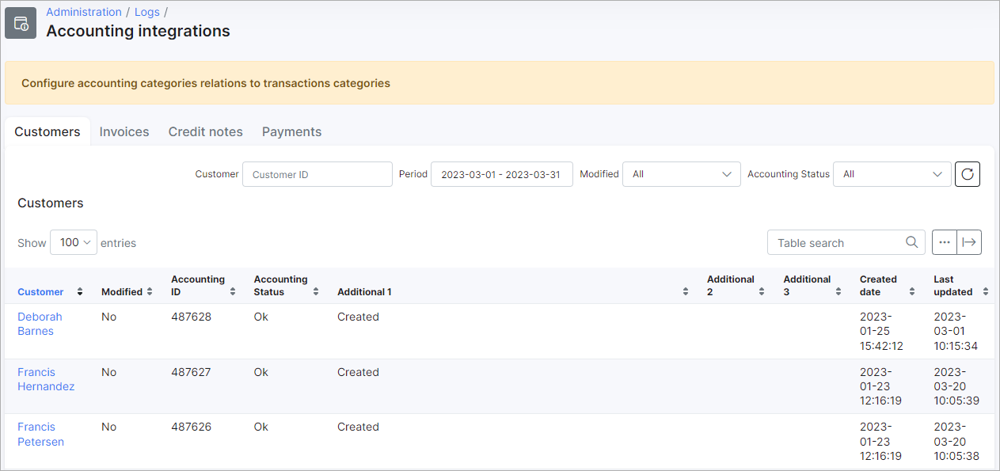

SageOne module
=========================================

The SageOne add-on in Splynx was designed to improve efficiency and the ability to perform all activities on one platform. We have integrated all SageOne features into Splynx for your convenience. Syncing customer data, invoices, and payments can now be done effortlessly by your powerful Splynx server.

### Important:

**SageOne integration is available only for SageOne South Africa**

**It's recommended do not configure the add-on on your own.**
**Please, contact our support team before starting the accounting integration.**

---------------------

The following steps can be taken to integrate your Splynx server with your SageOne platform:

## 1. Connecting the two platforms
* **To install the SageOne addon in Splynx** - Navigate to `Config / Integrations / Addons`, search for `splynx-sageone` and click on the install <icon class="image-icon"></icon> icon:

* **Configure addon settings** - navigate to `Config / Integrations / Module list`, search for `splynx_addon_sageone_accounting` and click on the edit <icon class="image-icon"></icon> icon:

Enter SageOne credentials into the `Login` and `Password` fields provided under the **SageOne API settings** section:

### Note:
**The company ID will be fetched from SageOne upon saving the login and password. Once the ID appears in Splynx it is an indicator that the platforms have connected successfully.**

### Synchronization settings:

The general configuration of the SageOne integration module can be viewed and edited here. Double check if **Entry points status for portal** option is enabled and **API domain** (with last slash) value is set correctly.

- **Payment method ID** - select the [payment method](configuration/finance/payment_methods/payment_methods.md) for imported payments. Payments with selected method id will not be pushed to SageOne;
- **Bank statements group** - group bank statements by "month" or "day";
- **Partners ignore list** - select the [partners](administration/main/partners/partners.md) which will be ignored in sync process. Customers, invoices and payments of the partners selected here, **WILL NOT** be synced with SageOne;
- **Import payments from date** - specify the date in 'Y-m-d'(2021-03-31) format, which will be used as the start date for importing all payments;
- **Payments synchronization direction** - define the direction of syncing payments: `SageOne → Splynx`, `Splynx → SageOne` or `Bidirectional`. If **SageOne to Splynx** direction is selected - all payments which were created in Splynx will not be synced to SageOne;
- **Payments push to SageOne** - select the [payment methods](configuration/finance/payment_methods/payment_methods.md) to sync to SageOne, this selection only applies if the selected method to sync payments is set to `Splynx → SageOne`;
- **Create payment without invoice** - a toggle allows to enable creating payment in Splynx when customer doesn't have invoice (e.g. for the partial payments in SageOne) or, in disabled status - only bank statement (-s) will be created in Splynx. Used on payments import. **Attention:** in some cases can lead to duplicate payments. Use this option with caution;
- **Create payment for paid invoice** - a toggle allows to enable creating payment in Splynx when the invoice has already been paid (actually for invoice with any status in Splynx), in disabled status - payment will be created only for **Not paid** invoice in Splynx. Used on payments import. The option is useful when payment (receipt) in SageOne was incorrectly linked to the invoice, the invoice or the total amount were incorrect etc. The current option doesn't include the SageOne partial payments, during import to Splynx, in order to create payments for everything in Splynx, both options (*Create payment for paid invoice* and *Create payment without invoice*) should be enabled. **Attention:** in some cases can lead to duplicate payments. Use this option with caution;
- **Customer name pattern** - used as SageOne customer 'Contact Name'. The following variables can be used: `{id}`, `{login}`, `{name}`, `{email}`. Customer name max length: 100;
- **Active** - the option to activate (deactivate) the customer profile on SageOne side. The toggle allows to configure the same relevant state of customer profile (checkmark's status) during sync between Splynx and SageOne (e.g. in case of customers manual pairing);
- **Accepts Electronic Invoices** - enable/disable to accept electronix invoices, the option is located in customer profile in SageOne. The toggle allows to configure the same relevant option state in customer profile (checkmark's status) during sync between Splynx and SageOne;
- **Auto Allocate Receipts to Oldest Invoice** - use this option if you want Accounting to automatically allocate receipts to the oldest invoice. If you do not use this option, when you receive money from customer, you will need to go to the Customer Allocations option to allocate each receipt to the correct invoice. The toggle allows to configure the same relevant state of customer profile (checkmark's status) during sync between Splynx and SageOne;
- **Allow this customer to view invoices online** - enable/disable for customer to view the invoices online, this option is located in customer profile in SageOne. The toggle allows to configure the same relevant option state in customer profile (checkmark's status) during sync between Splynx and SageOne;
- **Use Inclusive Amounts** - toggle allows to enable/disable the usage of the inclusive amounts for invoices. Inclusive amounts may provide more accurate roundings. In disabled status Splynx pushes all invoices to SageOne with VAT exclusive, this however make some rounding in SageOne and most of the time the account is out by 1 or 2 cent. In enabled status - Splynx pushes the invoices to SageOne with VAT inclusiveso that the total amount will always be the same in Splynx and Sage One;
- **Invoice fix Item id** - in the field the id of SageOne item can be specified to fix (the SageOne item will be added to invoice) mismatched totals due to rounding differences. Using the empty value - the totals will not be fixed. Items' ids can be found in `Config / Finance / Accounting categories` of Splynx.
- **Use system document number** - toggle allows to enable/disable the usage of the Splynx invoice number format for new Sageone invoices during export;
- **Use Credit Notes** - a toggle allows to enable/disable the sending Splynx invoices with negative totals to SageOne as *Credit Notes* (can be found in `Customers / Transactions / Customer Credit Notes` in SageOne).

### Cron settings

These are the global settings to automatically sync items between the two platforms, in any selected direction of syncing.

- **Customers** - enables/disables automatic syncing of customers;
- **Invoices** - enables/disables automatic syncing of invoices;
- **Payments** - enables/disables automatic syncing of payments;
- **Payments synchronization dates** - enables/disables payments sync by cron on selected dates in drop-down list. The toggle **Payments** should be enabled.

If any of the above items are not enabled to sync automatically, we can manually sync items via the Web UI under `Finance → Sageone Accounting`, with the export and import functions.

**It is recommended that all settings in the "Cron settings" section of the page are disabled for the initial set up of the add-on to avoid syncing all these elements automatically via cron jobs, the first import and export should be done manually**

## 2. Define the payment methods to push to SageOne from Splynx
* **Payments are processed within Splynx and sent to SageOne. Credit cards, cash, debit orders, Paypal payments, etc.** - Navigate to the `Synchronization settings` section, select *SageOne* as the `Payment method ID` and which `Payments push to SageOne` from Splynx:

**NOTE:**

* **Exclude payments processed in SageOne from the payments to push to SageOne from Splynx (if SageOne will be used as a payment gateway) because it will grab payments from SageOne.**

<icon class="image-icon"></icon> **How to create and link a Bank account in Splynx and SageOne:**

<b>Click here to expands</b>

**On SageOne side**

**On Splynx side**

Navigate to `Config / Finance / Accounting bank accounts`, scroll to the **Accounting bank accounts** section and click on the load button. The Bank account created in SageOne will appear in the table:

Once the bank account has been loaded, scroll to the top of the page and select the necessary account as the default one to which all payments processed in Splynx will be transferred. The default bank account should be selected for each payment method listed in *Bank Accounts Map*.

<b>In case the bank account list is not loaded</b>

On the sidebar, click on the `Finance / Sageone Accounting` and press the **Import mapping settings into Splynx** button, then try again.

## 3. Define items within SageOne with the correct VAT

**Understanding transaction categories:** all types of tariff plans within Splynx create its own transaction and each transaction for tariff plans are by default set to a service type of transaction. This behavior can be modified and it is necessary to do when using the SageOne addon in order to successfully pair items with transaction categories.

**Define accounting categories items in SageOne and sync it to Splynx** (`Items / Add an Item`) - these items you will use to pair/sync with [transaction categories](configuration/finance/transaction_categories/transaction_categories.md) in Splynx.

The first step is to create the items within SageOne.
Items created in SageOne should have relativity to services within Splynx.

For instance, if you have prepaid and recurring *Fibre* tariff plans in Splynx, you should have/create these items in SageOne.

In essence, for each different **type** of service in Splynx, there should be a corresponding item in SageOne. Think of items in SageOne as the grouping mechanism for types of costs from Splynx.

Then we will create transaction categories within Splynx that correspond to the items created within SageOne.

Navigate to `Config / Finance / Transaction categories`, here you can edit the default transaction categories or simply add new categories for each item created in SageOne.

After creating all the relevant categories, then it's necessary to assign these categories to the different types of services (accounting categories in SageOne). You can assign one category to a full type of services, e.g. one category for all Internet services and one for all voice services, etc, or you can assign the separate category to each of the different tariffs plans, e.g., one category for a *wifi* tariff and another for a *fiber* tariff.

To assign transaction categories by tariff plans, it is necessary to enable the transaction category fields within the tariff plans. To do this, simply scroll down to the bottom of the `Transaction categories` page and enable this option for the desired types of tariffs.

Once you have enabled these fields for the desired types of tariffs, you can simply navigate to the tariffs and assign categories to individual plans.

Navigate to `Tariff plans / Internet`, find in the list the desired Internet plan and click on *Edit* icon, scroll down to the bottom of the page, in the field `Transaction category` change the default category to the corresponding category you have created.

Once all your transaction categories have been created and assigned to the different plans, we can now start to link the categories in Splynx to the (accounting categories) items in SageOne.

`Navigate to Config / Finance / Accounting Categories`:

Once here, the first step is to load the categories/items from SageOne. To do so, scroll to the bottom of the page and click on the Load button in the *Accounting categories* sections:

<b>In case the accounting categories list is not loaded</b>

On the sidebar, click on the `Finance / Sageone Accounting` and press the **Import mapping settings into Splynx** button, then try again.

Once the categories have been loaded we can now proceed to map them to the relevant transaction categories, simply select the relevant SageOne accounting category for each corresponding transaction category in Splynx :

**NOTE:** In case the monthly invoices are [generated](finance/history_and_preview/history_and_preview.md) in Splynx, its transactions won't be related to the newly created transaction categories. This setting will be applied only for new created transactions.

<b>Click here to see how to cancel the last charge and perform the new service re-charge</b>

1. **To delete the created invoices and its transactions:** open `Finance / History & Preview` in the *History* table find the necessary item of charged invoices, click on the **Cancel** icon and confirm the action;

2. **To remove finance history records:** a new **Delete** icon will then appear in place of the **Cancel** icon. Click on the **Delete** icon and confirm the action to remove batch files;

3. **To generate new invoices:** select the correct date in the filed **Date**, press **Preview** button and choose the **Invoice date**. After that press **Confirm** button;

4. **Double check the generated invoices and its transactions with new categories:** the invoices can be checked for specific period in `Finance / Invoices` section, the transaction, accordingly, in `Finance / Transactions`.

## 4. Push customers from Splynx to SageOne and merge the customers between two platforms

In order to sync all customers between two platforms, click on `Finance` item on the sidebar of Splynx and in the drop-down menu click on `SageOne Accounting`.

**NOTE:** This step is only required for the initial set up of the *SageOne* add-on, as we have disabled the Cron settings in the second step of the configuration of the add-on. Once the step **Export customers to SageOne** has been completed for the first time, all cron functions can be enabled to allow the system to sync data automatically.

To export customers **from Splynx to SageOne**, simply click on **Export customers to SageOne** button:

Check exported customers in SageOne to confirm the export was successful:

## 5. Push customer invoices from Splynx to SageOne

After we have successfully exported customers to SageOne, the next step is to export all customer invoices. To do so, on the sidebar, navigate to `Finance / SageOne Accounting`.

**NOTE:** This step is only required for the initial set up of the *SageOne* add-on, as we have disabled the Cron settings in the second step of the configuration of the add-on. Once the step **Export invoices to SageOne** has been completed for the first time, all cron functions can be enabled to allow the system to sync data automatically.

<icon class="image-icon"></icon> **Attention:** The invoices without transactions or marked as **Deleted** in Splynx will not be synced to SageOne.

Click on **Export invoices to SageOne** button:

Check exported invoices in SageOne to confirm the export was successful:

As shown below, customer balances have already changed due to invoice.

Check the customer in SageOne to verify the invoices:

## 6. Push payments from Splynx to SageOne

The next step is to export the payments from Splynx to SageOne.

To do so, on the sidebar, navigate to `Finance / SageOne Accounting`, click on **Export new payments to SageOne** button:

**NOTE:**  This step is only required for the initial set up of the *SageOne* add-on, as we have disabled the Cron settings in the second step of the configuration of the add-on. Once the step **Export new payments to SageOne** has been completed for the first time, all cron functions can be enabled to allow the system to sync data automatically.

Check the exported payments and the customer balance as well as the bank account status (`Banking / Lists / List of Banks and Credit Cards / Activity tab`) in SageOne to confirm the export was successful:

The payments can then be allocated and processed within SageOne:

## 7. Sync payments from SageOne to Splynx (if needed)

Using SageOne as a payment gateway in Splynx is possible, but it is very important to be careful to avoid making any duplicated payments.

Navigate to `Customers / Lists / List of Customers` find in the list the required customer and click to the name to edit (or `Actions / Edit`). Click on **Invoices** tab, an unpaid invoices will be listed here (the option to **Include Paid Invoices** is present as well). Click on **detail** of the selected invoice to process. Then, click on **Options**, in drop down menu choose **Create Receipt** option.

Check the balance of the bank account in `Banking / Lists / List of Banks and Credit Cards `.

Now we can synchronize this payment that is present in SageOne to Splynx.

<icon class="image-icon"></icon> **Attention:** The `Payments synchronization direction` option should be set to `SageOne to Splynx` in `Config / Integrations / Modules list / Sageone Accounting`.

On the sidebar, navigate to `Finance / SageOne Accounting`, click on **Import all payments into Splynx** button.

After the payments import is completed, double check the invoice and its transaction in customer's profile (`Billing / Invoices` and `Billing / Transactions` tabs). The status of the invoice should be `Paid` and the description of the payment transaction - *SageOne*.

If the customer receipt has been created and processed on *SageOne* side without being linked to the *Unpaid* invoice and the step **Import new payments into Splynx** has been performed - the invoice will remain unpaid (the balance will not top up as well) in Splynx. To fix this it's necessary to do the manual pair of the new bank statement with *Unpaid* invoice in Splynx. Navigate to `Finance / Payment statements / History / SageOne (some date) ` find the related statement and click on *Manual pair* icon. In new window specify the invoice number to pair with and click on *Manual pair* icon again. In next window specify the *Payment type* and press **Pair** button (pay attention what types of payments are ignored in `Payments push to SageOne` drop down list in add-on config. This option is used for Splynx to SageOne sync).

Now we can check the list of transactions to verify all is correct: navigate to the customer transactions tab and check if the transaction have been added accordingly.

---------------------

You might also be interested in the **video tutorials about SageOne integration**

<b>Click here to expand</b>

(*based on Splynx v3.0 and SageOne add-on v1.0.90.20200417*)

<iframe width="350" height="270" src="https://www.youtube.com/embed/7q_BzL2LQbk" title="YouTube video player" frameborder="0" allow="accelerometer; autoplay; clipboard-write; encrypted-media; gyroscope; picture-in-picture" allowfullscreen></iframe>

<iframe width="350" height="270" src="https://www.youtube.com/embed/ctuNzm_qWgs" title="YouTube video player" frameborder="0" allow="accelerometer; autoplay; clipboard-write; encrypted-media; gyroscope; picture-in-picture" allowfullscreen></iframe>

---------------------

## SageOne accounting integration logs

All actions of the SageOne add-on can be monitored regularly to ensure that the add-on is working as expected. To check the list of add-on activities, navigate to `Administration / Logs / Accounting Integrations`:

---------------------
## SageOne tweaks

There are a few more settings and tools related to the SageOne add-on:

- **Import mapping settings into Splynx** - when SageOne login and password are set on the add-on configuration page, press this button to import mapping settings such as *accounting categories* and *bank accounts* into Splynx. Configure the mapping settings according to the steps described above;

- **Customers manual pairing** - this function is used where there are existing customers in Splynx as well as SageOne. Press `Load SageOne customers for manual pairing` button, then click on the small gear icon at the top right corner, choose *Customers manual pairing* option. These features pull the customer list from SageOne into Splynx and allow the admin to manually pair the customers without having to create them in either platform again;

- **Module Config** - the link is used to open the SageOne add-on configuration page (`Config → Integration → Modules list → SageOne Accounting`).

- **Pair SageOne same number invoices** - allows to make the request for all unpaired invoices in order to receive their accounting IDs from SageOne and put those IDs into Splynx database. For example, the invoices have been exported but their IDs have not been received and an error *Document Number already exists* occurs when re-exporting.

---------------------

## Troubleshoot

Follow these instructions to troubleshoot problems with *SageOne*:

<b>Error: '400 Document Number already exists'</b>

*An invoice was synchronized to SageOne, then it was deleted in Splynx (e.g. invoice was an incorrect and you have deleted it and create a new one with the same number) and you are attempting to sync invoices to SageOne again*

**Solution:** Remove the invoice from the SageOne account or if you are not able to remove it from SageOne - re-create the invoice in Splynx with a new invoice number.

---------------------
