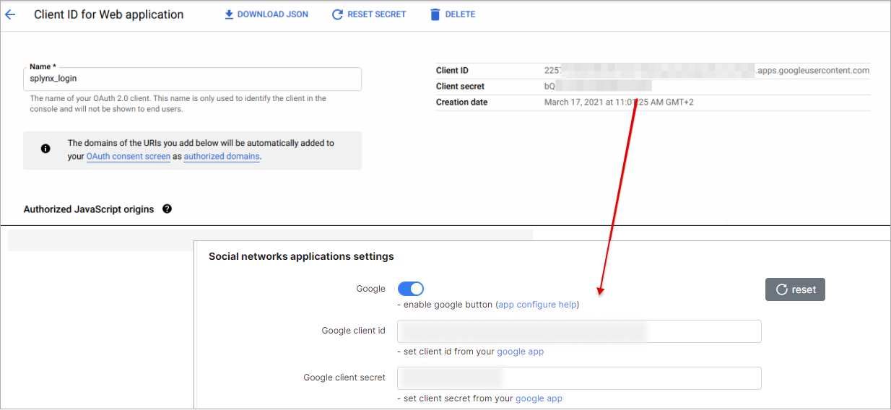
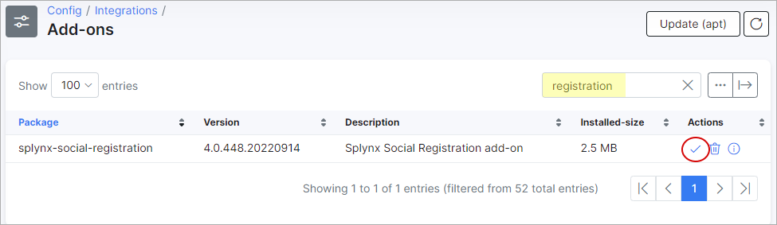
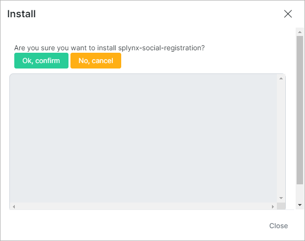
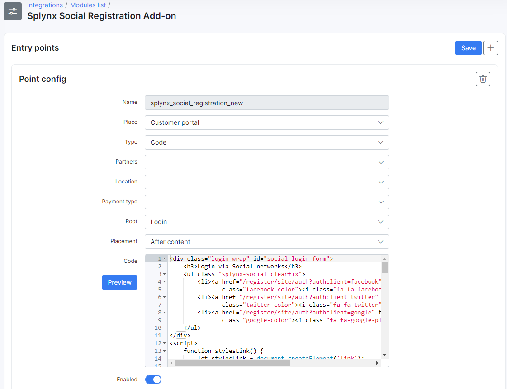
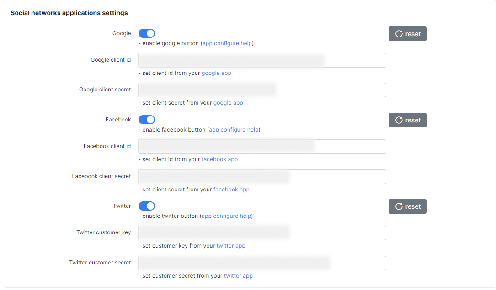
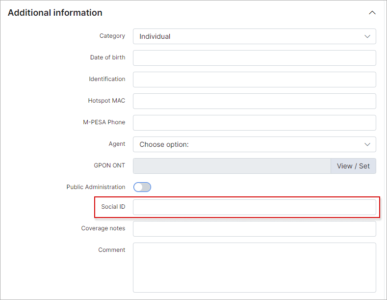

Self Registration
=================

**Self Registration** (formerly called **Social registration**) is a Splynx add-on that allows customers to register themselves in the Splynx portal using their e-mail address or mobile phone numbers. Customers can also register and log in using their Google+, Facebook or Twitter accounts.

If you want to use this add-on to social platforms - it is necessary to have the API applications . If you don't have this - below is how you create them.

**How to create and enable API-apps in Google+, Facebook, and Twitter**

### **Google API**

You need a Google API Console project to integrate Google Sign-In into your Splynx-site. To create a Google API Console project and client ID, follow these steps:

* Go to the Google API Console ([https://console.developers.google.com/projectselector/apis/library](https://console.developers.google.com/projectselector/apis/library))
* Select an existing project, or create a new one
    

* In the sidebar under **APIs & Services**, select **Credentials**, then select the **OAuth consent screen** tab  
    

* Choose an **Email Address**, specify a **Product Name**, and press **Save**
    

* In the **Credentials** tab, select **Create credentials** drop-down list, and choose **OAuth client ID**
    

* Under **Application type**, select **Web application**
    **Authorized JavaScript origins** - URL of your Splynx-server
    **Authorized redirect URIs** - enter these values:
    1) `https://splynx.youdomain.com/register/site/auth?authclient=google`
    2) `https://splynx.youdomain.com/register/login/auth?authclient=google`

    

* Click **Create**

**NOTICE:** If the customer receives this error message during registration or sign-in process, then the _wrong_ URI (1) has been added to **Authorized redirect URIs** list.


* From the resulting OAuth client dialog box, copy **Client ID** and **Client secret** to Splynx.
    

* And, finally, turn on the Google+ API ([https://console.developers.google.com/apis/library/plus.googleapis.com](https://console.developers.google.com/apis/library/plus.googleapis.com))  
    

Reference: [Google documentation](https://developers.google.com/identity/sign-in/web/devconsole-project)

### **Facebook API**

To integrate Facebook Logins into your Splynx-site, you must have a Facebook API.
**Notice:** Splynx-site must use HTTPS. It is required by Facebook.

* Go to developers portal [https://developers.facebook.com/apps](https://developers.facebook.com/apps)
* Create App
    

* In **Select a product** select **Facebook Login** (click **Set Up**)  
    

* Do not use **Quickstart**, use **Settings**
    

* Enter **Valid Oauth redirect URIs**:
    1) `https://splynx.youdomain.com/register/site/auth?authclient=facebook`
    2) `https://splynx.youdomain.com/register/login/auth?authclient=facebook`
    

* Click **Save Changes**

* Go to App _Settings / Basic_, copy **App ID** and **App Secret** to Splynx  
    

* Enable App as **Public** (from **App Review**)
    

Reference: [Facebook documentation](https://developers.facebook.com/docs/facebook-login)

### **Twitter API**

For Twitter integration, go to the Application Management page - [https://apps.twitter.com/](https://apps.twitter.com/)

* Create a New App
    

* Enter application **Name**, **Description**, **Website**, **Callback URL** (http://splynx.youdomain.com/register/login/auth?authclient=twitter), and click button **Create your Twitter application**
    

* From tab **Keys and Access Tokens** copy **Consumer Key (API Key)** and **Consumer Secret (API Secret)** to Splynx  
    
* Go to **Permissions** and enable **Request email addresses from users**  
    

## Installing the Add-on

The add-on can be installed in two methods, via CLI or the Web UI.

To install the "Self Registration" add-on via CLI, the following commands can be used:

```bash
sudo apt update
sudo apt install splynx-social-registration
```
To install it via the Web UI:

Navigate to *Config -> Integrations -> Add-ons:*


Locate or search for the "splynx-0self-registration" addon and click on the install icon in the *Actions* column



Click on the "OK, confirm" button to begin the installation process




After the installation has completed, you have to configure the add-on under _Config / Integrations / Modules List_.


Locate or search for the "splynx-0self-registration" addon and click on the edit icon in the *Actions* column


You need to enable the **Entry points status for portal** in the **Main information** section


You may enable or disable **Entry Points** here as well. There are two entry points in the configuration.


The first one provides the ability to sign-in to the Splynx-portal using social networks.



The second one provides the ability of registration via social networks.


Edit the URL of your server:


Enable social networks that you want to use:



You can enable [TowerCoverage](addons_modules/towercoverage/towercoverage.md) integration:


Once all settings have been configured click on **Save**.

* * *

**Registration**


Customer will need to Enter the required information, and click on the **Sign In** button.


* * *

## **Login customer to Splynx-portal**

* Login with Facebook  
    If the customer is not logged into Facebook, they will be prompted to log into Facebook and then redirected to Splynx-portal.
    

* Login with Google
    If the customer is not logged in Google+, they will be prompted to log into Google and then redirected to Splynx-portal.
    

* Login with Twitter  
    If the customer is not logged in Twitter, they will be prompted to log into Twitter and then redirected to Splynx-portal.
    

Information about social-networks is stored in _Customer / Information / Additional information_ in the **Social ID** field




* * *

[TowerCoverage Integration](addons_modules/towercoverage/towercoverage.md)
