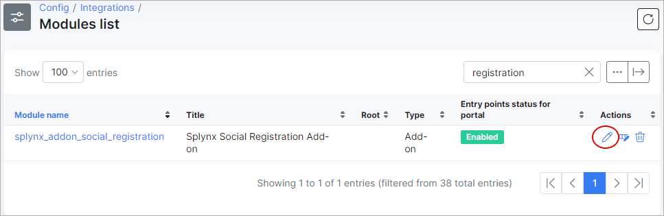
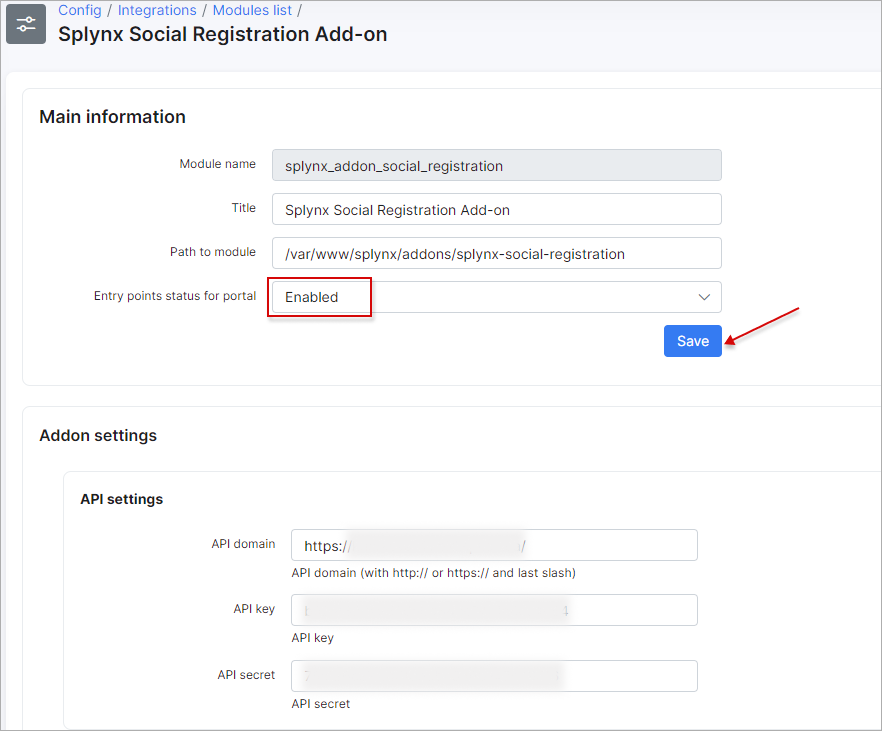
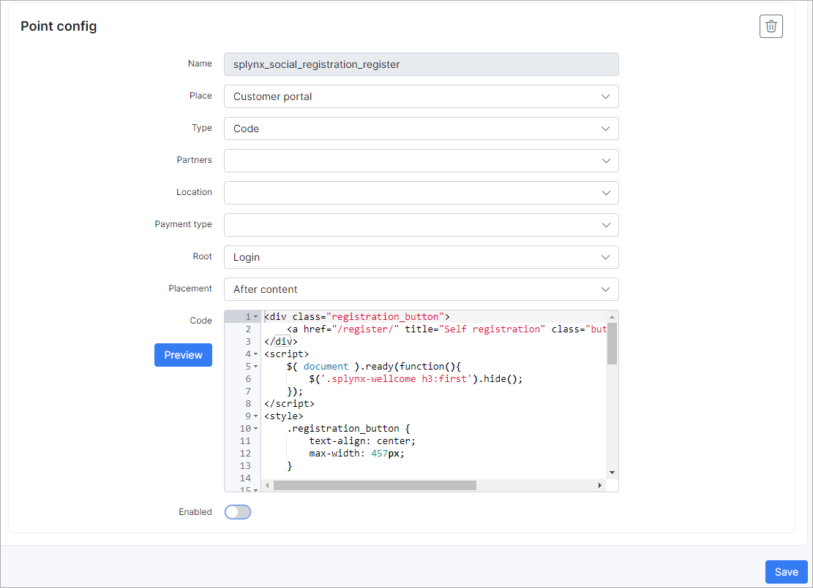

Self Registration
=================

**Self Registration** (formerly called **Social registration**) is a Splynx add-on that allows customers to register themselves in the Splynx portal using their e-mail address or cell phone number. Customers can also register and log in using their Google, Facebook or Twitter accounts.

If you want to use this add-on with social network platforms - it is necessary to have the API applications. If you don't have such apps - below you can find how to create them.

**How to create and enable API-apps in Google, Facebook, and Twitter**

### **Google API**

You need a Google API Console project to integrate Google Sign-In into your Splynx-site. To create a Google API Console project and client ID, follow these steps:

* Go to the Google API Console ([https://console.developers.google.com/projectselector/apis/library](https://console.developers.google.com/projectselector/apis/library))
* Select an existing project, or create a new one
    

* Click on navigation menu, choose **APIs & Services**, select **Credentials**, then select the **OAuth consent screen** tab. In **OAuth consent screen** choose how you want to configure and register your app.
    
    

During app registration steps you should specify the app name, its logo, user support email, authorized domain, developer contact info, add the necessary scopes etc. If you want to continue testing your app (internal app type), you can specify test users as well, only such users will be able to access the app. Otherwise, for production (external app type), publish your app. If you change your app's configuration in the future, like adding more than 10 domains, uploading a logo, or requesting sensitive or restricted scopes, you will need to [submit for verification](https://support.google.com/cloud/answer/9110914).
    
    

* In the **Credentials** tab, select **Create credentials** drop-down list, and choose **OAuth client ID**
    

* Under **Application type**, select **Web application**;
    **Authorized JavaScript origins** - URL of your Splynx-server;
    **Authorized redirect URIs** - enter these values:
    1) `https://splynx.youdomain.com/register/site/auth?authclient=google`
    2) `https://splynx.youdomain.com/register/login/auth?authclient=google`

    

* Click **Create**

**NOTICE:** If the customer receives this error message during registration or sign-in process, then the _wrong_ URI has been added to **Authorized redirect URIs** list.


* From the resulting OAuth client dialog box, copy **Client ID** and **Client secret** to Splynx.
    

* And, finally, turn on the Google+ API ([https://console.developers.google.com/apis/library/plus.googleapis.com](https://console.developers.google.com/apis/library/plus.googleapis.com))  
    

Reference: [Google documentation](https://developers.google.com/identity/sign-in/web/devconsole-project)

### **Facebook API**

To integrate Facebook Logins into your Splynx-site, you must have a Facebook API.

**Notice:** Splynx-site must use HTTPS. It is required by Facebook.

* Go to developers portal [https://developers.facebook.com/apps](https://developers.facebook.com/apps)
* Create App and specify its name, app contact email, app purpose etc. Pay particular attention to complete the security check (Google reCaptcha), some adblock extensions can block it.
    
    

More about facebook app [types](https://developers.facebook.com/docs/development/create-an-app/app-dashboard/app-types).

* From **Add Products to Your App** select **Facebook Login** (click **Set Up**)  
    

* Do not use **Quickstart**, use **Settings**.
    
By default facebook app has standard access to public_profile and email, it should be changed to advanced access.
The **public_profile** permission allows apps to read the Default Public Profile Fields on a User node. The allowed usage for this permission is to authenticate app users and provide them with a personalized in-app experience.
The **email** permission allows your app to read a person's primary email address. The allowed usage for this permission is to let end users log into your app with the email address associated with their Facebook profile.
In order to change permission settings, open _App Review > Permissions and Features_


* Open facebook login settings and enter **Valid Oauth redirect URIs**:
    1) `https://splynx.youdomain.com/register/site/auth?authclient=facebook`
    2) `https://splynx.youdomain.com/register/login/auth?authclient=facebook`
    

* Click **Save Changes**

* Go to App _Settings / Basic_, copy **App ID**  and **App Secret** to Splynx
    

Reference: [Facebook documentation](https://developers.facebook.com/docs/facebook-login)

### **Twitter API**

For Twitter integration, go to the Application Management page - [https://apps.twitter.com/](https://apps.twitter.com/)

* Create a New App
    

* Enter application **Name** and copy your **API key (consumer key)** and **API secret key (consumer secret)** to Splynx (_Config → Integrations → Modules list → Splynx Social Registration Add-on_).
After that click on **App settings** button.


* In **App settings** you can specify app description and its icon. Also, it's necessary to change **App permissions** to _Read and Write_.


* In **Authentication settings** enable **_3-legged OAuth_** and **_Request email address from users_** options, after that add info to required fields:
**Callback URLs**: 1) `https://splynx.youdomain.com/register/login/auth` 2) `https://splynx.youdomain.com/register/site/auth`;
**Website URL**: `https://splynx.youdomain.com` ;
**Terms of service** and **Privacy policy**:`https://splynx.youdomain.com/privacy_policy` .


## Installing the Add-on

The add-on can be installed in two methods, via CLI or the Web UI.

To install the "Self Registration" add-on via CLI, the following commands can be used:

```bash
sudo apt update
sudo apt install splynx-social-registration
```
To install it via the Web UI:

Navigate to *Config -> Integrations -> Add-ons:*


Locate or search for the "splynx-social-registration" addon and click on the install icon in the *Actions* column


Click on the "OK, confirm" button to begin the installation process


After the installation has completed, you have to configure the add-on under _Config / Integrations / Modules List_.


Locate or search for the "splynx-social-registration" addon and click on the edit icon in the *Actions* column



You need to enable the **Entry points status for portal** in the **Main information** section



You may enable or disable **Entry Points** here as well. There are two entry points in the configuration.


The first one provides the ability to sign-in to the Splynx-portal using social networks:


The second one provides the ability of registration via social networks:



Edit the URL of your server:


Enable social networks that you want to use:


Also, you can enable [TowerCoverage](addons_modules/towercoverage/towercoverage.md) integration (optional):


[TowerCoverage Integration](addons_modules/towercoverage/towercoverage.md)

Once all settings have been configured click on **Save**.

* * *

**Registration**


Customer will need to Enter the required information, and click on the **Sign In** button. Confirmation code will be send to the mentioned mail box.


* * *

## **Login customer to Splynx-portal**

* Login with Facebook  
    If the customer is not logged into Facebook, they will be prompted to log into Facebook and then redirected to Splynx-portal.
    

* Login with Google
    If the customer is not logged in Google, they will be prompted to log into Google and then redirected to Splynx-portal.
    

* Login with Twitter  
    If the customer is not logged in Twitter, they will be prompted to log into Twitter and then redirected to Splynx-portal.
    

Information about social-network is stored in _Customer / Information / Additional information_ in the **Social ID** field.


