Signaturit
==========

Signaturit is a Splynx add-on which allows you to complete any signing processes in the business with a legally binding eSignature.

The "Splynx-Signaturit" add-on works started from Splynx version 2.0+  

The add-on can be installed in two methods, via CLI or the Web UI

1. To install the "Splynx-Signaturit" add-on via CLI, the following commands can be used:

```bash
sudo apt update
sudo apt install splynx-signaturit
```
To install it via the Web UI:

Navigate to *Config -> Integrations -> Add-ons:*


Locate or search for the "splynx-signaturit" addon and click on the install icon in the *Actions* column

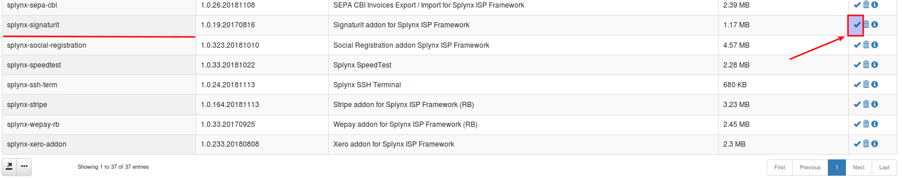

Click on the "OK, confirm" button to begin the installation process

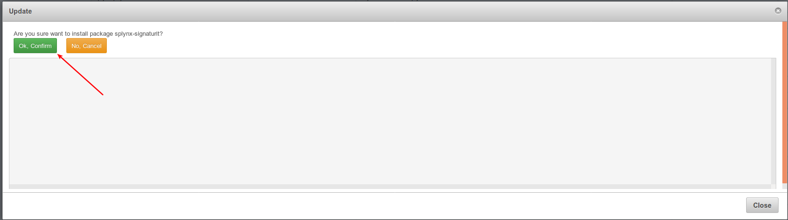

After the installation process has completed, we ca then configure the add-on.


2. To configure the "Splynx-Signaturit" add-on, it is necessary for you to obtain a "Access token" from [http://app.signaturit.com](http://app.signaturit.com/):

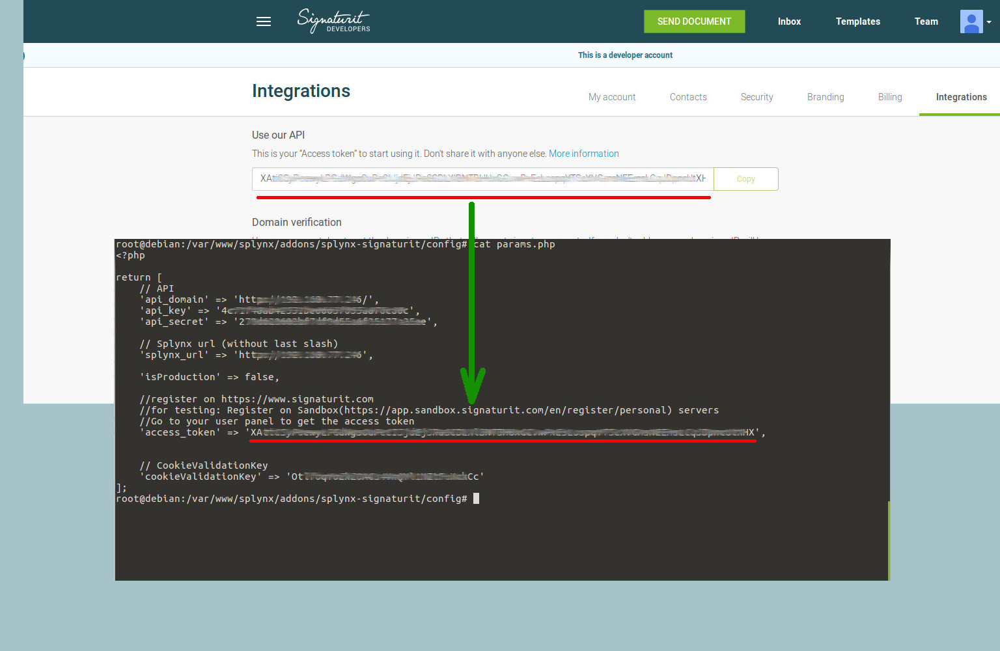

3. Then check your setup in the admin-panel:

Navigate to _Config -> System -> Signaturit Config_

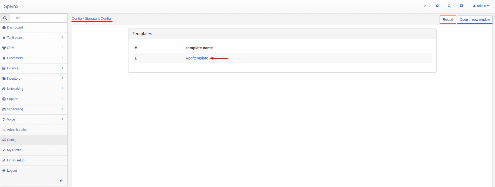

4. To be able to send documents to customers, you should generate templates from SignaturIt (1) or Splynx (3) or upload them (2) from computer:

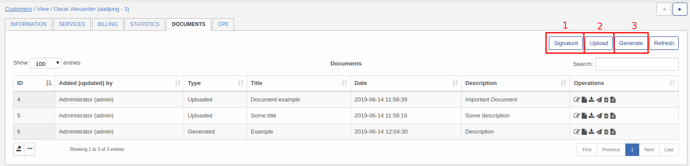

4.1. **To generate documents from SignaturIt-template** ,you need to create the template in _SignaturIt-templates_:

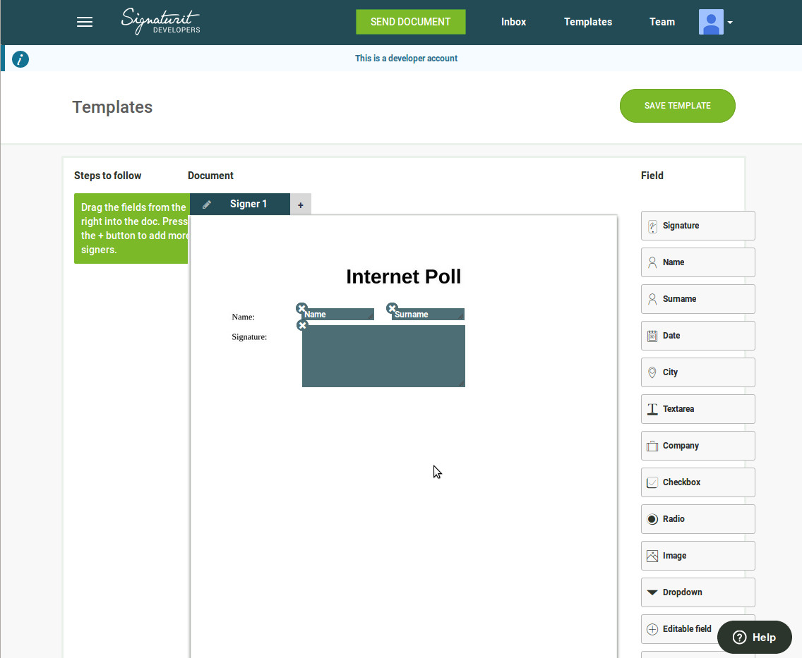

And add at least one field in _Config → SignaturIt Config → Template_:

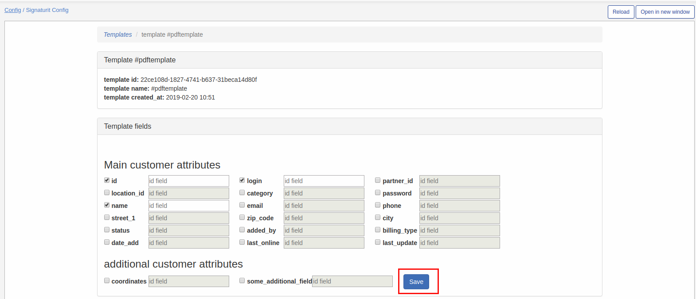

Then you can send it:

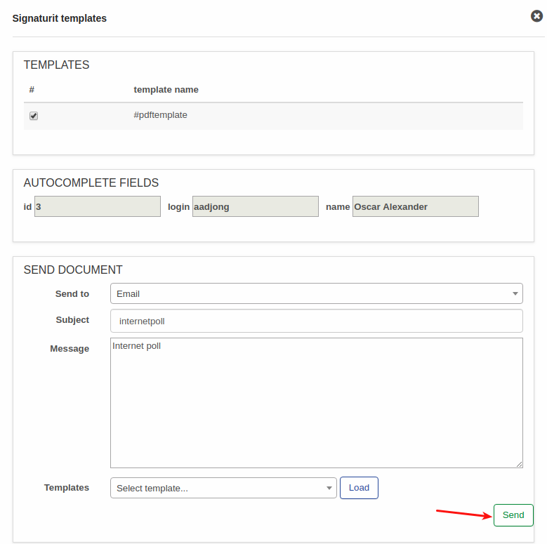

Your signature:

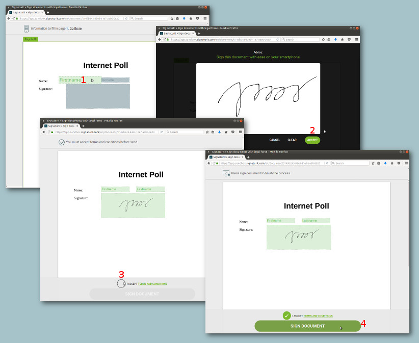

4.2. **To upload the document from your PC**, click on "_Upload_" icon and in the window that will appear, select the file you'd like to upload:

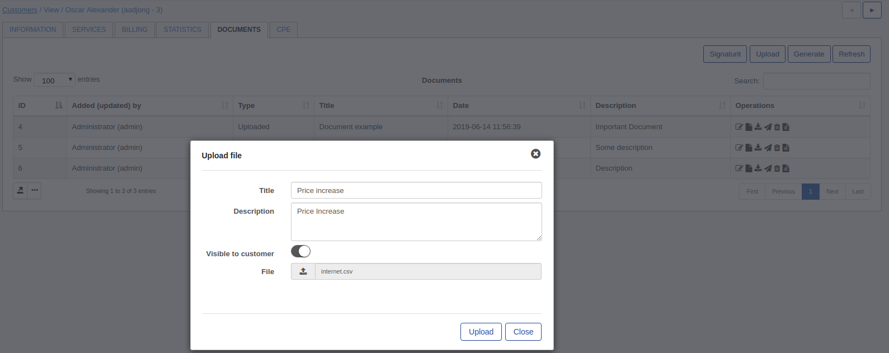

Then click on the "_Send to signature_" icon and _“Send”_.

Your signature:

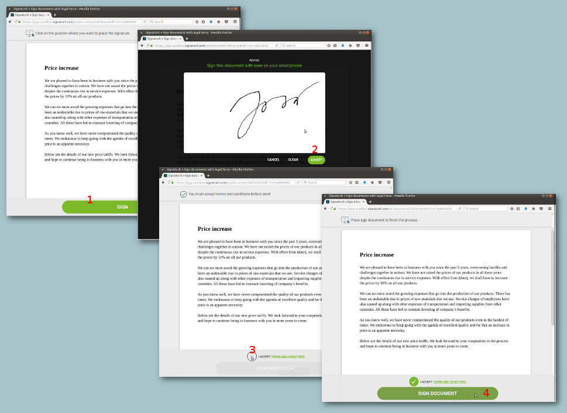

4.3. **To generate documents from Splynx-template**, you need to create the template in _Splynx-> Config->Templates_:

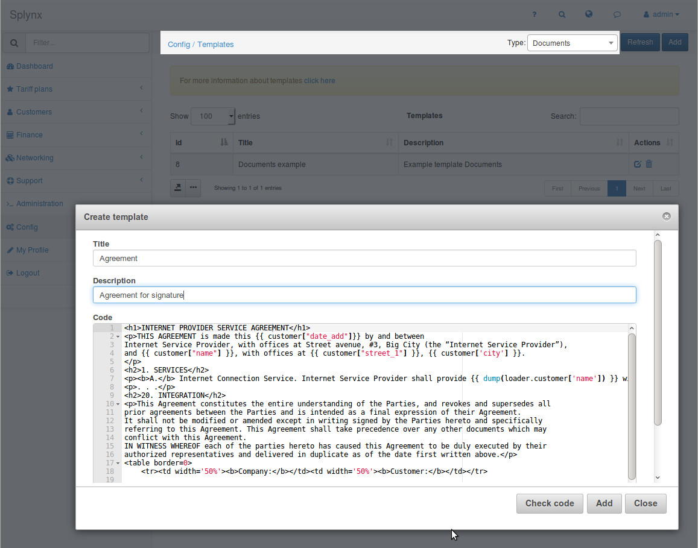

An example of the generated document from Splynx-template can be viewed below:

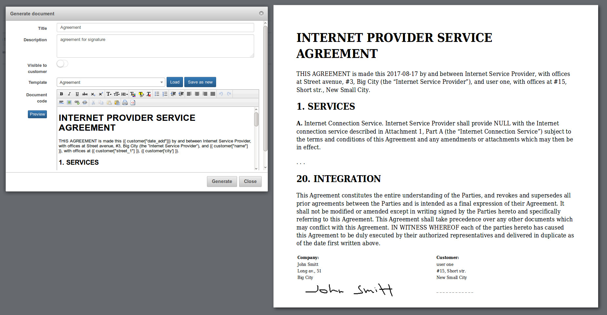

Then. click on the "_Send to signature_" icon, type a Subject, and click _“Send”_

Signature:

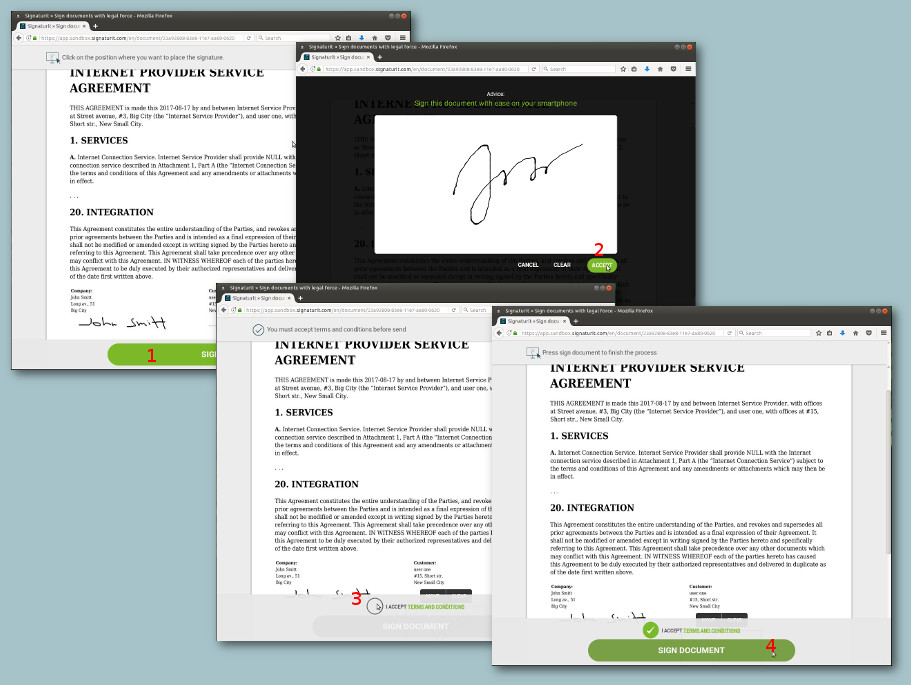

5. Once completed, you can download the signed document:

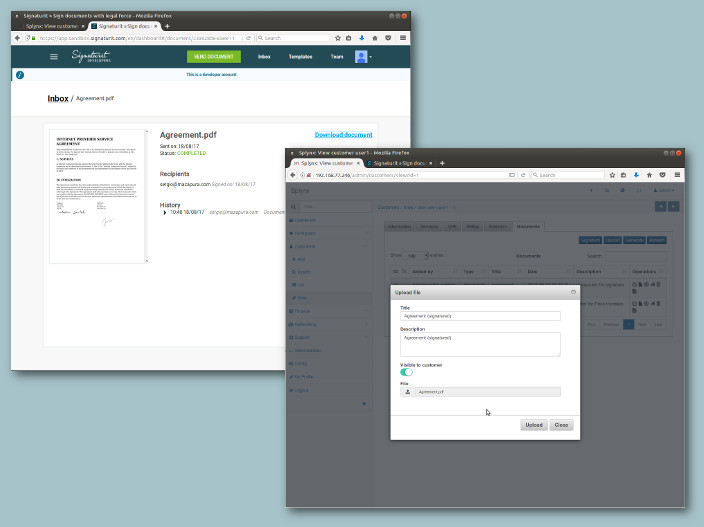
