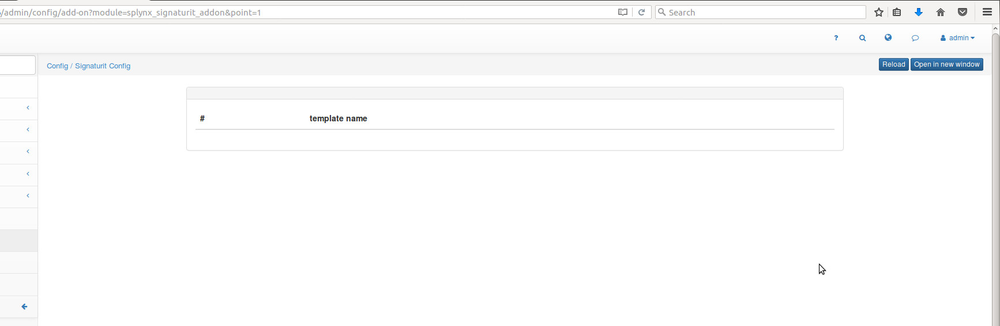
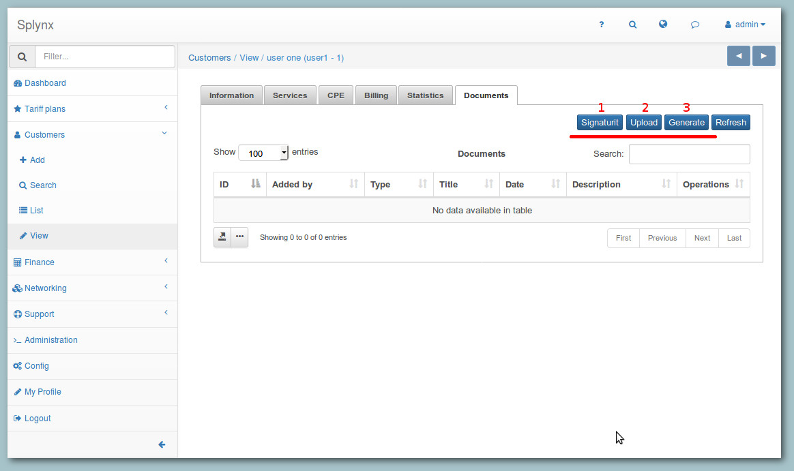
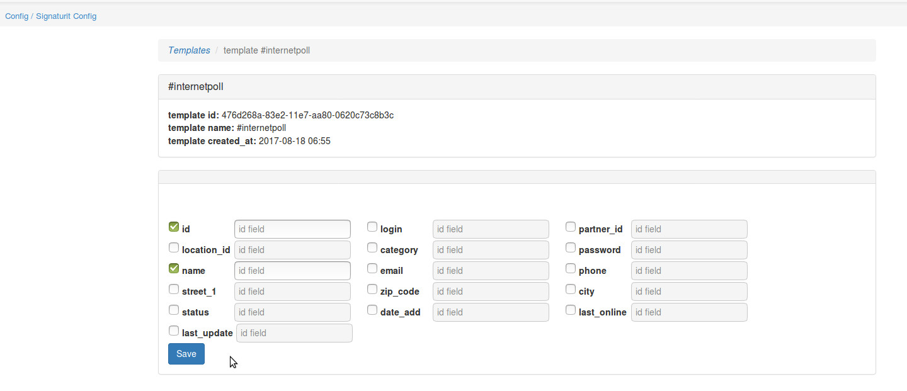
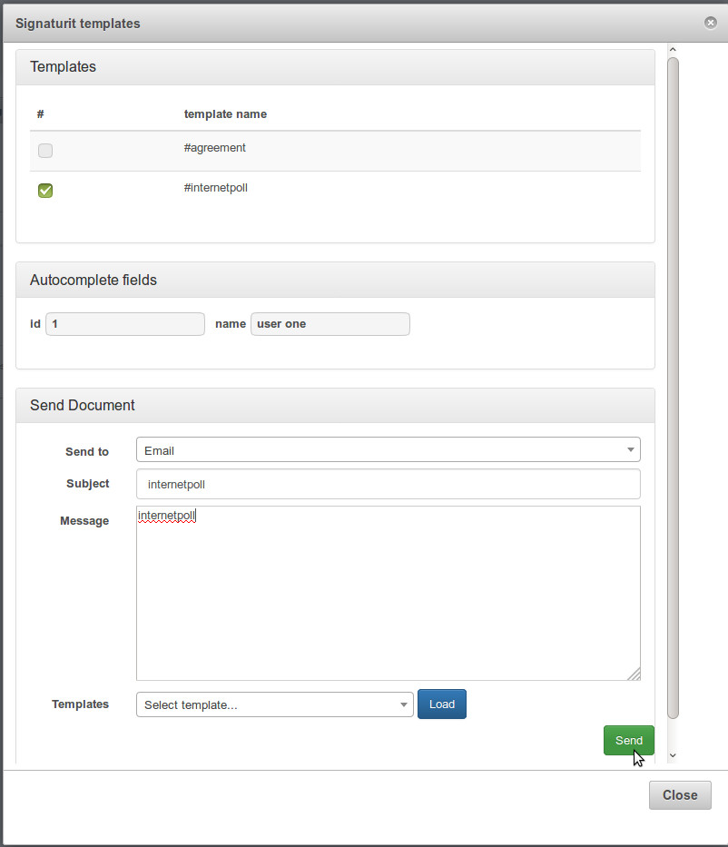
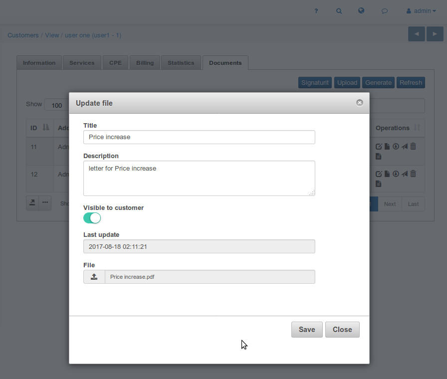

Signaturit
==========

Signaturit is a Splynx add-on which allows you to complete any signing processes in business with legally binding eSignature.

"Splynx-Signaturit" add-on works in Splynx version 2.0+  

1. To install "Splynx-Signaturit" add-on please enter the command:

```bash
sudo apt update
sudo apt install splynx-signaturit
```
or oyu can install it from Web UI:

*Config -> Integrations -> Add-ons:*


2. To configure add-on "Splynx-Signaturit" you should get "Access token" from [http://app.signaturit.com](http://app.signaturit.com/):


3. Then check your setup in admin-panel:

_Config -> System -> Signaturit Config_



4. To be able to send document to the customer you should generate templates from SignaturIt (1) or Splynx (3) or upload them (2) from computer:



4.1. **To generate document from SignaturIt-template** you have to prepare its template in _SignaturIt-templates_:


And add at least one field in _Config → SignaturIt Config → Template_:



Then you can send it:



Your signature:


4.2. **To upload the document from PC** click on "_Upload_" icon and in a window poped-up choose the file you'd like to be uploaded:



Then click on icon "_Send to signature_" and _“Send”_.

Your signature:


4.3. **To generate document from Splynx-template** you should prepare its template in _Splynx-> Config->Templates_:


Example of the generated document from Splynx-template:


Then click on icon "_Send to signature_", write Subject, and click _“Send”_

Signature:


5. At the end you can download the signed document:


