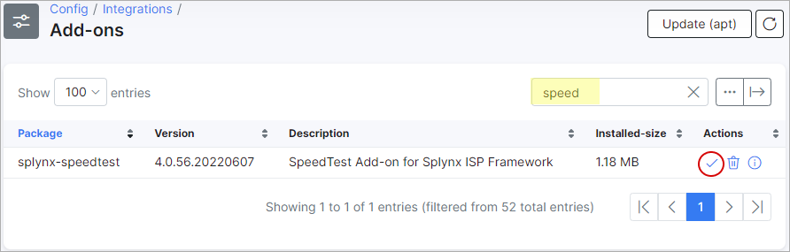

Speedtest
=========

The Splynx Speedtest add-on is used to show administrators and customers, Customer's Download and Upload internet speeds, their Ping, Jitter, Ip address and Latency.

The add-on can be installed in two methods, via CLI or the Web UI

To install the splynx-speedtest add-on via CLI, the following commands can be used:
```bash
apt-get update

apt-get install splynx-speedtest
```
To install it via the Web UI:

Navigate to *Config → Integrations → Add-ons*:


Locate or search for the "splynx-speedtest" add-on and click on the install icon in the *Actions* column



Click on the "OK, confirm button" to begin the installation process.


After the installation process has completed, customers will see a new function in the “Services” module, as depicted below:


You can enable speed tests to be available in other section of Splynx in the *Config → Integrations → Modules list → Splynx Speedtest → Entry points*:


Thereafter, customers will see the SpeedTest window on their Dashboard:


as well as new SpeedTests in his Services:


SpeedTest gauges:


SpeedTest basic:


SpeedTest chart:


SpeedTest prety:


Speed Test progress bar:


After customers have run Speed tests, admins can see the results in the *Networking → SpeedTest result*, the admin can then print, copy or save it in few available formats such as Excel, CSV, PDF:


