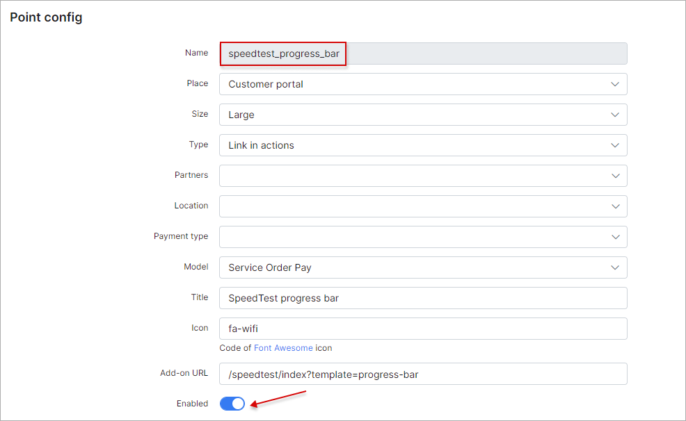

Speedtest
=========

Speedtest is a Splynx add-on. It used to show for administrators and customers, Customers Download internet speed and Upload internet speed their Ping, Jitter, Ip address and Latency.

To install splynx-speedtest add-on use next commands:
```bash
apt-get update

apt-get install splynx-speedtest
```
or you can install it from Web UI:

Config → Integrations → Add-ons:


after installation customer will see a new functional in the “Services” menu. Look at the screenshot:


You can turn on other speed tests in the Config → Integrations → Modules list → Splynx Speedtest → Entry points:





After that customer will see SpeedTest window on his Dashboard:


And he will see a new SpeedTests in his Services:


SpeedTest gauges:


SpeedTest basic:


SpeedTest chart:


SpeedTest prety:


Speed Test progress bar:


After customer have made Speed test, admin can see it in the Networking → SpeedTest result, and he can print copy or save it in few formats such as Excel, CSV, PDF:

