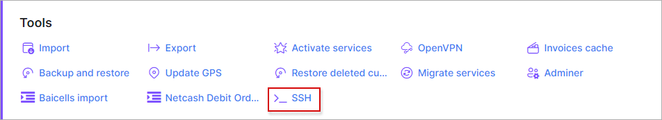

**ssh-term**
========
**ssh-term** - is a Splynx add-on developed to use a terminal within the Splynx web-interface.

The add-on can be installed in two methods, via CLI or the Web UI

**Installation:**

To install the *ssh-term* add-on via CLI, the following commands can be used:

`apt-get update`

`apt-get install splynx-ssh-term`

To install it via the Web UI:

Navigate to *Config → Integrations → Add-ons:*

Locate or search for the "splynx-ssh-term" addon and click on the install icon in the *Actions* column

Thereafter, a window will appear for you to confirm or cancel the installation of the addon, click on the "OK, confirm" button to begin the installation process

After the installation process has completed, you will see a new icon in *Config → Tools:*

When you click on this icon, a terminal window will appear, which you can then enter your login details and be able to use the terminal from the Splynx web-interface as from a console:

