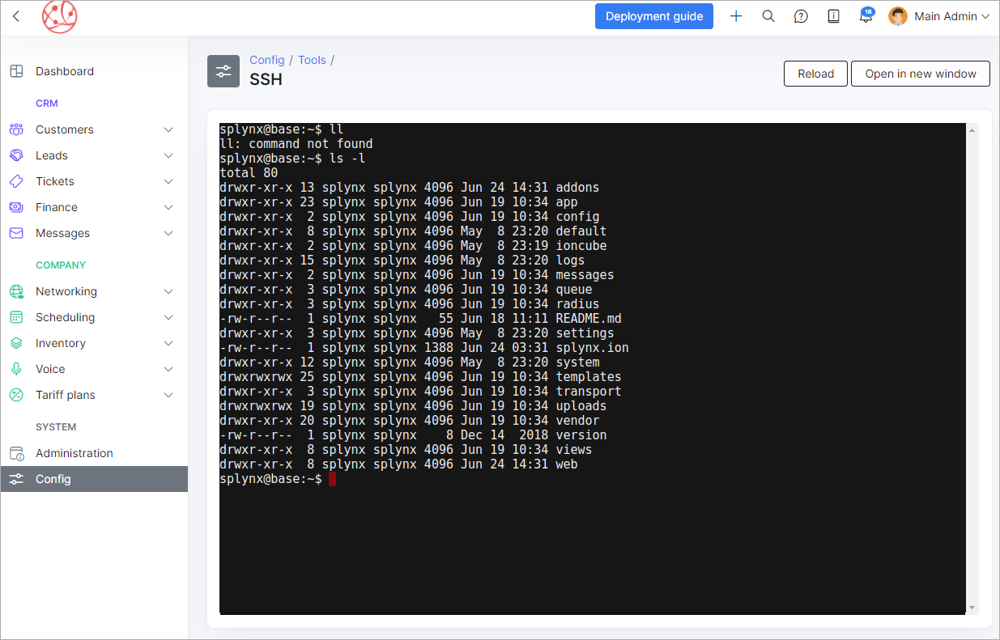

**ssh-term**
========
**ssh-term** - is a splynx add-on, what had been developed to use  terminal from browser.

**Installation:**

To install *ssh-term* add-on use next commands:

`apt-get update`

`apt-get install splynx-ssh-term`

or you can install it from Web UI:

*Config → Integrations → Add-ons:*

after installation you will see a new icon in *Config → Tools:*

when you'll press on this icon you will see a terminal window, and there you need to enter your login and password:

now you can use terminal from browser as from console:

