Splynx Adamo
==========


**Contenido**

- [Documentacion Splynx Adamo](#documentacion-splynx-adamo)
  - [1. Configuración del módulo](#1-configuración-del-módulo)
    - [1.1 Preparación de los datos](#11-preparación-de-los-datos)
    - [1.2 Obtención del Api-Key de Adamo](#12-obtención-del-api-key-de-adamo)
    - [1.3 Configuración del módulo](#13-configuración-del-módulo)
  - [2. Gestión de UUIS](#2-gestión-de-uuis)
    - [2.1 Añadir UUIS](#21-añadir-uuis)
    - [2.1 Actualizar UUIS](#21-actualizar-uuis)
  - [3. Gestión de pedidos](#3-gestión-de-pedidos)
    - [3.1 Listado de Pedidos](#31-listado-de-pedidos)
    - [3.2 Pedido de Alta](#32-pedido-de-alta)
    - [3.3 Pedido de Modificación](#33-pedido-de-modificación)
    - [3.4 Pedido de Baja](#34-pedido-de-baja)

## 1. Configuración del módulo 
### 1.1 Preparación de los datos
Para el correcto funcionamiento del módulo hace falta disponer de la API-Key de Adamo, en el siguiente paso se describe cómo obtenerlo, y un acceso al correo electrónico que se facilitó a Adamo, el mismo con el que hacen login en el portal de Wholesale de Adamo, para el envío del correo necesario en caso de generar una incidencia. La contraseña se encriptará y no se utilizará para otra cosa que no sea el envío de correos a Adamo.

### 1.2 Obtención del Api-Key de Adamo
Para la obtención del Api-Key vamos a necesitar un terminal con la funcionalidad curl instalada y las credenciales para el acceso a la plataforma Wholesale. Cuando tengamos estos datos, vamos al terminal del equipo e introducimos el siguiente comando:
```sh
curl --header "Content-Type: application/json" \
     --request POST \
     --data '{"email":"xyz","password":"xyz"}' \
https://wholesale.adamo.es/api/v1/api-key
````

Se sustituirá xyz tanto en email y en la password con los datos de acceso al portal y dará una
respuesta como esta:
```sh
{
    "key":"9775aed2ce1a547d0d78e3c8f60cc51883a34234e4b0b1ca1138dbffad2ac918a491cf6871619286b04ce97b7e6eb8e86073a59bb8414ed5286069f7bf63f6c4",
    "role":"operator",
    "organization":"yy",
    "id":"xxx",
    "email":"xyz",
    "self_installer":z
}
````

Nos quedaremos con la key para la configuración del módulo.

### 1.3 Configuración del módulo
Accederemos a **Configuración > Integraciones > Lista de módulos > splynx_adamo_addon** y rellenaremos los siguientes campos:

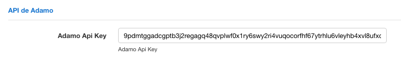

Aquí pegamos la key que obtuvimos en el paso anterior.

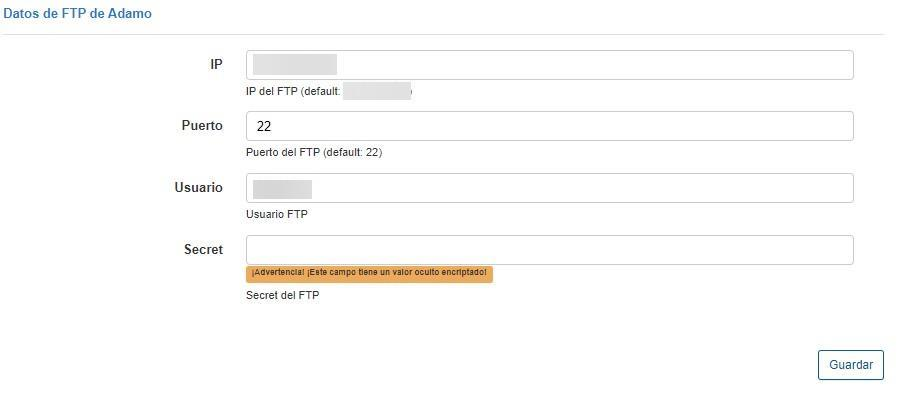

Completamos los datos de FTP de Adamo (IP, puerto, usuario y contraseña), en el caso de que se quiera hacer uso del botón de importación de UIs automático desde el FTP.

## 2. Gestión de UUIS
### 2.1 Añadir UUIS
Para añadir UUIS al sistema para poder realizar las altas hay que ir a Configuración > Integraciones > Adamo UIs en la que veremos en la parte superior el texto “Importar UIs” haremos click en él para que se despliegue el menú para la subida del csv. Adicionalmente, existe la posibilidad de cargar directamente desde el FTP de Adamo (siempre que se hayan configurado los datos de acceso al mismo como se puede ver en la figura anterior).

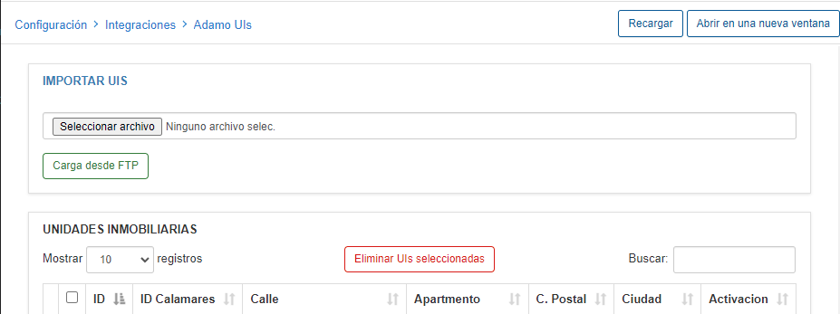

Los formatos soportados para la subida de unidades inmobiliarias son los formatos en los que Adamo los exporta, teniendo estas dos opciones:

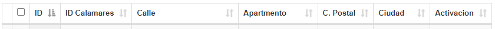

Cualquier subida con otro formato puede dar un error de de base de datos como el siguiente:

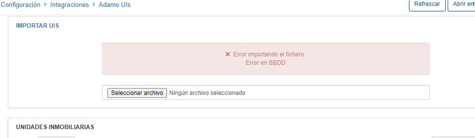

Una vez importado el fichero nos saldrá en la tabla inferior las UUIS ya importadas, pudiendo utilizar el buscador para encontrar una en específico.

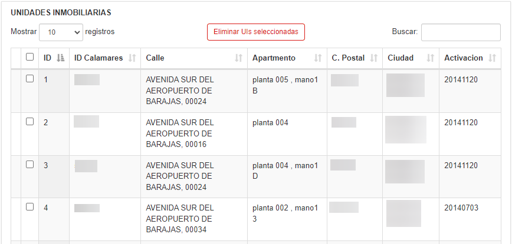

### 2.1 Actualizar UUIS
Para actualizar una UUI o añadir otra, hay que volver a subir un fichero con el formato especificado en el punto anterior, si se vuelve a subir un fichero con UUIS solo se actualizan las que con el mismo id tengan valor distinto y se insertarán las que no estén previamente. Por lo tanto se puede subir el fichero entero de todas las UUIS sin temor a que se dupliquen.

## 3. Gestión de pedidos
### 3.1 Listado de Pedidos
Para ver los pedidos existentes se debe acceder a la siguiente ruta desde el dashboard principal: **Clientes > Pedidos Adamo** .
Una vez en esta página se puede visualizar una tabla mostrando los pedidos del cliente tal como se
observa en la figura 1.

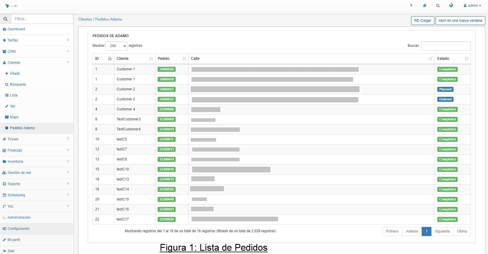

Dicha tabla incluye una fila por cada pedido de cliente y se compone de las las siguientes columnas:

- **ID**: El identificador único del cliente.
- **Cliente**: El nombre del cliente.
- **Pedido**: El identificador único del pedido.
- **Calle**: La dirección del pedido.
- **Estado**: El estado actual del pedido.

En la parte superior de la vista hay dos campos:
- **Mostrar**:
Permitiendo elegir el número de filas de la tabla de pedidos a mostrar entre las siguientes opciones: 10, 25, 50, 100, 200.

- **Buscar**:
Permitiendo filtrar las filas previamente mencionadas (ID, Cliente, Pedido, Calle, Estado) de la tabla por un valor cualquiera que incluyan.
En la parte inferior de la página también se puede elegir la siguiente vista de registro según la configuración del campo mostrar mencionado anteriormente.

### 3.2 Alta de pedidos
Para realizar un pedido de alta de usuario, primero se debe elegir el cliente desde la ruta **Clientes->Lista** y pulsando en el el campo “Nombre” del cliente, tal como muestra la figura 2 a continuación.

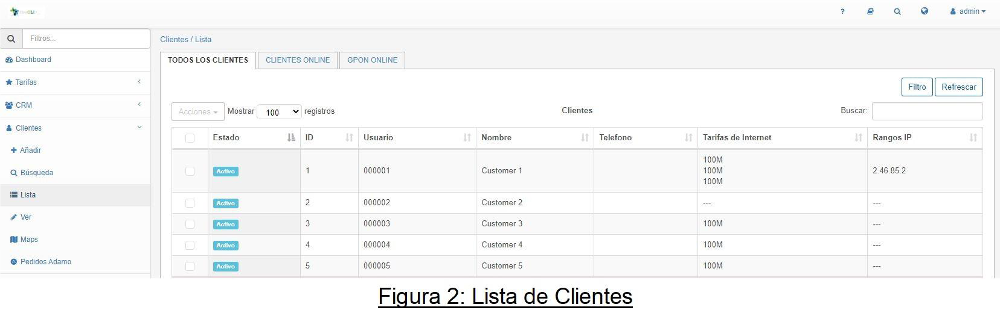

Una vez abierta la vista del cliente elegido, se debe navegar hasta la pestaña “Adamo” y pulsar en el campo **“Alta de Usuario De Usuario En Adamo”** en la parte superior de esta pestaña. Tal como muestra:

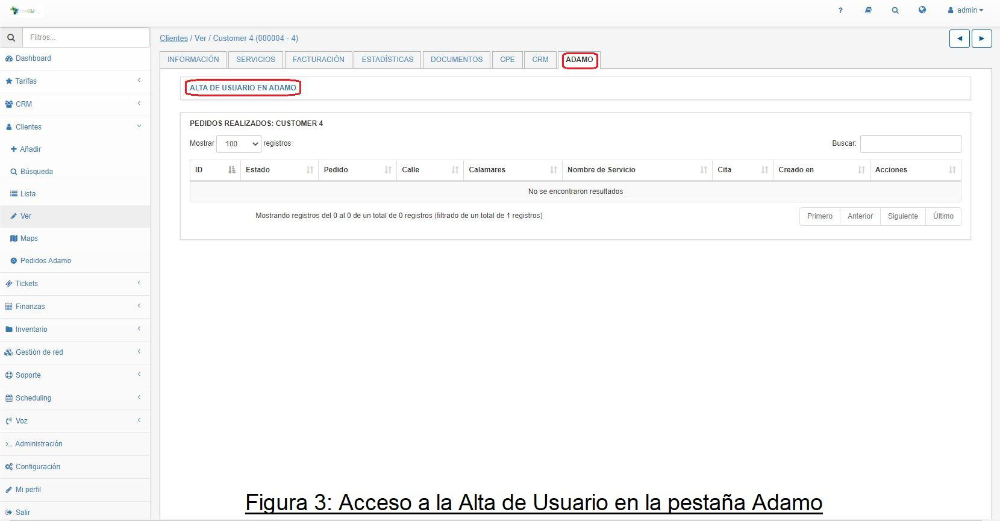

Una vez pulsado el campo se accede al formulario de alta de usuario en el que se cumplimentan los siguientes campos:

- **Nombre**: Nombre del Usuario objeto del pedido de Alta.
- **Teléfono**: Teléfono del Usuario objeto del pedido de Alta.
- **Calle**: Dirección del Usuario objeto del pedido de Alta.
- **ID Calamares**: Identificador de la UUI en el sistema de Adamo
- **Servicio**: Servicio objeto del pedido de Alta.
Dicho servicio debe elegirse entre el listado de servicios disponibles mostrado.

Tal como muestra la Figura 4 a continuación

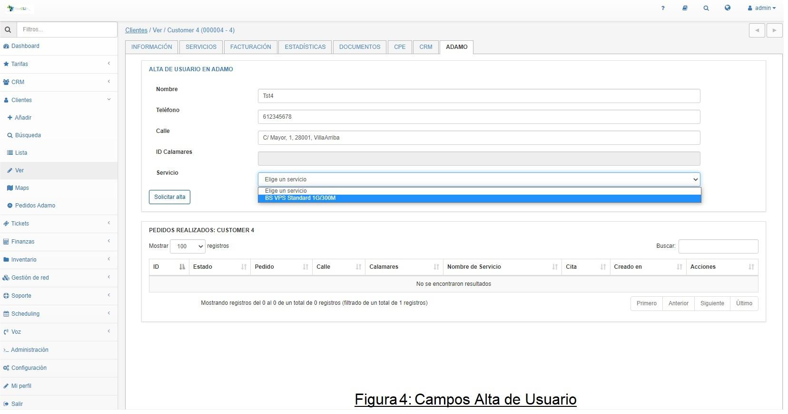

Una vez solicitado el alta se puede comprobar el estado de su tramitación de alta en la tabla mostrando el resumen de pedidos realizados.
Tal como muestra la Figura 5 a Continuación

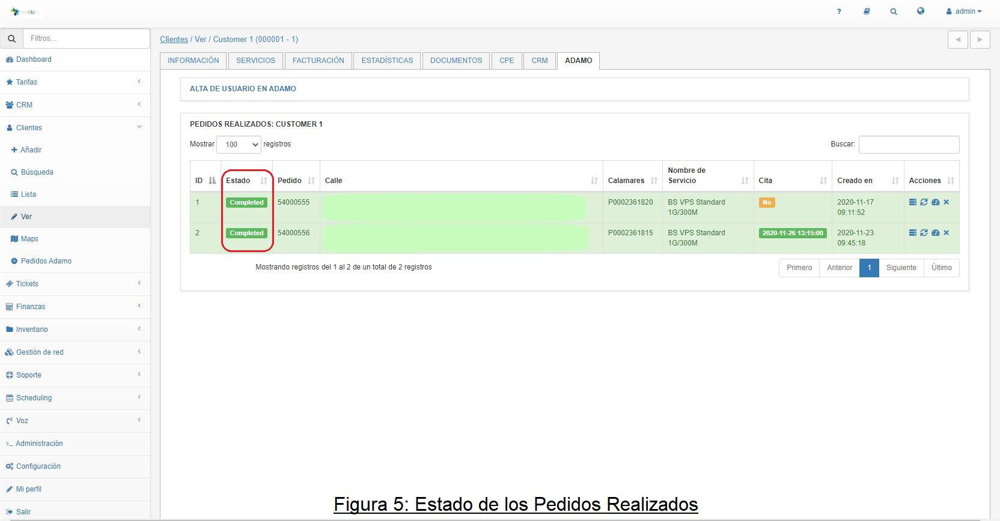

Pudiendo ser dichos estados:
- **Ordered**: Pedido solicitado a falta de verificación por parte de Adamo de por serviciar en esa UUI.
- **Verified**: Pedido verificado con Adamo que se puede serviciar.
- **Planned**: Se ha cerrado una cita con el cliente para la instalación.
- **Issue**: Pedido con una incidencia de falta de recursos.
- **Canceled**: Pedido cancelado, si no se llega a completar.
- **Disconnect**: Pedido de baja de cliente, una vez el pedido ha estado en Completed.
Completed: Pedido completado.

### 3.3 Modificación de pedidos
Solamente se pueden realizar pedidos de modificación para los pedidos que se encuentren en el estado **Completed**.
Para modificar un pedido dependiendo de su estado se debe pulsar el icono  en la columna Acciones del listado de pedidos del cliente seleccionado mostrado en la figura 6.

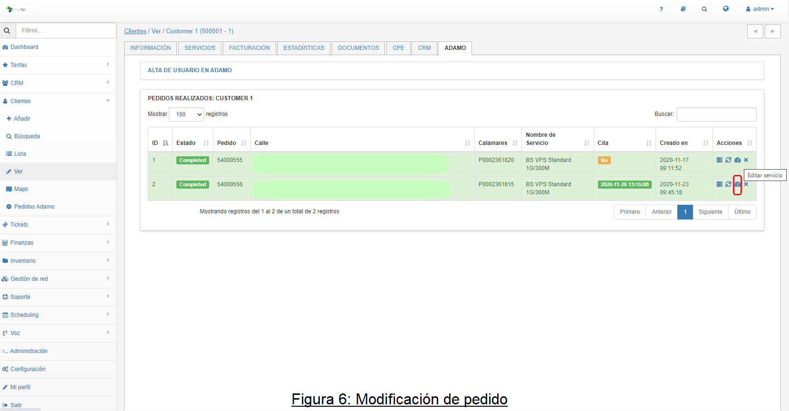

Una vez pulsado dicho icono se muestra un desplegable reflejando los tipos de servicio objetivo hacia los que se puede solicitar la modificación.
Tal como muestra la figura 7.

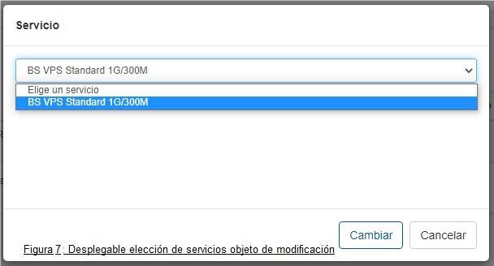

Una vez realizado el pedido de modificación se muestra el pedido actualizado en el listado de pedidos del cliente.


### 3.4 Cancelación/Baja de pedidos
La solicitud de baja de los pedidos que no han llegado a estar en Completed se denomina Canceled, y de los que sí han estado en Completed es Disconnected. Un pedido está en Completed una vez ha provisionado una ONT en esa orden. Para modificar un pedido dependiendo de su estado se debe pulsar el icono  en la columna Acciones del listado de pedidos del cliente seleccionado mostrado en la figura 8.

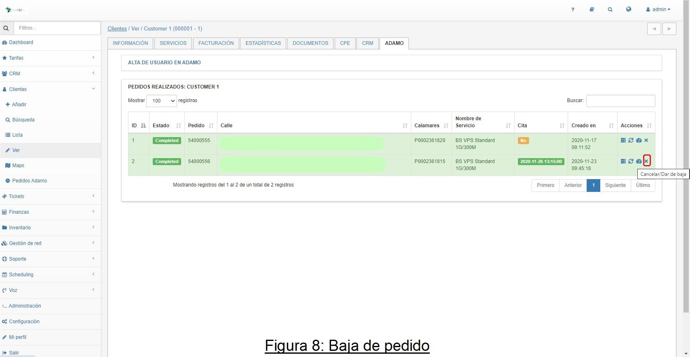

Una vez pulsado dicho icono se muestra un desplegable reflejando los campos de servicio objeto del pedido de Baja. Para proseguir con el pedido de baja se debe pulsar el botón **“Confirmar Cancelación/Baja”**. Tal como muestra la figura 9.

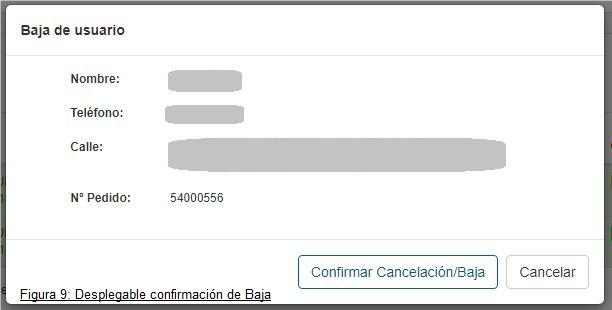

Una vez realizado el pedido de baja se muestra un nuevo pedido en el listado de pedidos del cliente.