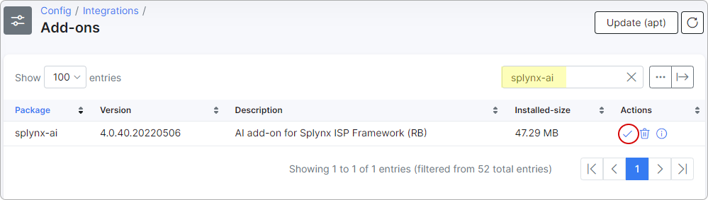
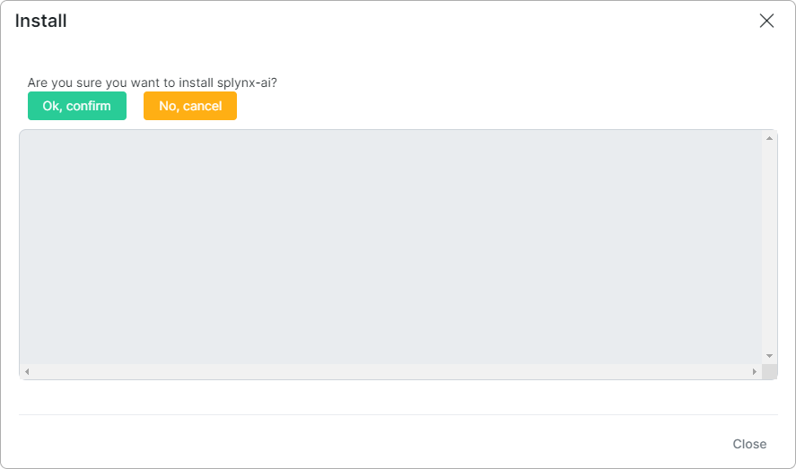
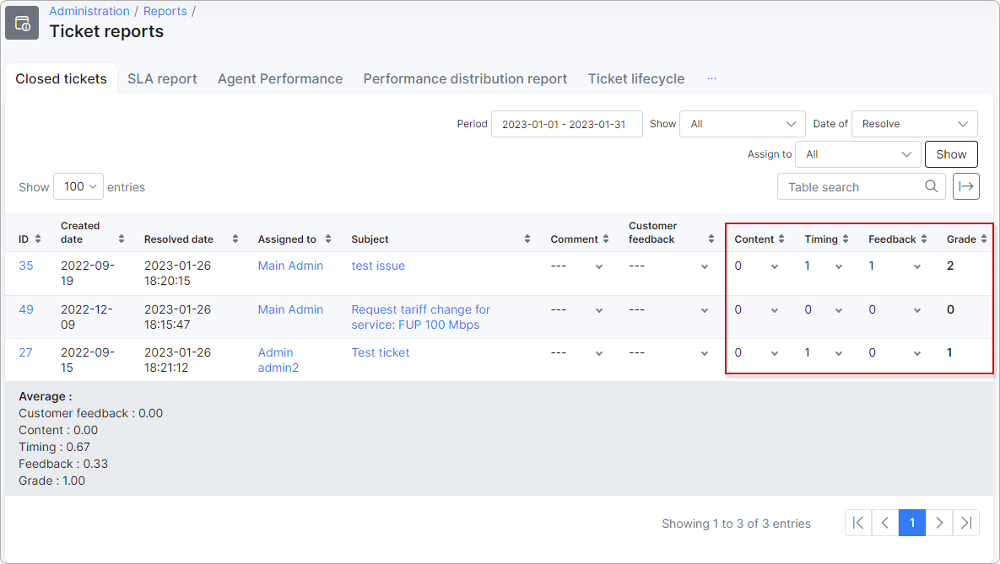

Splynx AI
================================
The Splynx AI add-on, based on artificial intelligence, is intended to evaluate the support quality. Before this, you had to give [grades](administration/reports/ticket_reports/ticket_reports.md) for closed tickets manually. Our developers have automated this procedure by teaching neural networks to evaluate the support work considering various parameters in closed tickets.

Together with the [Ticket feedback add-on](addons_modules/ticket-feedback/ticket-feedback.md), this will give you a powerful tool to analyze and improve the quality of your customer support service.

## Installation

Navigate to *Config → Integrations → Add-ons* and search for the *splynx-ai* package. Then click the *Install* button:

Confirm the installation by clicking the `Ok, confirm` button.

## Ticket grades

After the successful installation, the Splynx AI add-on will evaluate the support work every time you close a ticket with the *Resolved* status.

The grades can be found in *Administration → Reports → Ticket reports* under *Content*, *Timing* and *Feedback* columns:

1 - satisfied;

0 - not satisfied.

Under the *Grade* column, there is the total grade for each ticket. The average grade can be found below the Ticket reports table.

## How Splynx AI evaluates tickets

A ticket, to be evaluated, needs to have the *Resolved* status and be closed by a support engineer.

The following parameters are considered when evaluating the ticket by the Splynx AI neural networks:

1. **Content**
* all of the admin's messages in text format.

2. **Timing**
* ticket type;
* ticket priority;
* the number of customer's messages in the ticket;
* the number of admin's messages in the ticket;
* the number of attached files in the ticket;
* how much time has passed since the admin's first response;
* the admin's longest response time to the customer
* the admin's average response time to the customer;
* how much time has passed since the ticket creation until its closing.

3. **Feedback**
* the last admin's message in the ticket;
* the last customer's message in the ticket.

